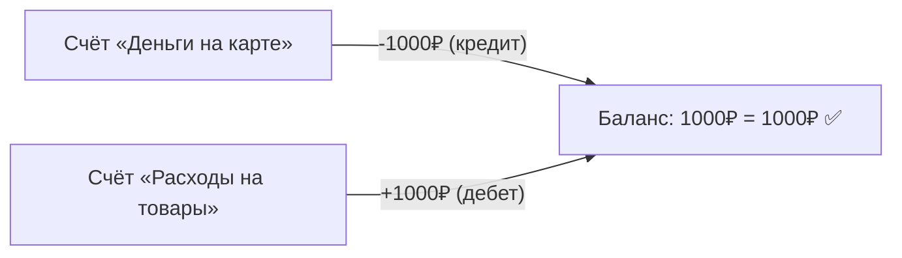
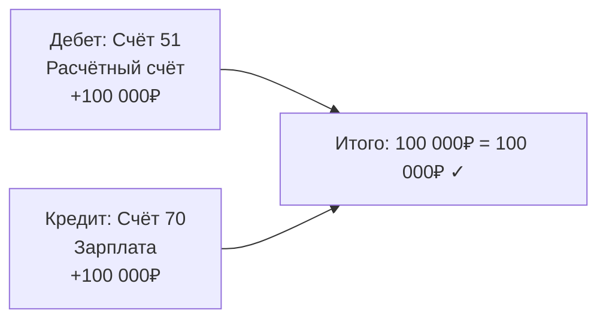
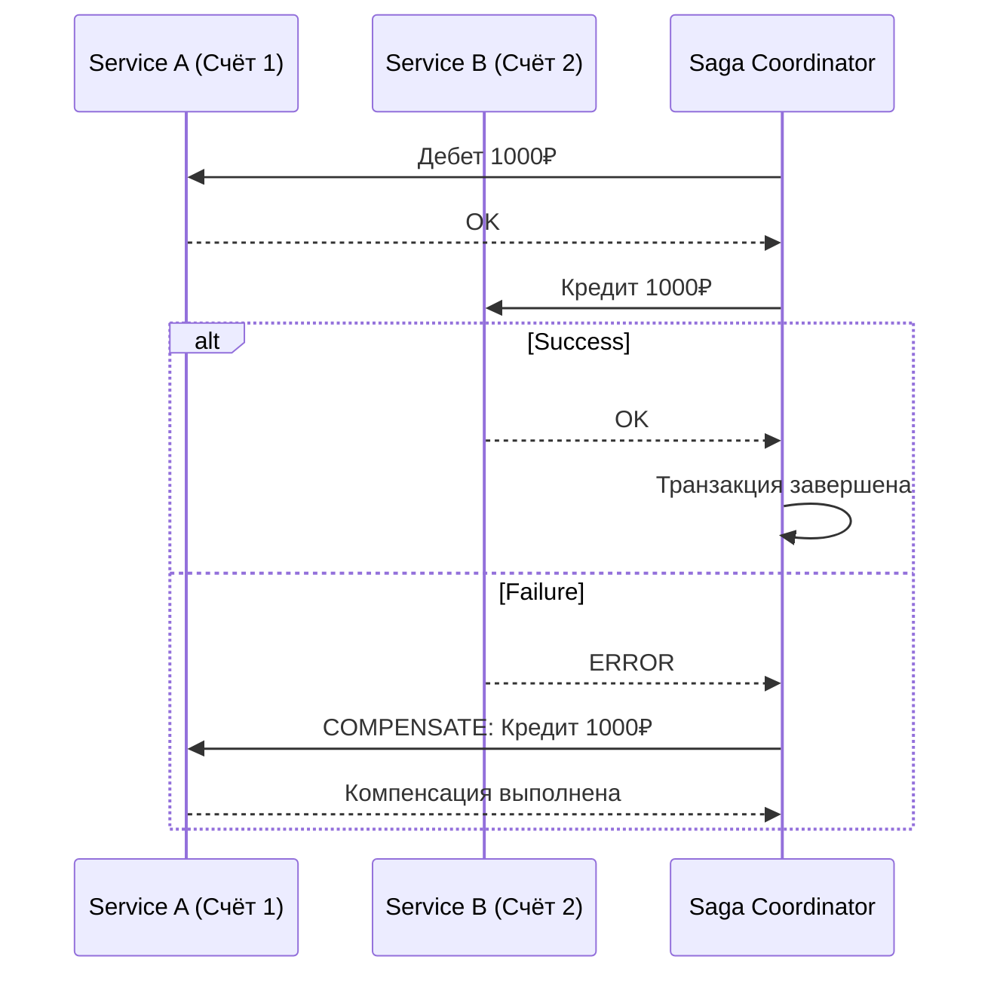

:::info TL;DR
Double-entry accounting (двойная запись) — основа любой финансовой системы. Каждая транзакция записывается дважды: дебет одного счёта и кредит другого. Сумма дебетов всегда равна сумме кредитов. Аналитик должен понимать, как спроектировать ledger, что такое план счетов, как формируются проводки и почему система «не сходится».
:::

## Для кого эта статья

- Middle SA, работающий с финансовыми системами
- SA, которому нужно общаться с бухгалтерами и аудиторами
- Разработчик, проектирующий ledger

После прочтения вы:
- Поймёте принцип double-entry и план счетов
- Узнаете структуру проводки (journal entry) и ledger
- Сможете специфицировать требования к финансовой системе

## Почему это важно для аналитика

Без понимания double-entry аналитик не сможет:
- Спроектировать корректную схему данных для финансовой операции
- Понять, почему «деньги не сошлись»
- Специфицировать требования к отчётности
- Общаться с бухгалтерами и аудиторами на их языке

## Double-entry: базовый принцип

Каждая операция изменяет **минимум два счёта**:



**Фундаментальное уравнение:**
```
Assets (активы) = Liabilities (обязательства) + Equity (капитал)
```

Любая операция сохраняет это равенство.

### Дебет и кредит — запоминаем

| | Дебет | Кредит |
|---|---|---|
| **Актив (деньги, здания, инвентарь)** | Увеличивается | Уменьшается |
| **Пассив (долги, обязательства)** | Уменьшается | Увеличивается |
| **Капитал (собственные средства)** | Уменьшается | Увеличивается |
| **Доходы** | Уменьшается | Увеличивается |
| **Расходы** | Увеличивается | Уменьшается |

**Правило для аналитика:** дебет — слева, кредит — справа. 
Проводка всегда: Дебет одного счёта = Кредит другого.

## План счетов (Chart of Accounts)

Иерархическая структура счетов, по которым учитываются операции.

**Типовая структура (РФ):**

```
Класс 1: Внеоборотные активы (01..09)
Класс 2: Оборотные активы (10..19)
  ├── 10: Материалы
  ├── 50: Касса
  ├── 51: Расчётный счёт
  └── 52: Валютный счёт
Класс 3: Затраты на производство (20..29)
Класс 4: Готовая продукция (40..46)
Класс 5: Денежные средства (50..59)
Класс 6: Расчёты (60..79)
  ├── 60: Расчёты с поставщиками
  ├── 62: Расчёты с покупателями
  └── 76: Разные дебиторы/кредиторы
Класс 7: Капитал (80..89)
Класс 8: Финансовые результаты (90..99)
```

**Для аналитика:** в проекте не нужно реализовывать все счета. Нужно определить, какие счета использует система, и как проводки маппятся на план счетов.

## Проводка (Journal Entry)

Запись об операции:



**Обязательные поля проводки:**
- Дата операции
- Счёт дебета
- Счёт кредита
- Сумма
- Валюта
- Описание / назначение
- ID корреспондирующей транзакции (для аудита)
- Дата проводки (может отличаться от даты операции)

## Ledger (Главная книга)

Таблица, в которой собраны все проводки в хронологическом порядке. Из ledger формируются:

1. **Оборотно-сальдовая ведомость** (Trial Balance) — остатки по всем счетам
2. **Баланс** (Balance Sheet) — активы = пассивы + капитал
3. **Отчёт о прибылях и убытках** (P&L) — доходы - расходы

### Как это выглядит в БД

```sql
-- Таблица проводок
CREATE TABLE journal_entries (
    id UUID PRIMARY KEY,
    transaction_id UUID NOT NULL,      -- ID бизнес-транзакции
    account_id INT NOT NULL,            -- счёт (план счетов)
    entry_type VARCHAR(4) NOT NULL,     -- 'DEBIT' или 'CREDIT'
    amount NUMERIC(16,2) NOT NULL,
    currency CHAR(3) NOT NULL,
    entry_date DATE NOT NULL,
    description TEXT,
    created_at TIMESTAMP NOT NULL
);

-- constraint: сумма дебетов = сумма кредитов для каждой транзакции
```

## Saga + Ledger

В микросервисной архитектуре распределённая транзакция (перевод денег между счетами в разных сервисах) реализуется через Saga:



**Для аналитика:** специфицировать компенсирующие проводки для каждого шага Saga.

## Практический кейс: Внедрение double-entry ledger для платёжной платформы

**Проблема:** Платёжная платформа (микросервисы, 500 тыс. транзакций/день) использует «простой» учёт: каждая транзакция — одна запись в БД. Бухгалтеры не могут свести дебет с кредитом, аудит находит расхождения на 2 млн ₽/мес. Причина: нет double-entry, транзакции теряются в saga-компенсациях.

**Анализ:**
- Статусная модель: 4 статуса (created, processed, failed, refunded) — не хватает
- Нет обязательного constraint: сумма дебетов = сумме кредитов
- Saga pattern без compensations: если перевод упал, деньги «зависают»
- Нет audit trail: нельзя восстановить, что произошло с транзакцией
- 0.5% транзакций не имеют пары (дебет без кредита)

**Решение:**
1. Внедрение ledger-сервиса с double-entry: каждая транзакция — 2+ проводки
2. Constraint CHECK (SUM_DEBITS = SUM_CREDITS) на уровне БД
3. Все saga-шаги с компенсирующими проводками
4. Immutable ledger: проводки не удаляются, только сторно
5. Audit dashboard для бухгалтерии (Trial Balance по всем счетам)

**Результат:**
- Расхождения: 2 млн ₽/мес → 0 ₽ (первый месяц без break'ов)
- Аудит: 3 недели → 2 дня
- Время разбора инцидента: с 2 дней до 30 минут
- Бухгалтеры могут сформировать Balance Sheet за 1 клик
- Стоимость проекта: 18 млн ₽

## Типовые проблемы, которые находит аналитик

| Проблема | Причина | Решение |
|----------|---------|---------|
| **Не бьётся баланс** | Проводка без пары (дебет без кредита) | Валидация: сумма дебетов = сумме кредитов в одной транзакции |
| **Дубликаты** | Повторная проводка | Idempotency key + unique constraint |
| **Разрыв в нумерации** | Транзакция отменена | Не удалять проводки, а добавлять сторно |
| **Несоответствие дат** | Проводка в одном периоде, а операция — в другом | Разделять дату операции и дату проводки |
| **Ошибка округления** | Разные валюты, курсы | Фиксированная точность NUMERIC(16,6) |

## Ключевые термины

- **Double-entry** — двойная запись (дебет + кредит)
- **Ledger** — главная книга, хронология всех проводок
- **Journal Entry** — отдельная проводка
- **Chart of Accounts** — план счетов
- **Trial Balance** — оборотно-сальдовая ведомость
- **Balance Sheet** — баланс (активы = пассивы + капитал)
- **P&L** — Profit and Loss, отчёт о прибылях и убытках
- **Storno** — сторно, отмена проводки обратной записью

## Что дальше

- [Сверка данных (reconciliation)](/docs/specialization/fintech-reconciliation) — как проверять, что проводки корректны
- [Saga pattern](/docs/architecture/saga-pattern) — как работают распределённые транзакции в FinTech

## Проверь себя

1. **Как работает double-entry accounting?**
   *Ответ:* Каждая операция записывается как дебет одного счёта и кредит другого на ту же сумму. Сумма дебетов всегда равна сумме кредитов.

2. **Что такое план счетов и зачем он нужен?**
   *Ответ:* Иерархическая структура счетов для учёта операций. Определяет, как классифицируются активы, пассивы, доходы и расходы.

3. **Как Saga pattern связан с ledger?**
   *Ответ:* В распределённой транзакции (перевод между сервисами) каждый шаг — проводка. При сбое Saga выполняет компенсирующие проводки (возврат).

4. **Что такое Trial Balance?**
   *Ответ:* Оборотно-сальдовая ведомость — таблица остатков по всем счетам. Сумма дебетовых остатков должна равняться сумме кредитовых. Если нет — ошибка в проводках.

5. **Как правильно отменить проводку?**
   *Ответ:* Не удалять, а добавлять сторно — обратную проводку (дебет и кредит меняются местами). Immutable ledger: проводки только добавляются, никогда не удаляются.

## Ссылки для самостоятельного изучения

| Что | Описание | URL |
|-----|----------|-----|
| IAS 1 — Presentation of Financial Statements | Международный стандарт отчётности | ifrs.org |
| План счетов РФ (Приказ Минфина №94н) | Официальный документ | minfin.gov.ru |
| Martin Fowler — Accounting Patterns | Паттерны проектирования учёта | martinfowler.com |
| Double-Entry Bookkeeping (Wikipedia) | Базовое объяснение принципа | wikipedia.org |
| Saga Pattern in Microservices | Распределённые транзакции | microservices.io
