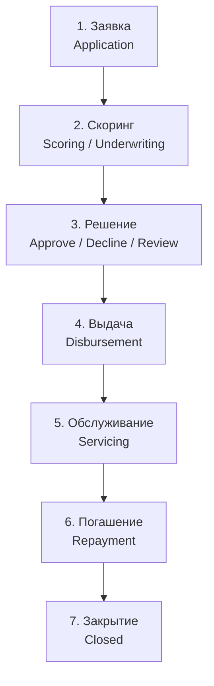
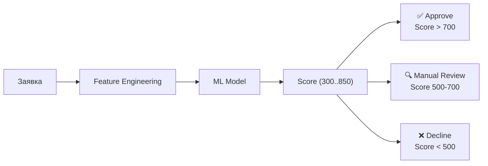
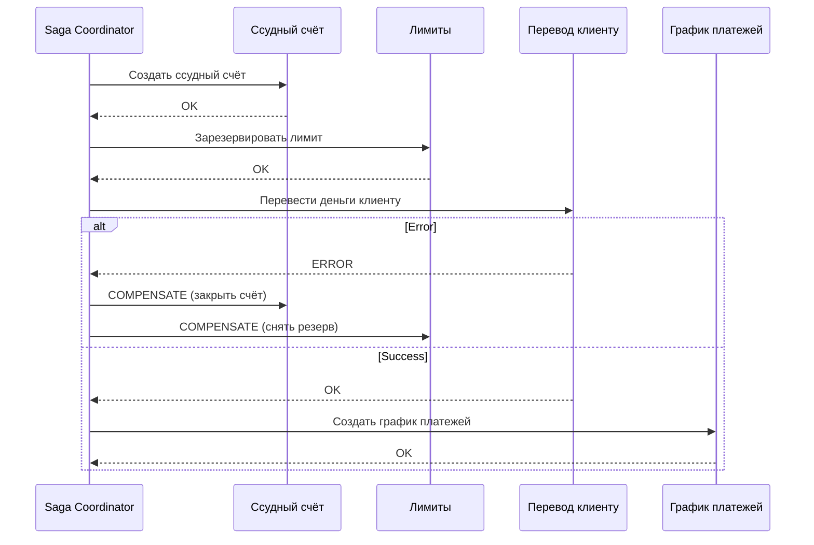

:::info TL;DR
Кредитный конвейер (loan origination system) — процесс от подачи заявки до выдачи кредита и его погашения. Аналитик должен понимать этапы: заявка → скоринг → решение → выдача → обслуживание → погашение. Скоринг — ML-модель, оценивающая вероятность дефолта. Амортизация — график платежей (аннуитетный / дифференцированный). BNPL — отдельный продукт.
:::

## Для кого эта статья

- Senior SA, работающий над кредитным конвейером
- SA в банке или МФО
- Продуктовый аналитик, желающий понять устройство скоринга

После прочтения вы:
- Поймёте жизненный цикл кредита (заявка → выдача → погашение)
- Узнаете, как работает скоринг и амортизация
- Сможете специфицировать требования к кредитному конвейеру

## Жизненный цикл кредита



## 1. Заявка (Loan Application)

**Какие данные собирает система:**

| Категория | Поля | Проверка |
|-----------|------|----------|
| **Персональные** | ФИО, паспорт, ИНН, СНИЛС | 115-ФЗ (KYC), паспортные данные |
| **Контакты** | Телефон, email, адрес | Верификация через СМС |
| **Работа** | Место работы, должность, стаж | Возможно, через СБК (соц. фонды) |
| **Финансы** | Доход, расходы, кредитная нагрузка | Справка 2-НДФЛ / выписка |
| **Запрос** | Сумма, срок, цель | Андеррайтинг |

## 2. Скоринг (Scoring)

**Credit scoring** — оценка кредитоспособности заёмщика.

### Виды скоринга

| Тип | Данные | Время | Пример |
|-----|--------|-------|--------|
| **Application scoring** | Данные из заявки | Секунды | Approved/Declined |
| **Behavioral scoring** | История платежей заёмщика | Online | Изменение лимита |
| **Collection scoring** | Вероятность возврата просрочки | Online | Стратегия взыскания |
| **Fraud scoring** | Вероятность мошенничества | < 100 ms | Блокировка заявки |

### Как работает Application Scoring



**Факторы, влияющие на score:**
- Платёжная дисциплина (история по другим кредитам)
- Доход (стабильность, соотношение платёж/доход — PTI)
- Кредитная нагрузка (total debt / income)
- Стаж на текущей работе
- Возраст
- Количество запросов в БКИ за последние 30 дней

**Интеграция с БКИ (Бюро Кредитных Историй):**
- НБКИ, OKB, Equifax — получение кредитной истории
- Запрос по ИНН / паспорту
- Время ответа: < 2 сек

## 3. Решение (Decision)

| Решение | Что происходит | Требования к системе |
|---------|---------------|---------------------|
| **Approve** | Утверждён, показать условия | Предварительный расчёт платежа |
| **Decline** | Отказ с причиной | Причина отказа (обязательно по 115-ФЗ) |
| **Manual review** | На проверку кредитному эксперту | Case management, SLA на решение |
| **Conditional** | Одобрено, но с условиями | Уменьшить сумму / увеличить первоначальный взнос |

## 4. Выдача (Disbursement)

После одобрения:
1. Клиент подписывает договор (SMS/биометрия/УКЭП)
2. Система переводит деньги (обычно через PISP или платёжную систему)
3. Открывается ссудный счёт

**Архитектура:** Saga pattern (списание + открытие счёта + создание графика):



## 5. Амортизация (Amortization)

График погашения кредита.

### Аннуитетный платёж (равный каждый месяц)

```
Платёж = Сумма × (ставка × (1+ставка)^срок) / ((1+ставка)^срок - 1)

Где:
  ставка — месячная процентная ставка (годовая / 12)
  срок — количество месяцев
```

В начале срока: большая часть платежа — проценты.
В конце срока: большая часть — тело кредита.

### Дифференцированный платёж (убывающий)

```
Платёж = тело_кредита/срок + остаток × ставка
```

Тело кредита выплачивается равными долями, проценты — на остаток. Первые платежи выше.

**Для аналитика:** специфицировать метод расчёта график, поддерживаемые сроки, досрочное погашение (полное/частичное), штрафы за просрочку.

## 6. BNPL (Buy Now Pay Later)

Отдельный продукт: короткий кредит без процентов (обычно 4 платежа за 6 недель).

**Отличия от обычного кредита:**

| Критерий | Кредит | BNPL |
|----------|--------|------|
| Срок | 6–60 месяцев | 6 недель |
| Проценты | Есть | Нет (штраф за просрочку) |
| Скоринг | Полный | Упрощённый (soft check) |
| Сумма | Любая | До 15 000₽ (типично) |
| Регуляция | Полная | Упрощённая |

## Практический кейс: Цифровой кредитный конвейер для МФО

**Проблема:** МФО (100 тыс. заявок/мес) обрабатывает кредиты вручную: заявка приходит на email, менеджер проверяет документы, передаёт в БКИ, через 2 дня — решение. 70% клиентов уходят к конкурентам, где «одобрение за 5 минут».

**Анализ:**
- Time-to-decision: 2 дня (конкуренты — 5 минут)
- Manual review: 100% заявок (вручную проверяются все)
- Нет интеграции с БКИ (НБКИ, OKB) — запрос через веб-интерфейс
- Нет ML-скоринга — решение на основе 3 простых правил (возраст, доход, стаж)
- Отказ: 45% — клиент не дождался решения

**Решение:**
1. Автоматизация заявки: онлайн-форма + API интеграция с НБКИ (< 2 сек)
2. ML-скоринг (Gradient Boosting): 30 features → score, threshold Approve/Decline/Review
3. Decision Engine: Approve (< 1 сек) / Decline с причиной / Manual Review (10% заявок)
4. Автоматическая выдача через PISP, подписание — SMS-код
5. Dashboard для мониторинга: конверсия, default rate, time-to-decision

**Результат:**
- Time-to-decision: 2 дня → 30 секунд (95% заявок)
- Manual review: 100% → 8% заявок
- Конверсия (заявка → выдача): 15% → 35% (+20 п.п.)
- Default rate: 8% → 6% (ML-скоринг лучше отсеивает)
- Доля рынка: +12% за полгода
- Стоимость проекта: 15 млн ₽, окупаемость: 4 месяца

## Требования к кредитному конвейеру (спецификация)

| Параметр | Пример |
|----------|--------|
| Время скоринга | < 5 сек |
| Интеграция с БКИ | НБКИ, OKB (XML/JSON, ISO 20022) |
| SCA при выдаче | Да (PSD2, SCA для онлайн-кредита) |
| Retention договоров | 5 лет после закрытия кредита |
| Амортизация | Аннуитет + дифференцированный |
| Досрочное погашение | Частичное (без штрафа), полное |
| Просрочки | Grace period 5 дней, затем пени |
| Отчётность | Ежемесячно в БКИ |

## Ключевые термины

- **Loan Origination** — процесс от заявки до выдачи
- **Scoring** — оценка кредитоспособности
- **BKI (Credit Bureau)** — бюро кредитных историй (НБКИ, OKB)
- **Amortization** — график погашения кредита
- **Annuity** — аннуитетный платёж (равный каждый месяц)
- **Differentiated** — дифференцированный платёж (убывающий)
- **PTI (Payment-to-Income)** — отношение платежа к доходу
- **BNPL** — Buy Now Pay Later
- **Grace period** — льготный период до начисления штрафа

## Что дальше

- [Регуляторика в FinTech](/docs/specialization/fintech-regulation) — 115-ФЗ, кредитные истории
- [Этика, bias и регуляторика ИИ](/docs/specialization/ai-ethics) — bias в кредитном скоринге
- [Saga pattern](/docs/architecture/saga-pattern) — распределённые транзакции при выдаче

## Проверь себя

1. **Какие этапы проходит кредитная заявка?**
   *Ответ:* Заявка → Скоринг → Решение → Выдача → Обслуживание → Погашение → Закрытие.

2. **Чем аннуитетный платёж отличается от дифференцированного?**
   *Ответ:* Аннуитет — равные платежи весь срок, в начале больше процентов. Дифференцированный — тело кредита равномерно, проценты на остаток = платежи снижаются.

3. **Что такое BNPL и чем отличается от обычного кредита?**
   *Ответ:* BNPL — короткий беспроцентный кредит (6 недель, 4 платежа). Минимальный скоринг, малые суммы, упрощённая регуляция.

4. **Что такое PTI (Payment-to-Income) и зачем он нужен?**
   *Ответ:* Отношение ежемесячного платежа по кредиту к доходу заёмщика. Стандартное ограничение: PTI < 40-50%. Если выше — клиент не потянет кредит.

5. **Какие виды скоринга существуют?**
   *Ответ:* Application scoring (по заявке), Behavioral scoring (по истории), Collection scoring (вероятность возврата), Fraud scoring (вероятность мошенничества).

## Ссылки для самостоятельного изучения

| Что | Описание | URL |
|-----|----------|-----|
| НБКИ — Бюро кредитных историй | Крупнейшее БКИ в РФ | nbki.ru |
| FICO Scoring Guide | Классический credit score | fico.com |
| BNPL — Buy Now Pay Later | Обзор продукта | wikipedia.org |
| 115-ФЗ (ПОД/ФТ) | Требования к кредитованию | consultant.ru |
| ML для кредитного скоринга | Практическое руководство | kaggle.com/learn
