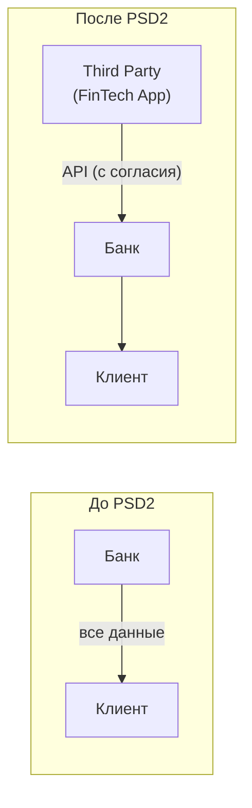
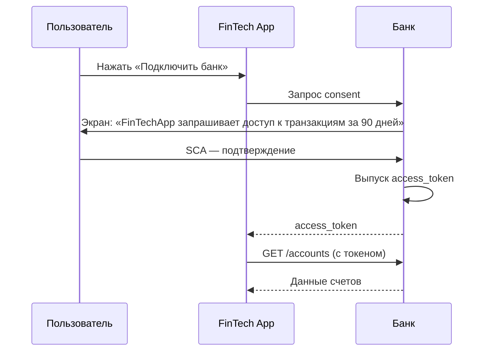

:::info TL;DR
Open Banking — требование регулятора (PSD2 в EU, Open Banking Standard в UK) заставить банки открыть API для третьих сторон. Аналитик должен понимать: какие типы API нужны (AISP, PISP), как работает consent management, что такое SCA (сильная аутентификация), и какие стандарты описывают API (Berlin Group, UK Standard, FAPI).
:::

## Для кого эта статья

- Senior SA, работающий над Open Banking проектом
- SA в банке, которому предстоит открыть API
- Архитектор, проектирующий API для PSD2

После прочтения вы:
- Поймёте роли в PSD2 (AISP, PISP, ASPSP)
- Узнаете API-эндпоинты Open Banking и consent flow
- Сможете специфицировать Open Banking API для банка

## Что такое Open Banking

До PSD2: банк хранит данные клиента и сам инициирует платежи.
После PSD2: клиент может дать третьей стороне (финтех-приложению) доступ к своим данным и возможность инициировать платежи.



## Роли в PSD2

| Роль | Что делает | Пример |
|------|-----------|--------|
| **ASPSP** (Account Servicing Payment Service Provider) | Банк, который предоставляет API | Сбер, Альфа-Банк |
| **AISP** (Account Information Service Provider) | Читает данные счета (с согласия клиента) | Приложение для учёта финансов |
| **PISP** (Payment Initiation Service Provider) | Инициирует платёж от имени клиента | Платежный сервис |
| **CISP** (Card Issuer Service Provider) | Работа с карточными данными | Карточный кошелёк |
| **TPP** (Third Party Provider) | Общее название для AISP/PISP/CISP | — |

## API-эндпоинты Open Banking

### Account Information (AISP)

```
GET    /accounts                                    — список счетов
GET    /accounts/{id}/balances                       — остатки
GET    /accounts/{id}/transactions                   — транзакции
GET    /accounts/{id}/beneficiaries                  — получатели
GET    /accounts/{id}/direct-debits                  — прямой дебет
GET    /accounts/{id}/standing-orders                — регулярные платежи
```

### Payment Initiation (PISP)

```
POST   /payments/sepa-credit-transfers              — инициировать SCT
GET    /payments/sepa-credit-transfers/{id}          — статус платежа
POST   /payments/sepa-instant-credit-transfers       — инициировать SCT Inst
POST   /payments/domestic-payments                    — локальный платёж
POST   /payments/file                                — bulk-платежи (файл)
```

### Consent Management

```
POST   /consents                                      — запрос согласия
GET    /consents/{id}                                 — статус согласия
DELETE /consents/{id}                                 — отозвать согласие
```

## SCA — Strong Customer Authentication

SCA требует два factor из трёх:
1. **Knowledge** — что знает клиент (пароль, PIN)
2. **Possession** — что имеет клиент (телефон, карта)
3. **Inherence** — что есть клиент (отпечаток, лицо)

### Когда SCA обязательна

| Сценарий | SCA нужна? |
|----------|-----------|
| Онлайн-платёж > 30 EUR | ✅ Да |
| Доступ к данным счета | ✅ Да (первый раз) |
| Инициация платежа | ✅ Да |
| Платёж < 30 EUR (low-risk) | ❌ Нет (исключение) |
| Подписка на один и тот же merchant | ❌ Нет (recurring) |
| Перевод между своими счетами | ❌ Нет (в одном банке) |

### Исключения (exemptions)

Банк может не требовать SCA в некоторых случаях:
- **Low-value**: < 30 EUR (лимит на 5 попыток или 100 EUR суммарно)
- **Recurring**: фиксированная подписка
- **Corporate**: B2B-платежи (корпоративные карты)
- **Trusted beneficiary**: получатель в белом списке
- **Transaction risk analysis (TRA)**: если банк оценил риск как низкий

**Liability shift:** если мерчант не запросил SCA там, где нужно — ответственность за chargeback на мерчанте.

## Стандарты Open Banking

### Berlin Group NextGenPSD2

Европейский стандарт, самый популярный. Описывает:

- **Restful API** — JSON over HTTPS
- **Стандартизированные эндпоинты** (accounts, payments, consents)
- **Формат ошибок** — единый для всех банков
- **SCA flows** — redirect, decoupled, embedded
- **Сертификация** — тестовый стенд для TPP

**Для аналитика:** Berlin Group — стандарт де-факто в EU. Если банк хочет соответствовать PSD2 — имплементирует Berlin Group API.

### UK Open Banking Standard

Британский стандарт (схожий с Berlin Group, но не идентичный). Особенности:
- Требует FAPI (Financial-grade API) — более строгий security profile
- OAuth 2.0 + OpenID Connect
- Использует JWT для подписи запросов
- Обязательный сертификат (eIDAS QWAC + QSealC)

### FAPI (Financial-grade API)

OAuth 2.0 profile для финансовых API. Отличия от обычного OAuth:
- **Mutual TLS** (mTLS) — двусторонняя аутентификация
- **JWT Secured Authorization Request** (JAR) — подписанный request object
- **JWT Secured Introspection Response** (JWT-RAR)
- **Sender-Constrained Tokens** — токен привязан к TLS-сессии

## Consent management

**Проблема:** как дать TPP доступ к данным клиента, не давая ему логин/пароль от банка?

**Решение:** OAuth 2.0 consent flow:



## Требования к Open Banking API (спецификация)

При проектировании Open Banking API аналитик должен определить:

| Параметр | Пример |
|----------|--------|
| Стандарт | Berlin Group NextGenPSD2 |
| Типы доступа | AISP (read), PISP (write) |
| Период согласия | 90 дней (требование PSD2) |
| SCA flow | Redirect (перенаправление в банк) |
| Security | FAPI, mTLS, JWT |
| Rate limiting | 1000 запросов/мин на TPP |
| Мониторинг | Алерт при аномальном количестве запросов от TPP |

## Практический кейс: Внедрение Open Banking API в банке

**Проблема:** Банк топ-10 РФ получил требование ЦБ: «обеспечить доступ к данным счетов через Open API до конца года». В банке 3 legacy-системы (SAP, ЦФТ, самописный CRM), единого API нет. Конкуренты (Т-Банк, Альфа) уже запустили Open Banking.

**Анализ:**
- 3 системы-источника данных счетов: разные форматы, нет единого API
- Нет OAuth 2.0 инфраструктуры — только Basic Auth
- Нет consent management — данные клиента доступны по логину/паролю
- SCA — только SMS-OTP, нет биометрии или push

**Решение:**
1. API Gateway (Kong) + единый Open Banking API по Berlin Group
2. Внедрение OAuth 2.0 + FAPI (mTLS, JWT)
3. Consent Management Service: срок согласия 90 дней, отзыв через личный кабинет
4. SCA: OTP SMS + Push уведомление (2 factor)
5. Тестовый стенд для TPP (sandbox с мок-данными)

**Результат:**
- Open Banking API запущен за 8 месяцев (до дедлайна ЦБ)
- 50+ TPP (финтех-приложений) подключились за первый квартал
- 95% SCA — через push (время: 3 сек вместо 30 сек для SMS)
- Пропускная способность: 10 000 запросов/мин
- Стоимость проекта: 45 млн ₽

## Ключевые термины

- **PSD2/PSD3** — европейские директивы Open Banking
- **AISP** — сервис чтения данных счета
- **PISP** — сервис инициации платежа
- **SCA** — сильная аутентификация клиента (2FA)
- **Berlin Group** — стандарт API для PSD2
- **FAPI** — Financial-grade API (OAuth 2.0 + mTLS)
- **Consent** — согласие клиента на доступ к данным
- **TPP** — Third Party Provider (финтех-приложение)

## Что дальше

- [Регуляторика в FinTech](/docs/specialization/fintech-regulation) — PSD2, ЦБ, PCI DSS
- [Авторизация — RBAC, ABAC](/docs/architecture/authorization) — consent как авторизация
- [Аутентификация в API](/docs/integration/api-auth) — OAuth 2.0, JWT

## Проверь себя

1. **Какие есть роли в PSD2 и чем они отличаются?**
   *Ответ:* ASPSP (банк), AISP (читает данные), PISP (инициирует платежи), TPP (общее название для AISP/PISP).

2. **Что такое SCA и какие factor'ы используются?**
   *Ответ:* Strong Customer Authentication — 2FA из трёх: знание (пароль/PIN), владение (телефон/карта), биометрия (отпечаток/лицо).

3. **Как работает consent flow в Open Banking?**
   *Ответ:* Пользователь даёт согласие через OAuth 2.0: FinTech → Bank (запрос) → Банк → пользователь (экран согласия) → SCA → access_token → FinTech → Bank API.

4. **Чем Berlin Group отличается от UK Open Banking Standard?**
   *Ответ:* Berlin Group — EU стандарт, REST API, JSON. UK Standard — более строгий security (FAPI, mTLS, JWT, eIDAS сертификаты).

5. **Когда SCA не требуется (exemptions)?**
   *Ответ:* Low-value (< 30 EUR, лимит 5 попыток), Recurring (подписки), Corporate (B2B), Trusted beneficiary, Transaction Risk Analysis (банк оценил риск как низкий).

## Ссылки для самостоятельного изучения

| Что | Описание | URL |
|-----|----------|-----|
| Berlin Group NextGenPSD2 | Спецификация API | berlin-group.com |
| UK Open Banking Standard | Британский стандарт | openbanking.org.uk |
| FAPI Specification | Financial-grade API | openid.net/fapi |
| PSD2 Directive (EU) | Официальный текст | eur-lex.europa.eu |
| OAuth 2.0 Framework | RFC 6749 | rfc-editor.org
