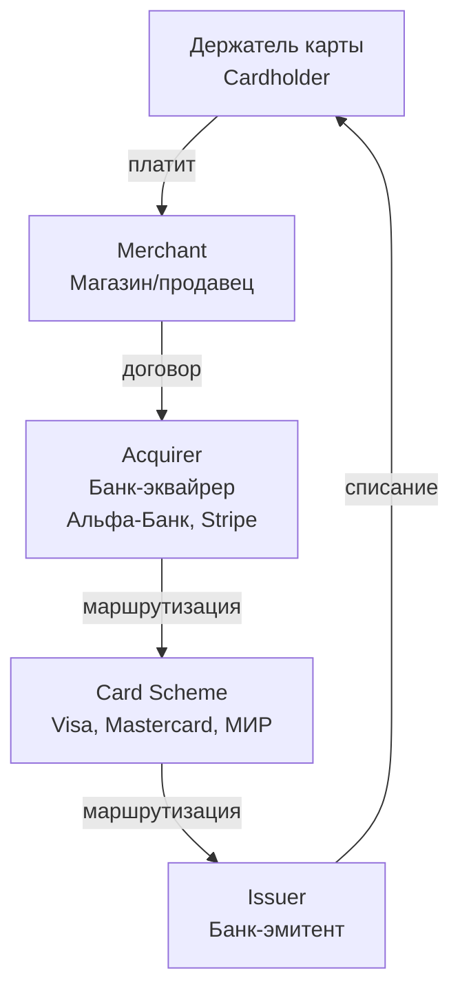
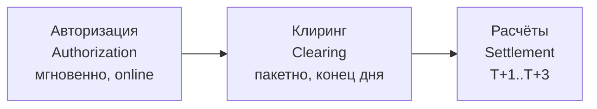
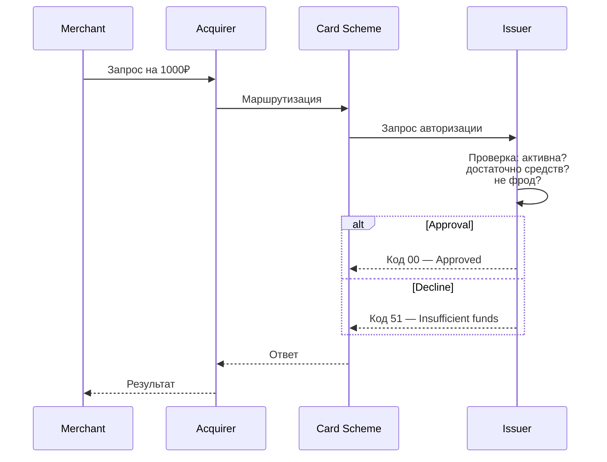
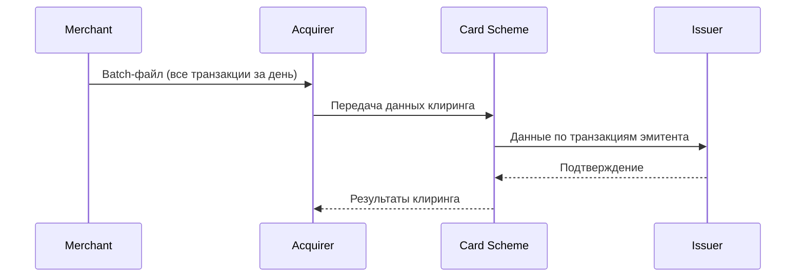
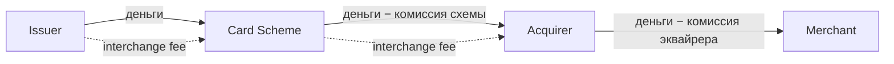

:::info TL;DR
Платёжная система — это механизм перевода денег от плательщика к получателю. Аналитику нужно понимать 4-стороннюю модель (держатель карты → банк-эмитент → платёжная система → банк-эквайрер → мерчант), жизненный цикл транзакции (авторизация → клиринг → settlement) и как это влияет на требования к системе.
:::

## Для кого эта статья

- Junior/Middle SA, начинающий в платёжных системах
- Разработчик, желающий понять бизнес-логику платежей
- Продуктовый менеджер платёжного продукта

После прочтения вы:
- Поймёте 4-стороннюю модель карточного платежа и роли участников
- Узнаете жизненный цикл транзакции (авторизация → клиринг → settlement)
- Сможете специфицировать требования к платёжной интеграции

## 4-сторонняя модель карточного платежа



**Аналитику важно:** каждый участник — отдельная система со своими API, протоколами и требованиями. При проектировании нужно указывать, с кем какая интеграция.

### Роли участников

| Участник | Что делает | Примеры |
|----------|-----------|---------|
| **Cardholder** | Держатель карты, инициирует платёж | Пользователь |
| **Merchant** | Продавец товаров/услуг | Интернет-магазин |
| **Acquirer** | Обслуживает мерчанта, передаёт транзакции в платёжную систему | Альфа-Банк, Сбер, Stripe, Adyen |
| **Issuer** | Выпустил карту, авторизует или отклоняет платёж | Банк держателя карты |
| **Card Scheme** | Маршрутизация, правила, клиринг и расчёты | Visa, Mastercard, МИР, American Express |

## Жизненный цикл транзакции

Каждый платёж проходит три этапа:



### 1. Авторизация

Проверка, есть ли у держателя карты достаточно средств, и блокировка суммы.



**Коды ответов авторизации (примеры):**
- `00` — Approved (одобрено)
- `05` — Do not honour (отказ)
- `51` — Insufficient funds (недостаточно средств)
- `14` — Invalid card (неверная карта)
- `41` — Lost card (карта утеряна)

**Требования для аналитика:**
- Время авторизации: < 5 секунд (иначе мерчант потеряет клиента)
- Idempotency: повторный запрос не должен списать деньги дважды
- Fallback: если эмитент не ответил — что делать? (обычно Decline)

### 2. Клиринг

Обмен финансовыми данными между участниками. Происходит пакетно (batch), обычно ночью.



**Что в batch-файле:**
- Все успешные авторизации за день
- Возвраты (refunds)
- Chargebacks (спорные транзакции)
- Комиссии (interchange fees)

### 3. Settlement (Расчёты)

Фактическое движение денег между банками.



**Timeline:**
- T+0: авторизация (деньги заблокированы, но не списаны)
- T+1: клиринг + settlement (деньги зачислены мерчанту)
- T+2..T+3: окончательные расчёты (для международных)

## Pre-auth, Capture, Refund, Chargeback

Типовые операции с платежом:

| Операция | Что делает | Когда |
|----------|-----------|-------|
| **Pre-auth** | Блокирует сумму, но не списывает | Отель (гарантия), каршеринг (депозит) |
| **Capture** | Списывает заблокированную сумму | После отгрузки товара |
| **Auth + Capture** | Блокирует и сразу списывает | Типовой платёж |
| **Refund** | Возврат денег | Возврат товара |
| **Chargeback** | Принудительный возврат (спор) | Клиент оспаривает платёж |
| **Reverse** | Отмена блокировки (если не списана) | Отмена заказа до capture |

**Для аналитика:** специфицировать, какие операции поддерживает система, в какой последовательности, какие статусы и тайминги.

## Платежи в интернете vs в терминале (офлайн)

| Критерий | E-commerce (CNP) | POS (терминал) |
|----------|-----------------|----------------|
| **Карта** | Card-Not-Present (ввод данных) | Card-Present (чип/магнит/NFC) |
| **Аутентификация** | 3DS, CVV, OTP | PIN, биометрия |
| **Риск фрода** | Высокий | Низкий |
| **Протокол** | ISO 8583 via Internet | ISO 8583 via HSM/VisaNet |
| **Требования** | 3DS, SCA (PSD2) | EMV, dCVV |

## Idempotency — критично для платежей

Повторная отправка запроса не должна привести к повторному списанию:

```json
// Запрос на платёж
{
  "idempotency_key": "order_123_2025-01-15_1",  // ← ключ идемпотентности
  "amount": 1000,
  "currency": "RUB",
  "card": {
    "pan": "400000****0000",
    "expiry": "12/26",
    "cvv": "***"
  }
}
```

**Правило:** если пришёл запрос с тем же `idempotency_key` — вернуть предыдущий ответ, не списывая деньги повторно.

## Практический кейс: Внедрение Apple Pay в интернет-магазине

**Проблема:** Интернет-магазин (5000 заказов/день, средний чек 2500₽) теряет 15% конверсии на этапе оплаты. Пользователи жалуются: «долго вводить данные карты», «неудобно». Конкуренты уже подключили Apple Pay / Google Pay, конверсия у них на 8% выше.

**Анализ:**
- Текущая платёжная форма — 8 полей (номер, срок, CVV, имя, email, телефон, адрес, комментарий)
- Только один PSP (Сбербанк) — если он лежит, магазин не принимает платежи 3+ часа
- Нет токенизации — каждый платёж требует повторного ввода карты
- 25% отказов — «прервал ввод» (пользователь устал заполнять)
- 5% — Decline по 3DS (карта не прошла аутентификацию)

**Решение:** Внедрение платёжного шлюза с поддержкой digital wallets:
1. Подключение PSP с токенизацией (Stripe) — Apple Pay, Google Pay, сохранение карт
2. Упрощение формы: только email + кнопка Apple Pay (1 клик для 70% пользователей)
3. Добавление второго PSP (Т-Банк) — fallback при отказе основного
4. Idempotency key на уровне мерчанта — защита от двойных списаний при таймаутах

**Результат:**
- Конверсия в платёж: 62% → 84% (+22 п.п.)
- Доля Apple Pay: 45% всех платежей
- Ошибки двойного списания: 0 (idempotency)
- Среднее время оплаты: 120 сек → 8 сек
- Дополнительная выручка: +35 млн ₽/мес (2500₽ × 5000 з/д × 22% × 30 дней)

## Ключевые термины

- **Acquirer (эквайрер)** — банк, обслуживающий продавца
- **Issuer (эмитент)** — банк, выпустивший карту
- **Card Scheme** — платёжная система (Visa, MC, МИР)
- **Authorization** — проверка и блокировка средств
- **Clearing** — обмен данными между участниками
- **Settlement** — фактический расчёт (движение денег)
- **Chargeback** — спор по транзакции (возврат через банк)
- **Pre-auth** — предварительная блокировка
- **Idempotency key** — ключ для защиты от двойного списания

## Что дальше

- [Платёжные протоколы](/docs/specialization/fintech-protocols) — ISO 8583, ISO 20022, SWIFT
- [Сверка данных (reconciliation)](/docs/specialization/fintech-reconciliation) — как проверять, что деньги сошлись
- [Регуляторика](/docs/specialization/fintech-regulation) — PCI DSS, ЦБ, KYC/AML

## Проверь себя

1. **Назовите 4 участника 4-сторонней модели и их роли.**
   *Ответ:* Cardholder (покупатель), Merchant (продавец), Acquirer (банк продавца), Issuer (банк покупателя). Card Scheme (Visa/MC) — связующее звено.

2. **Чем авторизация отличается от settlement?**
   *Ответ:* Авторизация — проверка и блокировка (мгновенно). Settlement — фактическое движение денег (T+1..T+3).

3. **Что такое idempotency key и зачем он нужен в платежах?**
   *Ответ:* Ключ, который защищает от двойного списания. Если запрос с тем же ключом пришёл повторно — система возвращает старый ответ, а не проводит новый платёж.

4. **Чем отличается Pre-auth от Capture?**
   *Ответ:* Pre-auth блокирует сумму без списания (гарантия для отеля/каршеринга). Capture списывает заблокированную сумму после оказания услуги.

5. **Почему в карточных платежах важна асинхронность?**
   *Ответ:* Платёж не мгновенен: авторизация — секунды, клиринг — часы, settlement — дни. Система должна асинхронно обрабатывать колбэки от PSP, обновлять статусы и не блокировать пользователя.

## Ссылки для самостоятельного изучения

| Что | Описание | URL |
|-----|----------|-----|
| Stripe Payments API | Документация платёжного шлюза | stripe.com/docs/payments |
| Visa Transaction Lifecycle | Жизненный цикл Visa-транзакций | visa.com/merchant |
| PCI DSS Quick Reference | Краткое руководство PCI DSS | pcisecuritystandards.org |
| EMV Specifications | Спецификации чиповых карт | emvco.com |
| ISO 8583 Overview | Описание протокола карточных транзакций | iso8583.info
