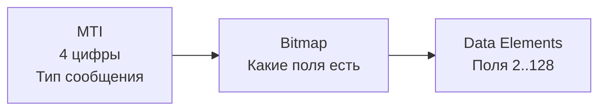
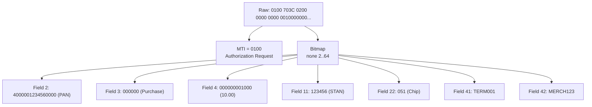

:::info TL;DR
Платёжные протоколы — форматы сообщений, которыми обмениваются участники платёжного рынка. Аналитик должен уметь читать спецификацию протокола, понимать обязательные и опциональные поля, знать, как транзакция «упаковывается» в сообщение. Основные: ISO 8583 (карточные транзакции), ISO 20022 (новый стандарт платежей), SWIFT MT/MX (межбанковские сообщения), SEPA (европейские платёжные схемы).
:::

## Для кого эта статья

- Senior SA, работающий с платёжными интеграциями
- SA, которому предстоит certification с платёжной системой
- Разработчик, реализующий платёжные протоколы

После прочтения вы:
- Поймёте структуру ISO 8583 и ISO 20022 сообщений
- Узнаете разницу между SWIFT MT и MX
- Сможете составить mapping полей вашей системы на протокол

## ISO 8583 — стандарт карточных транзакций

Старый (1987), но всё ещё основной протокол для ATM и POS-транзакций. Используется Visa, Mastercard, МИР, НСПК.

### Структура сообщения



**MTI (Message Type Identifier):**

**Data Elements (ключевые поля):**

| Поле | Название | Пример |
|------|----------|--------|
| 2 | PAN (номер карты) | `4000001234560000` |
| 3 | Processing Code | `000000` (покупка) |
| 4 | Amount Transaction | `000000010000` (100.00 RUB) |
| 7 | Transmission Date/Time | `0115123000` |
| 11 | Systems Trace Audit Number | `123456` |
| 12 | Local Time | `123000` |
| 22 | POS Entry Mode | `051` (chip) |
| 35 | Track 2 Data | `4000001234560000=25121210000000000` |
| 37 | Retrieval Reference Number | `123456789012` |
| 38 | Authorization Code | `A12345` |
| 39 | Response Code | `00` (approved) |
| 41 | Terminal ID | `TERM001` |
| 42 | Merchant ID | `MERCH123` |
| 48 | Additional Data | CVV result, 3DS data |
| 63 | Private/Reserved | Свои поля банка |

**Для аналитика:** понимать, какие поля обязательны для конкретного типа транзакции — без этого не пройти certification с платёжной системой.

### Пример сообщения (raw → decoded)



## ISO 20022 — стандарт нового поколения

ISO 20022 — XML-based стандарт, заменяющий ISO 8583 и SWIFT MT. Глобальная миграция: SWIFT завершит переход к 2025, Fedwire и SEPA уже перешли.

### Ключевые отличия от ISO 8583

| Критерий | ISO 8583 | ISO 20022 |
|----------|---------|-----------|
| Формат | Бинарный, фиксированные поля | XML, человекочитаемый |
| Гибкость | Фиксированный набор полей | Расширяемая схема |
| Rich data | Ограничен | Подробная информация о плательщике/получателе |
| Миграция | Устаревает | Стандарт для новых систем |

### Пример ISO 20022 сообщения (pain.001 — платеж)

```xml
<Document xmlns="urn:iso:std:iso:20022:tech:xsd:pain.001.001.11">
  <CstmrCdtTrfInitn>
    <GrpHdr>
      <MsgId>MSG-2025-01-15-001</MsgId>
      <CreDtTm>2025-01-15T10:30:00Z</CreDtTm>
      <NbOfTxs>1</NbOfTxs>
      <CtrlSum>100.00</CtrlSum>
      <InitgPty>
        <Nm>ООО Ромашка</Nm>
      </InitgPty>
    </GrpHdr>
    <PmtInf>
      <PmtMtd>TRF</PmtMtd>
      <ReqdExctnDt>2025-01-15</ReqdExctnDt>
      <Dbtr>
        <Nm>ООО Ромашка</Nm>
        <Acct><Id><IBAN>RU1234567890</IBAN></Id></Acct>
      </Dbtr>
      <CdtTrfTxInf>
        <Amt><InstdAmt Ccy="RUB">100.00</InstdAmt></Amt>
        <Cdtr>
          <Nm>ИП Иванов</Nm>
          <Acct><Id><IBAN>RU0987654321</IBAN></Id></Acct>
        </Cdtr>
        <RmtInf><Ustrd>Оплата по договору №1</Ustrd></RmtInf>
      </CdtTrfTxInf>
    </PmtInf>
  </CstmrCdtTrfInitn>
</Document>
```

**Типы ISO 20022 сообщений:**
- `pain.001` — Customer Credit Transfer Initiation (клиент инициирует платёж)
- `pain.002` — Customer Payment Status Report (статус)
- `pacs.008` — FIToFICustomerCreditTransfer (межбанковский перевод)
- `pacs.002` — FIToFIPaymentStatusReport (статус межбанка)
- `camt.053` — BankToCustomerStatement (выписка)
- `camt.054` — BankToCustomerDebitCreditNotification (уведомление об операции)

**Для аналитика:** знать, какие message types нужны для проекта, какие поля обязательны, как маппить данные из своей системы в XML-схему.

## SWIFT — межбанковские сообщения

SWIFT (Society for Worldwide Interbank Financial Telecommunication) — глобальная сеть для межбанковских сообщений.

**MT (Message Type) — legacy формат:**
- `MT103` — Customer Transfer (клиентский перевод)
- `MT202` — Bank Transfer (межбанковский перевод)
- `MT940` — Statement (выписка)
- `MT950` — (устаревшая выписка)
- `MTn9x` — Chargebacks (споры)

**MX (ISO 20022) — новый формат:**
- `pacs.008` вместо MT103
- `camt.053` вместо MT940

### Пример MT103

```
{1:F01BANKBEBBAXXX0000000000}
{2:O1031000150125BANKDEFFXXXX00000000001501251000N}
{4:
:20:REF-123456              (Reference)
:23B:CRED                   (Bank Operation Code)
:32A:250115RUB1000,00       (Value Date, Currency, Amount)
:50K:/1234567890             (Ordering Customer)
ООО Ромашка
Москва, РФ
:59:/0987654321              (Beneficiary Customer)
ИП Иванов
:70:/INV/Invoice №123        (Remittance Info)
:71A:SHA                     (Charge: shared)
-}
```

**Для аналитика:** понимать разницу MT vs MX, знать поля обязательные для конкретного message type, уметь маппить поля своей системы на SWIFT-формат.

## SEPA — Single Euro Payments Area

Европейская платёжная зона: стандартизированные платежи в евро.

### Схемы SEPA

| Схема | Описание | Время |
|-------|----------|-------|
| **SCT** (SEPA Credit Transfer) | Обычный перевод | T+1 |
| **SCT Inst** (Instant) | Мгновенный перевод | < 10 сек, 24/7 |
| **SDD** (SEPA Direct Debit) | Прямой дебет (подписки) | D-14 (уведомление) |
| **SDD Core** | Базовый прямой дебет | Для всех клиентов |
| **SDD B2B** | Для бизнеса | Без права возврата |

**Формат:** все SEPA-сообщения — XML по ISO 20022.

**Для аналитика:** SEPA — пример success story стандартизации. Аналитик должен знать, что если система работает с евро-платежами — она должна поддерживать SEPA-форматы и схемы.

## Практический кейс: Миграция с MT103 на pacs.008

**Проблема:** Российский банк (corporate banking) отправляет международные платежи через SWIFT MT103. SWIFT объявил о прекращении поддержки MT к 2025 году. Банку нужно мигрировать на ISO 20022 (MX). В портфеле: 50 000 MT103-сообщений/месяц, 20+ стран-корреспондентов.

**Анализ:**
- MT103: 30 полей, из них 12 обязательных, 18 опциональных
- pacs.008 (ISO 20022): 80+ полей, XML-схема, строгая типизация
- Маппинг: не 1:1 — в pacs.008 появились новые обязательные поля (Ultimate Debtor, Ultimate Creditor, Purpose Code)
- 30% MT103-сообщений содержали данные только в полях Free Text (неструктурированные данные)
- У legacy-системы нет API — генерация MT103 через flat file + FTP

**Решение:**
1. Разработка middleware-слоя (Translation Engine) для конвертации MT → MX
2. Доработка core banking: добавление полей Ultimate Debtor/Creditor
3. Внедрение ISO 20022 validator (XML Schema + бизнес-правила)
4. Этапный rollout: сначала pacs.008 для EU-корреспондентов, затем для остальных
5. Parallel run: 3 месяца — отправка дублирующих сообщений (MT + MX)

**Результат:**
- Миграция за 9 месяцев (до дедлайна SWIFT)
- 98% сообщений проходят валидацию ISO 20022 с первой попытки
- Структурированность данных: с 70% до 95% (снижение Free Text)
- Parallel run: 0 расхождений между MT и MX
- Стоимость проекта: 35 млн ₽

## Как аналитик работает с протоколами

1. **Определить, какие протоколы нужны** — зависит от участников (Visa, SWIFT, локальная платёжная система)
2. **Найти спецификацию** — ISO документы, SWIFT Implementation Guidelines
3. **Составить mapping** — какие поля вашей системы → какие поля протокола
4. **Определить обязательные поля** — без них certification не пройти
5. **Специфицировать обработку ошибок** — что пришло в ответе, как повторять, какие коды ошибок

## Ключевые термины

- **ISO 8583** — протокол карточных транзакций (бинарный, устаревает)
- **ISO 20022** — универсальный платёжный стандарт (XML)
- **MT** — Message Type, SWIFT legacy формат
- **MX** — ISO 20022-совместимый SWIFT формат
- **MTI** — Message Type Identifier (ISO 8583)
- **SEPA** — единая европейская платёжная зона
- **SCT / SCT Inst** — SEPA Credit Transfer / Instant
- **Mapping** — сопоставление полей двух систем

## Что дальше

- [Сверка данных (reconciliation)](/docs/specialization/fintech-reconciliation) — как проверить, что деньги сошлись
- [Ledger и double-entry](/docs/specialization/fintech-ledger) — как устроен бухгалтерский учёт

## Проверь себя

1. **Чем ISO 20022 отличается от ISO 8583?**
   *Ответ:* ISO 8583 — бинарный, старый, фиксированные поля. ISO 20022 — XML, новый, расширяемая схема, rich data. Глобальная миграция с 8583 на 20022.

2. **Какой SWIFT MT используется для клиентского перевода?**
   *Ответ:* MT103 — Customer Transfer. Его замена в ISO 20022 — pacs.008.

3. **Что такое SCT Inst и чем он отличается от обычного SCT?**
   *Ответ:* SCT Inst (Instant) — мгновенный перевод до 10 секунд, 24/7/365. Обычный SCT — до T+1, только в рабочие дни.

4. **Что такое MTI в ISO 8583 и какие бывают типы?**
   *Ответ:* Message Type Identifier — 4 цифры, определяющие тип сообщения. Примеры: 0100 (Authorization Request), 0110 (Response), 0200 (Financial Request), 0400 (Reversal).

5. **Какие сообщения ISO 20022 нужны для клиентского перевода?**
   *Ответ:* pain.001 (клиент инициирует), pacs.008 (межбанковский перевод), camt.053 (выписка получателю).

## Ссылки для самостоятельного изучения

| Что | Описание | URL |
|-----|----------|-----|
| ISO 20022 Official | Стандарт платёжных сообщений | iso20022.org |
| SWIFT MT103 Guide | Описание полей MT103 | swift.com |
| ISO 8583 Specification | Документация протокола | iso8583.info |
| SEPA Schemes | Правила SEPA Credit Transfer | europeanpaymentscouncil.eu |
| Berlin Group NextGenPSD2 | Спецификация API | berlin-group.com
