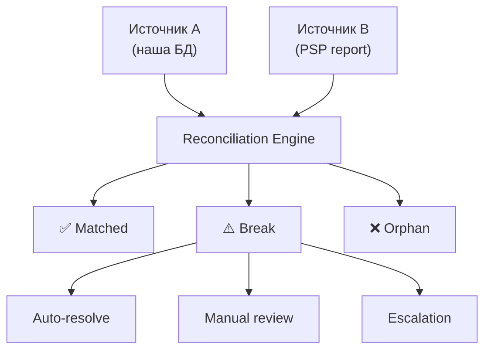

:::info TL;DR
Reconciliation (сверка) — процесс сравнения двух наборов данных, чтобы убедиться, что они совпадают. В FinTech: сверка платежей (наш лог vs отчёт платёжного шлюза), сверка проводок (ledger vs банковская выписка), сверка остатков. Аналитик специфицирует: правила matching, обработку break'ов, периодичность, SLA точности.
:::

## Для кого эта статья

- Middle/Senior SA, работающий с платёжными системами
- SA, которому предстоит проектировать сверку
- Аналитик, разбирающийся с break'ами в транзакциях

После прочтения вы:
- Поймёте, зачем нужна сверка и что сверять в FinTech
- Узнаете matching rules и типы break'ов
- Сможете специфицировать требования к reconciliation engine

## Зачем нужна сверка

Без сверки каждая ошибка — потеря денег:
- Платёж прошёл у нас, но не прошёл у PSP → клиент заплатил, деньги не пришли
- Платёж прошёл у PSP, но не у нас → нужно вернуть клиенту
- Двойное списание → chargeback, штраф
- Ошибка в комиссии → недополученная прибыль

**Требование ЦБ:** обязательная сверка остатков по счетам.

## Что сверять в FinTech

| Что сверяем | С чем сверяем | Периодичность |
|-------------|---------------|---------------|
| Транзакции в нашей БД | Отчёт платёжного шлюза (Stripe, Adyen) | Ежедневно |
| Остатки на счетах | Банковская выписка | Ежедневно |
| Проводки в ledger | Транзакции в operational БД | В реальном времени |
| Комиссии | Договор с PSP | Ежемесячно |
| Возвраты / chargebacks | Отчёт платёжной системы | Ежедневно |
| Баланс (дебет = кредит) | Ledger | Каждая транзакция |

## Как работает сверка

```
Источник A         Источник B
(наша БД)          (PSP report)
     │                  │
     ▼                  ▼
┌─────────────────────────┐
│     Reconciliation      │
│       Engine            │
│                         │
│  Matching (по ключу):   │
│  - exact match          │
│  - amount within допуск │
│  - частичный match      │
│  - не matched (break)   │
└─────────────────────────┘
     │
     ├── ✅ Matched
     ├── ⚠️ Break (не сошлось)
     └── ❌ Orphan (нет пары)
```



### Matching rules

**Exact match:** все поля совпадают (ID, сумма, дата, валюта, статус)

**Amount tolerance:** сумма совпадает с точностью до N копеек (для мультивалютных, курсовых разниц)

**Partial match:** несколько записей из источника A = одна в источнике B (агрегация)

**Time window:** транзакции могут быть в разных временных зонах, match по окну ± 1 день

## Типы break'ов

| Break | Причина | Действие |
|-------|---------|----------|
| **Missing in A** | В нашей БД нет, в PSP есть | Запрос к PSP, возможно необработанный callback |
| **Missing in B** | У нас есть, в PSP нет | Возможно наш duplicate, отменить / вернуть |
| **Amount mismatch** | Суммы разные | Проверить комиссии, курсы, округления |
| **Status mismatch** | У нас success, в PSP declined | Проверить логи, обновить статус |
| **Duplicate** | В одном источнике запись дублируется | Дедупликация |

### Что делать с break'ом

1. **Auto-resolve** — если известна причина (например, комиссия PSP)
2. **Manual review** — создаётся task на оператора
3. **Escalation** — если сумма > N, уведомляется руководитель
4. **SLA:** время разбора break'а — 24 часа для P0 (деньги)

## SLA сверки

| Параметр | Типовое значение |
|----------|-----------------|
| Периодичность | Ежедневно (EOD batch), для real-time — каждые 5 мин |
| Время сверки | < 1 час для 1 млн транзакций |
| Допустимый break rate | < 0.01% от транзакций |
| Время разрешения break'а | 24 часа для P0, 72 часа для P1 |
| Retention отчётов сверки | 3 года |

## Инструменты для сверки

| Уровень | Инструмент | Когда |
|---------|-----------|-------|
| **ETL** | Airflow, dbt | Периодическая загрузка данных для сверки |
| **Database** | SQL (JOIN, EXCEPT) | Простая сверка небольших объёмов |
| **Dedicated** | Norkon, Xceptor, собственный engine | Enterprise-объёмы, сложные правила |
| **ML** | Аномалии в транзакциях | Дополнительно к точному matching |

## Практический кейс: Сверка 1 млн транзакций в P2P-сервисе

**Проблема:** P2P-платёжный сервис (3 млн пользователей, 1 млн транзакций/день) растерял 15 млн ₽ за квартал. Бухгалтерия не может свести данные: транзакции есть в БД, но часть не прошла через PSP, часть прошла дважды. Источников данных — 5 (Stripe, Adyen, SberPay, T-Bank, ЮMoney).

**Анализ:**
- Ручная сверка: 3 бухгалтера, 5 дней в конце месяца
- Matching key: только ID транзакции (в PSP — свой reference)
- Нет tolerance для комиссий: платежи расходятся на 1-3 копейки → 15 000+ break'ов/день
- Нет дедупликации: повторный callback от PSP создаёт duplicate
- Time window: транзакция вечером 23:59 — в отчёте PSP уже на следующий день

**Решение:**
1. Внедрение reconciliation engine на базе Airflow + PostgreSQL
2. Matching по composite key: сумма + дата + ID мерчанта
3. Tolerance ± 0.02 для сумм (покрывает комиссии PSP)
4. Time window ± 24 часа
5. Auto-resolve: duplicate (оставить одну запись), amount tolerance (списать на комиссию)
6. Dashboard для бухгалтеров: break'ы по категориям, SLA

**Результат:**
- Время сверки: 5 дней → 4 часа (автоматизация)
- Break rate: 15 000/день → 50/день (0.005%)
- Потери: 15 млн ₽/квартал → 0 (break'ы разрешаются за 24 часа)
- Бухгалтеры: с рутины на анализ (3 → 1 человек)
- Стоимость проекта: 8 млн ₽, окупаемость: 3 месяца

## Как специфицировать сверку

При проектировании системы аналитик должен определить:

```yaml
Reconciliation Requirements:
  Sources:
    - Наша БД: таблица payments, поля id, amount, status, psp_ref
    - PSP: CSV-отчёт, поля ref, sum, status, fee
  Matching Key:
    - psp_ref (наш ID в системе PSP)
  Rules:
    - exact: id, amount, status
    - tolerance: amount ± 0.01 (для курсовых разниц)
    - time_window: ± 1 день
  Actions:
    - matched: пометить как reconciled
    - break: создать тикет в Jira
    - orphan: запустить ad-hoc запрос к PSP API
  SLA:
    - batch: daily at 03:00
    - completion: < 30 min
    - break resolution: 24h
```

## Ключевые термины

- **Reconciliation** — сверка, сравнение двух источников данных
- **Matching** — поиск соответствия записей по ключу
- **Break** — расхождение, запись без пары или с несовпадающими полями
- **Orphan** — запись из источника A без пары в источнике B
- **Tolerance** — допустимое отклонение суммы (для курсов, комиссий)
- **Auto-resolve** — автоматическое разрешение break'а
- **Settlement report** — отчёт платёжной системы для сверки

## Что дальше

- [Ledger и double-entry](/docs/specialization/fintech-ledger) — как устроены проводки
- [Платёжные системы](/docs/specialization/fintech-payments) — транзакции, которые сверяем
- [ETL](/docs/data/etl-basics) — как загружать данные для сверки

## Проверь себя

1. **Какие бывают типы break'ов при сверке?**
   *Ответ:* Missing in A (нет у нас, есть у PSP), Missing in B (есть у нас, нет у PSP), Amount mismatch, Status mismatch, Duplicate.

2. **Что такое tolerance в сверке и зачем он нужен?**
   *Ответ:* Допустимое отклонение суммы, например ±0.01. Нужен для комиссий, курсовых разниц, округлений.

3. **Какие SLA типичны для сверки?**
   *Ответ:* Batch раз в день, завершение < 30 мин, break rate < 0.01%, разрешение break'а за 24 часа (P0).

4. **Что такое orphan в сверке?**
   *Ответ:* Запись из одного источника, у которой нет пары в другом. Например, транзакция есть в нашей БД, но отсутствует в отчёте PSP.

5. **Какие matching rules бывают в сверке?**
   *Ответ:* Exact match (все поля совпадают), Amount tolerance (сумма ± допуск), Partial match (несколько записей = одна), Time window (окно ± 1 день).

## Ссылки для самостоятельного изучения

| Что | Описание | URL |
|-----|----------|-----|
| Stripe Reconciliation | Документация сверки Stripe | stripe.com/docs/reconciliation |
| Adyen Settlement Reports | Формат отчётов Adyen | docs.adyen.com |
| Airflow — Data Pipeline | Оркестрация ETL для сверки | airflow.apache.org |
| Norkon — Reconciliation Platform | Enterprise-решение для сверки | norkon.com |
| ISO 20022 — pacs.002 | Статус-сообщение для сверки | iso20022.org
