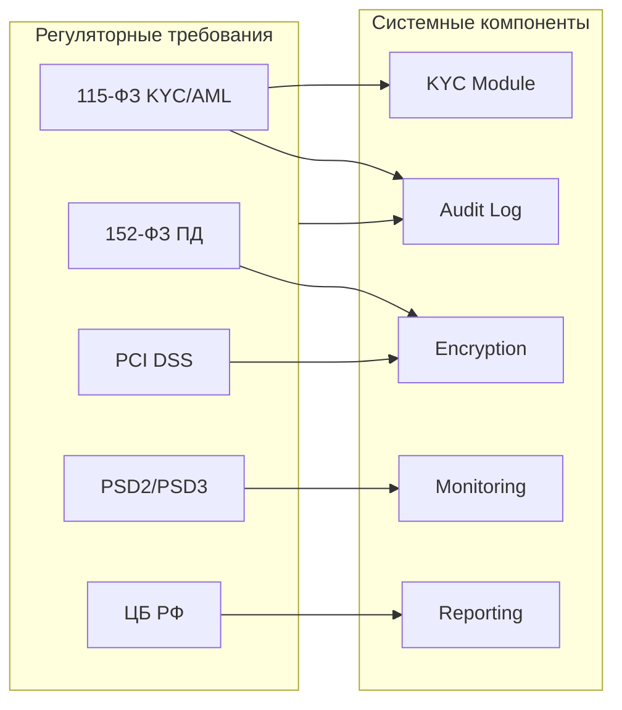

:::info TL;DR
FinTech — самая регулируемая отрасль IT. Аналитик должен знать ключевые регуляторные требования и то, как они влияют на архитектуру системы. Основные: KYC/AML (115-ФЗ), 152-ФЗ (персональные данные), PCI DSS (карточные данные), PSD2/PSD3 (Open Banking, SCA), требования ЦБ РФ к отчётности. Compliance-требования — не «бумажная работа», а конкретные технические решения: traceability matrix, audit trails, маскирование данных, encryption.
:::

## Для кого эта статья

- Middle/Senior SA, работающий в FinTech
- SA, переходящий в проект с compliance-требованиями
- Архитектор, проектирующий систему под регуляторные требования

После прочтения вы:
- Узнаете ключевые регуляторные требования (115-ФЗ, 152-ФЗ, PCI DSS, PSD2)
- Поймёте, как compliance влияет на архитектуру системы
- Сможете составить чек-лист регуляторных требований для проекта

## KYC / AML — против легализации доходов

**KYC (Know Your Customer)** — идентификация клиента перед оказанием услуг.
**AML (Anti-Money Laundering)** — меры против отмывания денег.
**В РФ:** 115-ФЗ «О противодействии легализации доходов, полученных преступным путём».

### Что должен делать аналитик

При спецификации системы учесть:

| Требование | Реализация в системе |
|------------|---------------------|
| Идентификация клиента | Сбор паспортных данных, ИНН, СНИЛС, проверка по спискам |
| Проверка по спискам экстремистов | Интеграция с ЦБ / Росфинмониторинг |
| Мониторинг операций | Правила: > 600 000 ₽ → обязательный контроль (ст.6 115-ФЗ) |
| Подозрительные операции | Блокировка, уведомление Росфинмониторинг |
| Хранение данных | Данные идентификации — 5 лет |
| Отказ в обслуживании | Если клиент не прошёл идентификацию |

### Как это влияет на систему

```yaml
Функциональные требования:
  - Модуль идентификации: сбор документов, верификация
  - Модуль AML-скрининга: проверка по спискам
  - Модуль мониторинга операций: правила для > 600k ₽
  - Модуль отчётности: формирование сообщений в Росфинмониторинг

Нефункциональные требования:
  - Время проверки: < 30 сек (транзакция ждёт)
  - Retention: 5 лет для данных идентификации
  - Audit: все действия с клиентом логируются
  - Security: данные KYC — PII, encryption at rest
```

## 152-ФЗ — персональные данные

| Требование | Реализация |
|------------|-----------|
| Согласие на обработку ПД | UI: чекбокс + запись согласия |
| Цель обработки | Нельзя использовать ПД не по назначению |
| Хранение в РФ | Серверы на территории РФ (152-ФЗ, 242-ФЗ) |
| Уведомление Роскомнадзора | До начала обработки ПД |
| Удаление по требованию | API для удаления данных пользователя |

## PCI DSS — безопасность карточных данных

**PCI DSS (Payment Card Industry Data Security Standard)** — 12 требований для всех, кто работает с картами.

### Уровни соответствия

| Уровень | Транзакций в год | Требования |
|---------|-----------------|-----------|
| 1 | > 6 млн | SAQ D + ROC + QSA-аудит |
| 2 | 1–6 млн | SAQ D + QSA |
| 3 | 20k–1 млн | SAQ B/IP |
| 4 | < 20k | SAQ A |

### Что означает PCI DSS для архитектуры

```
Критическое требование: НЕ хранить CVV и полный PAN.

✅ Можно хранить:     ❌ Нельзя хранить:
- PAN в зашифрованном  - CVV (код с обратной стороны)
  виде (AES-256)       - Магнитная полоса
- Последние 4 цифры    - PIN-код
- Токен (замена PAN)
- Срок действия карты
```

**12 требований PCI DSS (сгруппированно):**
1. **Build and Maintain a Secure Network** — firewall, secure config
2. **Protect Cardholder Data** — encrypt PAN at rest/in transit, не хранить CVV
3. **Maintain a Vulnerability Management Program** — антивирусы, patches, secure coding
4. **Implement Strong Access Control** — минимум прав, уникальные ID, физическая безопасность
5. **Regularly Monitor and Test Networks** — logging, monitoring, регулярные тесты
6. **Maintain an Information Security Policy** — политика безопасности

**Для аналитика:** специфицировать, где в системе хранятся данные карт, какие поля маскируются, кто имеет доступ, как настроено шифрование.

## PSD2 / PSD3 — Open Banking

**PSD2 (Payment Services Directive 2)** — европейская директива, требующая от банков открыть API третьим сторонам.

**Ключевые требования:**
- **SCA (Strong Customer Authentication)** — 2-factor для всех электронных платежей
- **AISP (Account Information Service Provider)** — доступ к данным счета (через API)
- **PISP (Payment Initiation Service Provider)** — инициация платежа от имени клиента
- **Open Banking API** — стандартизированные эндпоинты (Berlin Group, UK Standard)

### SCA — что это значит для UX

```
Платеж > 30 EUR → нужна SCA
  ↓
Запрос: введите одноразовый код из SMS / подтвердите в приложении банка
  ↓
Без SCA: платёж может быть оспорен (liability shift на продавца)
```

[Подробнее в статье Open Banking](/docs/specialization/fintech-open-banking)

## Требования ЦБ РФ

ЦБ РФ требует от банков и финансовых организаций:

1. **Формы отчётности** — регулярная отправка данных о транзакциях (формы 0409701, 0409155 и др.)
2. **Правила внутреннего контроля** — ПВК по 115-ФЗ
3. **Система управления рисками** — ИСУР (интегрированная система управления рисками)
4. **Обеспечение непрерывности** — БС (бесперебойность функционирования)
5. **Защита информации** — стандарты ЦБ (ГОСТ-шифрование, СЗИ)

### Как это влияет на систему

| Требование ЦБ | Что нужно реализовать |
|--------------|---------------------|
| Отчётность | OLAP-куб / DWH для формирования отчётов |
| Бесперебойность | Аварийное восстановление (DRP), SLA 99.99% |
| Защита информации | Сертифицированные СКЗИ (КриптоПро, VipNet) |
| Аудит | Полный audit trail всех операций |

## Compliance как требования: шаблон спецификации



При описании регуляторных требований аналитик использует чек-лист:

| Вопрос | Да/Нет | Детали |
|--------|--------|--------|
| Система работает с карточными данными? | | → PCI DSS |
| Система работает с ПД граждан РФ? | | → 152-ФЗ, хранение в РФ |
| Система проводит платежи? | | → 115-ФЗ, ЦБ |
| Система работает в EU/UK? | | → PSD2, Open Banking |
| Нужен аудит для регулятора? | | → Traceability, logging |
| Есть ограничения по странам? | | → Хранение данных, encryption |

## Практический кейс: PCI DSS compliance для мобильного приложения

**Проблема:** FinTech-стартап (мобильное приложение для переводов, 1 млн пользователей) получил уведомление от Visa: «Ваш уровень PCI DSS — не соответствует, срок устранения — 90 дней, иначе штраф $50K/мес и отключение». Аналитики не закладывали compliance с первого дня.

**Анализ:**
- CVV-коды хранились в логах (plain text) — прямое нарушение PCI DSS req 3.2
- PAN сохранялся в БД без токенизации — req 3.4
- Доступ к данным карт был у 20+ разработчиков — req 7
- Нет шифрования на уровне диска — req 3.4
- SAQ-D за предыдущий год — не заполнен

**Решение:**
1. Токенизация: внедрение стороннего token vault (VGS / Basis Theory) — PAN хранится только в vault
2. Очистка логов: удаление CVV и PAN из логов, masking (show_last_4)
3. Разграничение доступа: шифрование ключей, model RBAC для данных карт
4. Шифрование дисков: AWS EBS encryption для всех volumes
5. Внедрение SAQ-D процесса: автоматическая генерация отчётов, ежеквартальный аудит

**Результат:**
- PCI DSS SAQ-D пройден за 60 дней (30 дней до дедлайна)
- Штраф избегнут ($50K/мес)
- Токенизация: 100% PAN заменён на токены (кроме последних 4 цифр)
- Доступ: 20+ → 3 инженера
- Стоимость проекта: 8 млн ₽, ROI: избежание штрафа $600K/год + репутационные риски

## Ключевые термины

- **KYC** — идентификация клиента
- **AML** — противодействие отмыванию
- **115-ФЗ** — закон о ПОД/ФТ в РФ
- **152-ФЗ** — закон о персональных данных
- **PCI DSS** — стандарт безопасности карточных данных
- **PSD2** — директива EU об Open Banking
- **SCA** — сильная аутентификация клиента
- **ЦБ РФ** — Центральный Банк Российской Федерации

## Что дальше

- [Open Banking / PSD2](/docs/specialization/fintech-open-banking) — API, Berlin Group, consent management
- [Фрод-мониторинг](/docs/specialization/fintech-fraud) — антифрод-системы под требования 115-ФЗ
- [Трассировка требований](/docs/requirements/traceability) — как связать требования и реализацию для аудитора

## Проверь себя

1. **Что такое 115-ФЗ и какие требования он предъявляет к системе?**
   *Ответ:* Закон о ПОД/ФТ. Требует идентификацию клиентов (KYC), мониторинг операций > 600k ₽, проверку по спискам экстремистов, хранение данных 5 лет.

2. **Какие данные карты НЕЛЬЗЯ хранить по PCI DSS?**
   *Ответ:* CVV, магнитную полосу, PIN-код. PAN можно только в зашифрованном виде или токенизированным.

3. **Что такое SCA в PSD2?**
   *Ответ:* Strong Customer Authentication — двухфакторная аутентификация для всех электронных платежей > 30 EUR. Реализуется через OTP SMS, подтверждение в приложении банка, биометрию.

4. **Какие 12 требований PCI DSS делятся на какие группы?**
   *Ответ:* 6 групп: 1) Защита сети, 2) Защита данных держателей карт, 3) Управление уязвимостями, 4) Контроль доступа, 5) Мониторинг и тестирование, 6) Политика безопасности.

5. **Что такое liability shift в контексте PSD2 и SCA?**
   *Ответ:* Если мерчант не запросил SCA там, где это требуется (платёж > 30 EUR), ответственность за chargeback переходит на мерчанта. Если SCA была — на эмитента.

## Ссылки для самостоятельного изучения

| Что | Описание | URL |
|-----|----------|-----|
| 115-ФЗ (ПОД/ФТ) | Полный текст закона | consultant.ru |
| PCI DSS v4.0 | Стандарт безопасности карточных данных | pcisecuritystandards.org |
| PSD2 Directive (EU) | Официальный текст директивы | eur-lex.europa.eu |
| Berlin Group API | Спецификация Open Banking | berlin-group.com |
| ЦБ РФ — стандарты | Требования к защите информации | cbr.ru
