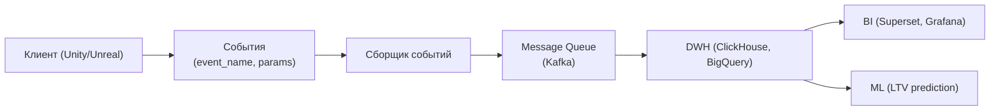
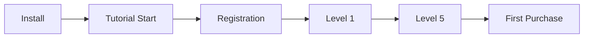

:::info[TL;DR]
Game Analytics — трекинг событий (event tracking), построение воронок, анализ метрик (retention, ARPU, LTV) и A/B тесты. Аналитик проектирует схему событий, дашборды и пайплайн данных (клиент → сервер → DWH → BI).
:::

## Пайплайн Game Analytics

## Типы событий

| Категория | Событие | Пример параметров |
|-----------|---------|-------------------|
| **Onboarding** | `tutorial_start`, `tutorial_step`, `tutorial_complete` | step_id, time |
| **Gameplay** | `level_start`, `level_complete`, `match_end` | level, score, result |
| **Economy** | `currency_spend`, `currency_earn`, `item_purchase` | currency, amount, item |
| **Monetization** | `iap_purchase`, `ad_watch`, `subscription_start` | product_id, price |
| **Social** | `friend_add`, `guild_join`, `invite_sent` | target_id |
| **LiveOps** | `event_start`, `event_reward`, `battlepass_level` | event_id, tier |

## Воронка (Funnel)

## Что дальше

Вернитесь к началу: [GameDev — путь аналитика](/docs/specialization/gamedev-path)

## Проверь себя

1. **Как устроен пайплайн Game Analytics?**
   *Ответ:* Клиент → События → Очередь → DWH → BI / ML.

2. **Какие категории событий трекаются в играх?**
   *Ответ:* Onboarding, Gameplay, Economy, Monetization, Social, LiveOps.
