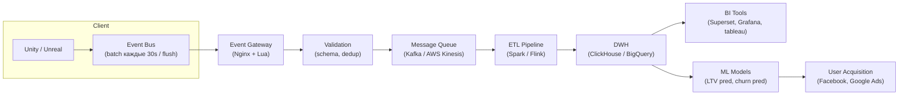
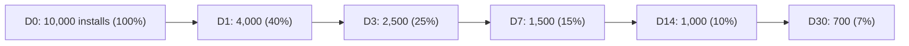
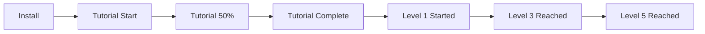
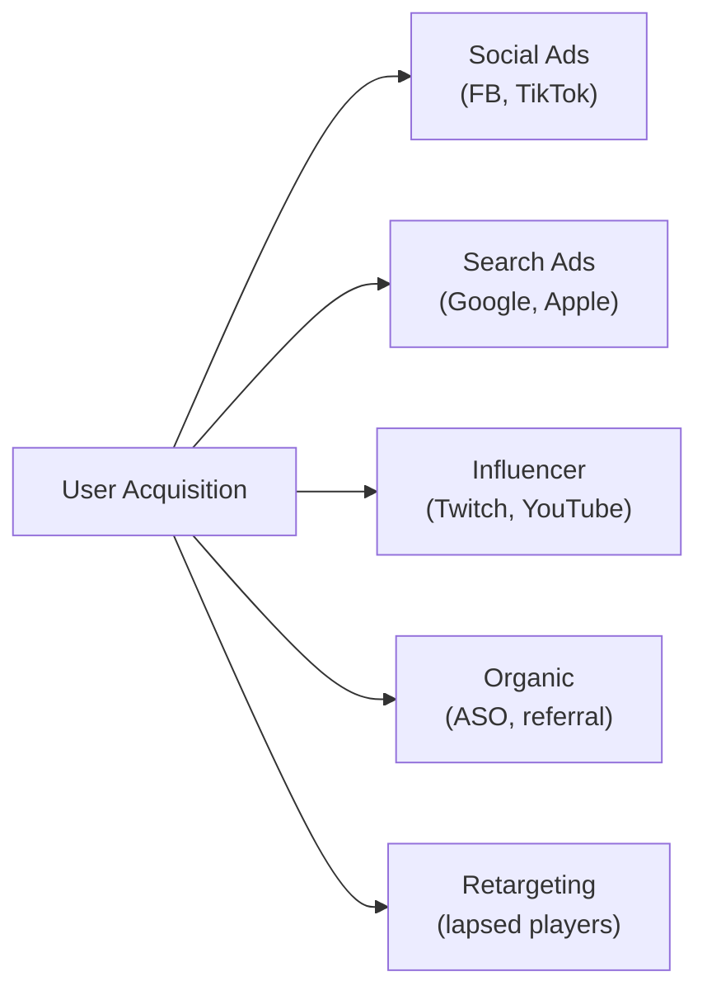

:::info[TL;DR]
Game Analytics — фундамент всех решений в играх. Трекинг событий (event tracking), построение воронок (funnel), анализ метрик (retention, ARPU, LTV) и A/B тесты. Аналитик проектирует схему событий, дашборды и пайплайн данных (клиент → сервер → DWH → BI). Без аналитики игры слепы: нельзя понять, почему игроки уходят, где они застревают и что приносит деньги. В GameDev аналитика — не «поддержка», а движущая сила продукта.
:::

## Для кого эта статья

Senior SA, который хочет строить аналитику в играх с нуля. После прочтения вы:

- Поймёте, как устроен event-driven пайплайн Game Analytics
- Сможете спроектировать схему событий для любой игры
- Научитесь строить когортный анализ retention и прогнозировать LTV
- Узнаете, как проводить A/B тесты в играх и не ошибиться в интерпретации
- Поймёте, чем game analytics отличается от enterprise BI

## 1. Пайплайн Game Analytics



**Отличие от Enterprise BI:**
- В enterprise — транзакции раз в день. В играх — миллионы событий в минуту
- В enterprise — точность до копейки. В играх — допускается loss rate < 1%
- В enterprise — отчёты на следующий день. В играх — real-time дашборды (live ops)

**PaaS решения:** Firebase Analytics (бесплатно), Unity Analytics, Amplitude, Mixpanel, Adjust, Appsflyer (для mobile).

## 2. Схема событий (Event Taxonomy)

Событие — атомарная единица аналитики. Каждое действие игрока — событие.

### Структура события

```json
{
  "event_name": "level_complete",
  "event_id": "abc123",
  "timestamp": 1712345678000,
  "player_id": "player_123456",
  "session_id": "session_789",
  "platform": "ios",
  "version": "2.5.1",
  "params": {
    "level_id": 15,
    "time_spent_sec": 120,
    "score": 4500,
    "stars": 3,
    "death_count": 2,
    "items_used": ["shield", "speed_boost"],
    "is_first_attempt": true
  }
}
```

**Правила именования:** `snake_case` (или `camelCase`, единообразно), иерархия: `domain_action` (например, `level_start`, `level_complete`, `item_purchase`).

### Категории событий

| Категория | События | Параметры |
|-----------|---------|-----------|
| **Onboarding** | `tutorial_start`, `tutorial_step_{n}`, `tutorial_complete`, `tutorial_skip` | step_id, time, player_level |
| **Gameplay** | `level_start`, `level_complete`, `level_restart`, `match_end`, `death` | level_id, score, result (win/loss), time, difficulty |
| **Economy** | `currency_earn`, `currency_spend`, `item_craft`, `item_upgrade` | currency_type, amount, source (battle/store/event), sink |
| **Monetization** | `iap_purchase`, `ad_watch_start`, `ad_watch_complete`, `subscription_start`, `subscription_renew` | product_id, price (USD), currency (gems/gold), revenue_type |
| **Social** | `friend_add`, `friend_remove`, `guild_join`, `guild_leave`, `invite_sent`, `invite_accepted` | target_id, guild_id, method |
| **LiveOps** | `event_start`, `event_progress`, `event_reward_claim`, `battlepass_level_up`, `battlepass_purchase` | event_id, tier, reward_type, offer_id |
| **Performance** | `app_crash`, `app_loading_time`, `network_latency`, `frame_rate_drop` | error_code, time_ms, fps |

### Типичные ошибки event tracking

| Ошибка | Почему плохо | Как правильно |
|--------|-------------|---------------|
| Нет event_id | Нельзя дедуплицировать | UUID для каждого события |
| Разный формат дат | Путаница | Всегда Unix timestamp ms |
| Параметры в camelCase и snake_case | Нельзя агрегировать | Единый стиль |
| Не трекаем source currency | Непонятно, откуда пришла валюта | source, sink — обязательны |
| События только на клиенте | Потеря при офлайне | Server-side tracking для критичных (IAP) |

## 3. Retention: когортный анализ

Retention — процент игроков, вернувшихся в игру на N-й день после установки.



**Когортная таблица retention (пример):**

| Когорта (неделя установки) | D0 | D1 | D7 | D14 | D30 |
|---------------------------|----|-----|------|-------|------|
| W1 (Jan 1-7) | 10,000 | 38% | 14% | 9% | 6% |
| W2 (Jan 8-14) | 12,000 | 41% | 16% | 11% | 8% |
| W3 (Jan 15-21) | 11,000 | 40% | 15% | 10% | 7% |
| W4 (Jan 22-28) | 14,000 | 42% | 17% | 12% | 9% |

**Нормы retention по жанрам (2024 данные):**

| Жанр | D1 | D7 | D30 |
|------|------|-------|-------|
| Hyper-casual | 25–35% | 5–10% | 2–5% |
| Casual (match-3) | 35–45% | 15–20% | 8–12% |
| Mid-core (strategy, RPG) | 40–50% | 20–30% | 10–15% |
| Hard-core (MMO, shooter) | 50–60% | 25–35% | 15–20% |
| Social (Party Royale) | 45–55% | 20–30% | 10–15% |

### Что влияет на retention

| Фактор | Влияние | Как улучшить |
|--------|---------|-------------|
| **Tutorial quality** | D1 +- 10% | Не длиннее 3 минут, сразу в геймплей |
| **First-time UX** | D1 +- 15% | Первый опыт — «вау», награда сразу |
| **Loading time** | D1 -3% за каждую сек >5 | Оптимизация ассетов |
| **Social features** | D30 +10-20% | Friends, clans, gifting |
| **Push notifications** | D7 +5-10% | Не чаще 2/день, персонализация |
| **Game balance** | D7 +-10% | Не слишком лёгко, не слишком сложно |

## 4. Воронки (Funnels)

Воронка показывает, где игроки отваливаются.

### Воронка онбординга



**Пример с цифрами:**

| Шаг | Игроков | Conversion | Drop-off |
|-----|---------|------------|----------|
| Install | 100,000 | 100% | — |
| Tutorial start | 85,000 | 85% | 15% |
| Tutorial 50% | 60,000 | 60% | 29% |
| Tutorial complete | 50,000 | 50% | 17% |
| Level 1 | 48,000 | 48% | 4% |
| Level 3 | 30,000 | 30% | 38% |
| Level 5 | 20,000 | 20% | 33% |

**Анализ:** 50% отваливаются на туториале → туториал слишком длинный или скучный. Ещё 38% уходят после Level 1 → Level 2 слишком сложный или нет мотивации.

### Воронка монетизации

```
Install → Tutorial → Level 5 → First IAP → Second IAP → Regular spender
100K     50K        20K       2K           1.2K         500
100%     50%        20%       2%           1.2%         0.5%
```

**Ключевая метрика:** время до первой покупки (Days to Pay). Если > 14 дней — игрок может уже уйти.

## 5. A/B тестирование в играх

В играх A/B тесты сложнее, чем в web: когорты, долгие циклы, много метрик.

### Структура A/B теста

```
Гипотеза: «Увеличение стартовой энергии с 100 до 120 повысит D7 retention на 5%»

Контроль:      100 энергии (50% игроков)
Эксперимент:   120 энергии (50% игроков)

Длительность: 14 дней (для D7 данных + запас)
Размер:       по 50,000 игроков в каждой группе (для статистической значимости)

Метрики:
  Primary:  D7 retention
  Secondary: D14 retention, ARPU, ARPPU, conversion rate
  Guardrail: IAP revenue (не должен упасть)
```

### Типичные A/B тесты в играх

| Что тестируют | Как | Длительность |
|--------------|-----|-------------|
| **Economy params** | Energy regen time, gold per battle | 7–14 дней |
| **Price IAP** | $0.99 vs $1.99 for starter pack | 7–14 дней |
| **Onboarding flow** | Tutorial length, first impression | 14–21 день |
| **UI/Layout** | Button placement, store design | 7–14 дней |
| **Reward amounts** | Double rewards vs control | 7 дней |
| **Difficulty curve** | Enemy HP, spawn rate | 14–21 день |
| **Push notifications** | Frequency, content, timing | 14–28 дней |

### Ошибки A/B тестов в играх

1. **Слишком короткий тест.** Когорты разного качества (например, в пятницу приходят другие игроки). Минимум 7 дней.
2. **Игнорирование сезонности.** Рождество vs обычный вторник — несравнимы.
3. **Multiple testing без поправки.** 10 гипотез → одна «значима» случайно. Использовать Bonferroni correction или Benjamini-Hochberg.
4. **Только одна метрика.** Новый баланс может повысить retention, но убить revenue. Смотреть на все ключевые метрики.
5. **Не учитывать learning effect.** Игроки учатся — слабый баланс в начале может стать нормой.

## 6. LTV и UA-аналитика

### User Acquisition (UA)



**Ключевая метрика UA — ROAS (Return on Ad Spend):**

```
ROAS_D7 = Revenue_D7 / CPI
ROAS_D30 = Revenue_D30 / CPI

Цель: ROAS_D30 > 100% (окупляемость)
```

**Пример:**
- CPI = $0.50
- ARPU_D7 = $0.08
- ARPU_D30 = $0.35
- ROAS_D7 = 16% (плохо на D7, но рано)
- ROAS_D30 = 70%
- ROAS_D90 = 110% (ок, игра окупается за 3 месяца)

### LTV prediction: простой метод

**Method 1: Historical multiplier**
```
pLTV_D180 = ARPU_D1 × M
где M — мультипликатор от D1 к D180 (по историческим данным)
```

**Method 2: Retention-based**
```
LTV(t) = ARPU_D1 × ∑(Retention_Di × ARPU_per_session_Di)

Упрощённо:
pLTV_180 = ARPU_D1 × D1_value_multiplier + ARPU_D7 × D7_value_multiplier + ...
```

**На практике:** используют ML-модели (XGBoost, Prophet) для предсказания LTV по первым 3–7 дням данных.

## 7. Дашборды Game Analyst

### Core Dashboard (ежедневный)

| Метрика | Значение | Изменение (WoW) |
|---------|----------|-----------------|
| DAU | 850,000 | +5% |
| MAU | 2.1M | +3% |
| New Users | 45,000 | -2% |
| Revenue | $120,000 | +8% |
| ARPU | $0.14 | +3% |
| D1 Retention | 42% | +1pp |
| D7 Retention | 18% | 0pp |
| D30 Retention | 9% | +0.5pp |

### Event Dashboard

| Ивент | Participants | Completion | Revenue | ARPU lift |
|-------|-------------|------------|---------|-----------|
| «Сбор сокровищ» | 320K (38%) | 85K (27%) | $45K | +12% |
| «Босс-рейд» | 250K (29%) | 120K (48%) | $38K | +8% |

### UA Dashboard

| Source | Spend | Installs | CPI | D1 Ret | ROAS_D7 | ROAS_D30 |
|--------|-------|----------|-----|--------|---------|----------|
| Facebook | $50K | 100K | $0.50 | 38% | 12% | 65% |
| TikTok | $30K | 75K | $0.40 | 42% | 15% | 80% |
| Google | $20K | 35K | $0.57 | 35% | 10% | 55% |

## 8. Кейс: Supercell — аналитика как культура

Supercell (Clash of Clans, Clash Royale, Brawl Stars) известна культовым подходом к аналитике:

**Принципы Supercell:**
1. **CEO смотрит retention D1/D7/D30 каждый день.** Без метрик не принимается ни одно решение.
2. **Каждый ивент — A/B тест.** Никогда не выпускают ивент без контроля. Сравнивают с предыдущим.
3. **Убивать проекты по метрикам.** Если D1 < 30%, D7 < 10% — проект закрывается, даже если команда вложила год.
4. **Sheets over slides.** Никто не ходит с презентациями — все данные в дашборде.
5. **Single source of truth.** Все метрики считаются одинаково (единая SQL-витрина).

**Пример:** Clash Royale перед запуском тестировала 5 разных моделей монетизации (IAP цены, сундуки, BP). Выбрали ту, где retention и revenue были максимальны — это заняло 3 месяца A/B тестов.

## Проверь себя

1. **Как устроен пайплайн Game Analytics?**
   *Ответ:* Клиент (события) → Event Gateway → Message Queue (Kafka) → ETL → DWH (ClickHouse) → BI / ML. Важно: loss rate < 1%, real-time для LiveOps.

2. **Какие категории событий трекаются в играх?**
   *Ответ:* Onboarding, Gameplay, Economy, Monetization, Social, LiveOps, Performance. Каждое событие имеет event_name, timestamp, player_id, session_id, params.

3. **Какой retention считается хорошим для casual игры?**
   *Ответ:* D1 = 35–45%, D7 = 15–20%, D30 = 8–12%. Hyper-casual — ниже, hard-core — выше.

4. **Как проводится A/B тест в игре и какие ошибки бывают?**
   *Ответ:* Контроль vs эксперимент, минимум 7–14 дней, primary + secondary + guardrail метрики. Ошибки: короткий тест, сезонность, multiple testing без поправки.

5. **Что такое ROAS и какая цель для окупаемости?**
   *Ответ:* Return on Ad Spend = Revenue от когорты / CPI. Цель: ROAS_D30 > 100% (игра окупает рекламные расходы за 30 дней).
