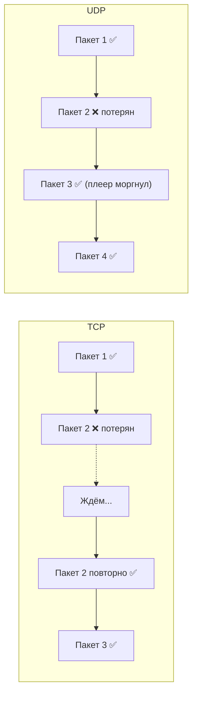
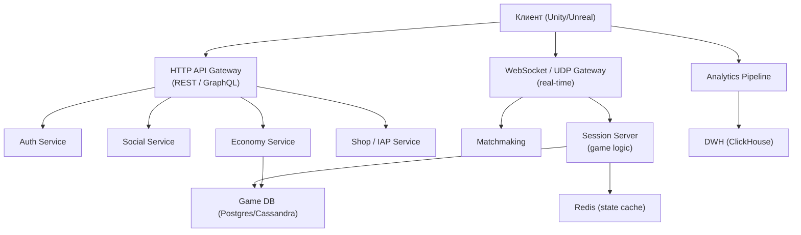
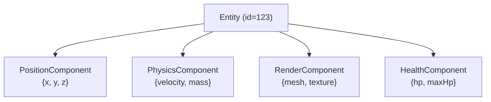

:::info[TL;DR]
Игровая архитектура принципиально отличается от Enterprise. Ключевые концепции: authoritative server (сервер принимает все решения), client-side prediction (клиент предсказывает, чтобы скрыть лаг), UDP вместо TCP (скорость важнее надёжности), Entity-Component pattern, state synchronization и rollback netcode для fighting/RTS игр. Аналитик должен понимать эти паттерны, чтобы проектировать API игрового бэкенда и специфицировать интеграции.
:::

## Для кого эта статья

Для Middle/Senior SA, которые хотят проектировать игровой бэкенд. К концу статьи вы:

- Поймёте, какая архитектура подходит для какого типа игр
- Узнаете, как работает authoritative server и почему он нужен
- Сможете проектировать API игрового бэкенда и специфицировать сессии

## 1. Типы игр по архитектуре

Выбор архитектуры зависит от типа игры:

| Тип игры | Требования к серверу | Синхронизация | Примеры |
|----------|---------------------|---------------|---------|
| **Single-player online** | Минимум — сохранения, лидерборды | Нет | Candy Crush, Township |
| **Async multiplayer** | База данных, очереди ходов | Через БД | Words with Friends, Clash of Clans |
| **Real-time PvP** | Выделенный сервер сессий, &lt;100ms | State sync + input | Clash Royale, Brawl Stars |
| **MMO / Open world** | Шардированный мир, 10K+ CCU | Interest management | WoW, Genshin Impact |
| **Battle Royale** | 100 игроков, dedicated servers | Full state sync | PUBG, Fortnite |
| **Fighting / Racing** | Rollback netcode, deterministic | Input sync | Street Fighter 6, Trackmania |
| **RTS** | Lockstep, deterministic | Command sync | StarCraft 2, Age of Empires |

## 2. Authoritative Server — почему это важно

В корпоративных приложениях сервер хранит данные, а клиент их отображает. В играх клиент тоже имеет логику — и это создаёт соблазн доверять клиенту. **Этого делать нельзя.**

**Authoritative server** = сервер принимает все ключевые решения и не доверяет клиенту:

| Что проверяет сервер | Зачем | Пример читерства |
|----------------------|-------|-----------------|
| Координаты игрока | Телепортация | Клиент шлёт «я в точке X=500,Y=300», а должен быть в X=50 |
| Здоровье/урон | Бессмертие | Клиент говорит «я не получил урон» |
| Экономика | Фарм валюты | Клиент шлёт «я заработал 1000 монет» за одно действие |
| Результат матча | Накрутка | Клиент шлёт «я победил» |

**На практике:** сервер пересчитывает всё сам. Клиент — только ввод (input). Сервер симулирует мир и рассылает результат.

```
Клиент:  "Я нажал D (вправо)"
Сервер:  "Ок, ты в X=12.5, шлю всем"
vs (читерский клиент):
Клиент:  "Я в X=999"
Сервер:  "Нет, ты у стены в X=12.5"
```

## 3. Синхронизация: State Sync vs Input Sync

### State Sync (состояние)

Сервер каждые 50–100ms шлёт полное состояние мира. Клиент отображает. Просто, но требует много трафика. Подходит для: гонки, казуальные PvP.

```
Каждый тик (10–20 раз/сек):
Сервер → Все: {players: [{id: 1, x:10, y:5, hp: 100}, {id: 2, x:12, y:3, hp: 80}]}
```

### Input Sync (ввод)

Игра детерминирована: все клиенты при одинаковом вводе получают одинаковый результат. Сервер только собирает и рассылает input'ы. Подходит для: RTS, fighting games (rollback netcode), симуляторы.

```
Каждый тик:
Игрок 1 → Сервер:  {move: D, attack: false}
Игрок 2 → Сервер:  {move: A, attack: true}
Сервер → Все:      {inputs: [...]} (рассылает всем)
Каждый клиент симулирует один и тот же мир → гарантированно одинаково
```

| Параметр | State Sync | Input Sync |
|----------|-----------|------------|
| Трафик | Большой | Маленький |
| Детерминизм | Не обязателен | Обязателен |
| Античит | Проще (сервер авторитарен) | Нужны дополнительные проверки |
| Rollback | Не нужен | Нужен |
| Латентность | Важна | Крайне важна |
| Примеры | Clash Royale, Brawl Stars | StarCraft 2, Street Fighter |

## 4. UDP vs TCP: почему в играх не используют HTTP

**Ключевое:** для игр критична задержка (latency), а не гарантия доставки каждого пакета. HTTP и TCP гарантируют, что все пакеты дойдут в правильном порядке — но если пакет потерян, он ждёт перепосылки, и игра «замирает».



**На практике:** используют **RakNet**, **ENet**, **KCP**, **WebRTC DataChannel** поверх UDP. Для некритичных данных (чат, магазин) — HTTP/WebSocket.

## 5. Client-Side Prediction и Interpolation

Даже на UDP есть задержка. Чтобы игра не «лагала»:

- **Client-side prediction:** клиент сразу применяет ввод игрока, не дожидаясь сервера. Если сервер сказал иначе — корректирует.
- **Interpolation:** между реальными состояниями объектов клиент плавно интерполирует (дорисовывает промежуточные кадры).
- **Reconciliation:** когда серверный тик приходит, клиент сверяет своё предсказанное состояние с серверным и исправляет расхождения.

## 6. Типовая архитектура игрового бэкенда



## 7. Entity-Component Pattern

В играх почти никогда не используют наследование (Player extends Character). Используют **Entity-Component**:



Каждая entity — просто контейнер компонентов. Сервер и клиент имеют одинаковую логику компонентов. Это позволяет легко добавлять новые типы объектов: «хочу летающего монстра с щитом» — добавил компоненты `FlightComponent + ShieldComponent`.

## 8. Практический пример: API боя в PvP-игре

Спецификация, которую пишет аналитик:

```
POST /match/{id}/action

Request:
{
  "action": "attack",
  "target": "entity_456",
  "skill_id": "fireball_01",
  "timestamp": 1712345678
}

Response:
{
  "success": true,
  "events": [
    { "type": "damage", "target": "entity_456", "amount": 50, "hp_left": 30 },
    { "type": "cooldown", "skill": "fireball_01", "duration": 5000 },
    { "type": "score", "player": "player_123", "points": 10 }
  ]
}
```

Аналитик специфицирует: какие action бывают, какие параметры, какие события могут быть в ответе, какие коды ошибок (цель мёртва, навык на кулдауне, нет маны).

## Проверь себя

1. **Что такое authoritative server и зачем он нужен?**
   *Ответ:* Сервер принимает все ключевые решения и не доверяет клиенту — защита от читеров.

2. **Чем State Sync отличается от Input Sync?**
   *Ответ:* State Sync шлёт состояния, Input Sync — только ввод (нужен детерминизм).

3. **Почему в играх используют UDP, а не TCP?**
   *Ответ:* UDP быстрее — потеря пакета не блокирует следующие. TCP ждёт повторной посылки, вызывая лаги.

4. **Что такое Entity-Component pattern?**
   *Ответ:* Объекты — это контейнеры компонентов. Вместо наследования — композиция.

5. **Какие сервисы есть в игровом бэкенде?**
   *Ответ:* Auth, Matchmaking, Session, Economy, Social, Shop, Analytics.
