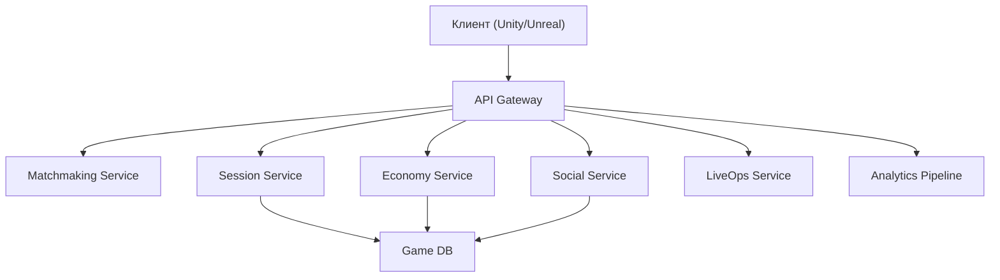

:::info[TL;DR]
Игровая архитектура делится на клиентскую (движок: Unity, Unreal) и серверную (backend: matchmaking, сессии, экономика, LiveOps). Спектр — от простых single-player до MMO с миллионами игроков. Аналитик проектирует API, поток сессии, синхронизацию данных и работу с игровым движком.
:::

## Типовая архитектура игры

## Типы игр по архитектуре

| Тип | Сервер | Клиент | Пример |
|-----|--------|--------|--------|
| **Single-player** | Минимум (лидерборды) | Вся логика на клиенте | Candy Crush |
| **PvP-сессии** | Матчмейкинг + сессия | Реалтайм (UDP) | Clash Royale |
| **MMO** | Шардированный бэкенд | Streaming контент | WoW, Genshin |
| **Hyper-casual** | Только аналитика | Простая механика | Paper.io |

## API игрового бэкенда

| Endpoint | Описание |
|----------|----------|
| `POST /auth` | Авторизация (Google/Apple/GameCenter) |
| `POST /matchmaking` | Поиск соперников |
| `POST /session` | Начать/завершить сессию |
| `POST /economy/currency` | Начислить/списать валюту |
| `POST /economy/purchase` | Покупка IAP |
| `POST /social/friend` | Добавить/удалить друга |

## Что дальше

- [Матчмейкинг и игровые сессии](/docs/specialization/gamedev-matchmaking)

## Проверь себя

1. **Какие сервисы есть в игровом бэкенде?**
   *Ответ:* Matchmaking, Session, Economy, Social, LiveOps, Analytics.

2. **Чем отличается архитектура MMO от hyper-casual?**
   *Ответ:* MMO — шардированный бэкенд, real-time синхронизация; hyper-casual — только аналитика.
