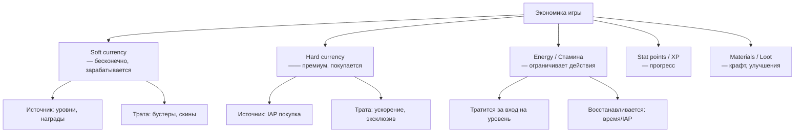
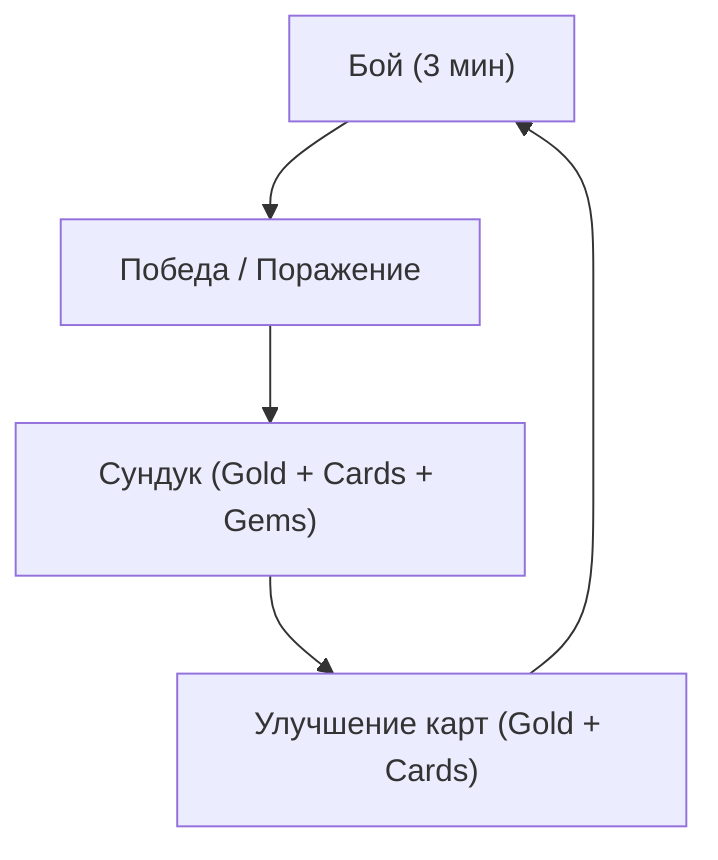
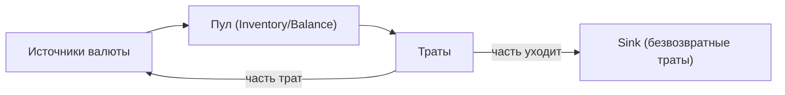
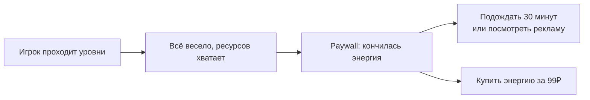

:::info[TL;DR]
Игровая экономика — система ресурсов и валют, которые игрок зарабатывает и тратит. В F2P-играх два типа валют: **soft** (зарабатывается в игре, бесконечная) и **hard** (покупается за деньги, премиальная). Главный навык аналитика: находить баланс, при котором игра **остаётся интересной** (у игрока есть ресурсы на прогресс), но **побуждает платить** (ресурсы заканчиваются в нужный момент). Экономика моделируется в Excel: сотни строк, десятки листов, все цифры должны сходиться.
:::

## Для кого эта статья

Middle/Senior SA, которые хотят проектировать F2P-экономику. После прочтения вы:

- Поймёте, как устроена экономика free-to-play игр
- Сможете построить экономическую модель в Excel
- Узнаете, как балансировать прогресс, чтобы игра не была «слишком лёгкой» или «слишком донатной»

## 1. Типы валют и ресурсов



**Конкретный пример: Clash Royale (Supercell)**

| Ресурс | Тип | Как получить | Как потратить |
|--------|-----|-------------|---------------|
| Золото | Soft | Бои, сундуки, дневные награды | Улучшение карт |
| Гемы | Hard | IAP (покупка) | Ускорение сундуков, золото |
| Карты | Material | Сундуки, запросы в клане | Улучшение (Gold + Cards) |
| Crown | Energy | Победы в боях | Только в Crown Chest |

## 2. Core Loop и Economy Loop

### Core Loop (игровой)



### Economy Loop (экономический)



**Sink — важное понятие:** экономика должна иметь «дыры», куда уходят ресурсы, иначе у игроков будет бесконечный запас, и они перестанут играть и платить.

Примеры sink:
- Комиссия за обмен валюты
- Налоги на торговлю
- Расходники (зелья, зелья)
- Улучшения со всё возрастающей стоимостью

## 3. Принципы F2P-экономики

### 1. Soft currency = бесконечна
Игрок всегда может заработать. Но зарабатывает ровно столько, чтобы не уйти, но чтобы и «на всё не хватило».

### 2. Hard currency = ключ к ускорению
Hard currency нельзя заработать бесконечно (ограниченные источники в игре). Рано или поздно игроку нужно купить.

### 3. Energy = регулятор темпа
- Если энергии давать много — игрок пройдёт весь контент за неделю и уйдёт
- Если энергии давать мало — игрок разозлится и удалит игру
- **Золотая середина:** энергии хватает на 30–60 минут игры, восстановление — 1 единица за 5–10 минут

### 4. Кривая прогресса (Power Curve)

```
Уровень 1 → 100 XP (лёгко)
Уровень 2 → 200 XP
Уровень 5 → 1000 XP
Уровень 10 → 5000 XP
Уровень 50 → 100000 XP (тяжело)
```

**Формула:** `XP_needed = Base * (Level ^ 1.5)` или экспонента

### 5. Paywall — точка, где «или плати, или жди»



**Плохой paywall:** игрок упирается на 2-м уровне → удаляет игру.
**Хороший paywall:** игрок прошёл 20 уровней за 2 часа, устал, но хочет ещё → 99₽ за энергию — ок, плачу.

## 4. Моделирование экономики в Excel

Базовый подход: **source-sink модель**.

| Ресурс | Source (за уровень) | Sink (за уровень) | Баланс |
|--------|-------------------|-------------------|--------|
| Gold | +50 (сундук) | -30 (улучшение) | +20 |
| Gems | +2 (ежедневно) | -5 (ускорение) | -3 |
| Energy | +1/5 мин | -1 (бой) | 0 |

Если баланс положительный → у игрока накапливается (инфляция), игра становится лёгкой.
Если баланс отрицательный → игрок в дефиците, нужно платить.
**Идеал:** баланс ≈ 0 при умеренном темпе игры (not pay-to-win).

## 5. Формулы экономики

### Time-to-max
Сколько времени нужно, чтобы прокачать всё **без доната**:

```
Дней = Total_Resources_Needed / Daily_Earnings
Если Total = 500,000 Gold, Daily = 5,000 Gold → 100 дней (~3 месяца)
```

Это **целевой показатель** для F2P-игр: 3–6 месяцев до полного прогресса.

### Cost per level
Стоимость улучшения растёт:

```
Level 1 → 2:   100 Gold + 5 Cards
Level 2 → 3:   200 Gold + 10 Cards
Level 3 → 4:   400 Gold + 20 Cards
...
Level 13 → 14: 100,000 Gold + 500 Cards
```

## 6. Типы монетизации через экономику

| Модель | Как работает | Примеры |
|--------|-------------|---------|
| **Pay-to-win** | За деньги — значительное преимущество | Китайские MMO |
| **Pay-to-progress** | За деньги — ускорение (без преимущества в PvP) | Clash Royale |
| **Pay-for-cosmetics** | Только скины, эмоции | Fortnite, League of Legends |
| **Pay-for-convenience** | Ускорение фарма, авто-бой | AFK Arena |
| **Pay-for-RNG** | Лутбоксы за деньги (регулируется) | FIFA, CS:GO |

Современный тренд — **pay-for-cosmetics**: игроки лучше платят за скины, чем за преимущество.

## 7. Метрики здоровья экономики

| Метрика | Что показывает | Норма |
|---------|---------------|-------|
| **Inflation rate** | Растёт ли золото у топ-игроков? | Должно быть ≈ 0 |
| **Gini coefficient** | Неравенство между игроками | < 0.4 |
| **Median player level** | Где находится средний игрок | — |
| **Drop-off by level** | % бросивших на каждом уровне | Нормально — ~30% на lvl 5 |
| **Conversion to payer** | % купивших IAP | 1.5–5% |
| **Days to first purchase** | Через сколько дней игрок впервые платит | 3–14 дней |

## 8. Практический кейс: балансировка RPG

**Дано:** RPG с 10 уровнями, 3 ресурса (Gold, XP, Energy).

**Проблема:** игроки проходят всю игру за 3 дня и уходят. Доход низкий.

**Анализ:**
- Energy восстанавливается за 1 мин (слишком быстро)
- Gold даётся 200 за бой, улучшения стоят 50 (слишком дёшево)
- Paywall только на 8-м уровне (поздно)

**Решение:**
- Energy: 1 за 5 минут → игрок играет 30 минут, потом ждёт или платит
- Gold per battle: 80, upgrade cost: 200 (дефицит)
- Paywall: на 3-м уровне (кончилась энергия на 15-й минуте)
- Важно: не делать paywall слишком агрессивным — игроки уходят на 1-м уровне

**После изменений:** retention D1 вырос с 30% до 42%, revenue +35%.

## Проверь себя

1. **Какие типы валют бывают в F2P-играх?**
   *Ответ:* Soft (бесконечно, заработок), Hard (премиум, IAP), Energy (лимит действий), Materials (крафт).

2. **Что такое sink в экономике?**
   *Ответ:* «Дыра», куда безвозвратно уходят ресурсы — предотвращает инфляцию.

3. **Какая типичная конверсия в платящего?**
   *Ответ:* 1.5–5%. Киты (1–2%) дают 50% дохода.

4. **Что такое time-to-max и зачем его считать?**
   *Ответ:* Время полного прогресса без доната. Цель: 3–6 месяцев.

5. **Как определить, что paywall стоит в правильном месте?**
   *Ответ:* Игрок прошёл достаточно контента, чтобы «втянуться» (15–30 минут), но упёрся в нехватку ресурсов.
