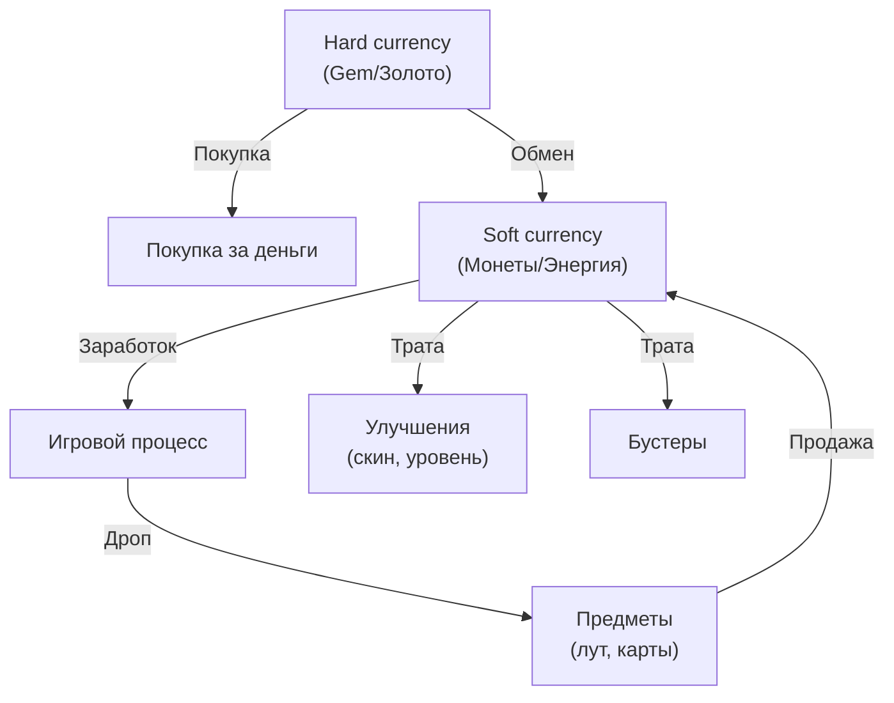

:::info[TL;DR]
Игровая экономика — система ресурсов, валют и обменов между ними (loops). Баланс — настройка количеств, чтобы игра была интересной и монетизируемой. Два типа валют: soft (зарабатывается в игре) и hard (покупается за деньги). Аналитик проектирует экономические модели, таблицы баланса и отслеживает здоровье экономики через метрики.
:::

## Типы валют и ресурсов

## Экономические конверсии

| Тип | Характеристика | Пример |
|-----|---------------|--------|
| **Soft currency** | Можно заработать в игре | Монеты, опыт |
| **Hard currency** | Покупается за реальные деньги | Гемы, кристаллы |
| **Premium currency** | Только за деньги | Жетоны |
| **Materials** | Для крафта | Дерево, камень |
| **Energy** | Лимитирует действия | «Хлеб», «топливо» |

## Принципы баланса

1. **Soft currency loop:** игра → награда → трата → игра (замкнутый цикл)
2. **Hard currency тратится на ускорение/улучшение** (pay-to-progress)
3. **Темп прогресса:** игрок не должен закончить контент слишком быстро
4. **Энергия ограничивает daily play** (30 мин/день — 6 «жизней»)
5. **Цена растёт** с уровнем (n-е улучшение дороже)

## Что дальше

- [Монетизация (IAP, реклама, подписки)](/docs/specialization/gamedev-monetization)
- [LiveOps](/docs/specialization/gamedev-liveops)

## Проверь себя

1. **Какие типы валют в играх?**
   *Ответ:* Soft (заработок), Hard (покупка), Premium (только деньги), Materials (крафт), Energy (лимиты).

2. **Что такое экономический баланс?**
   *Ответ:* Настройка количеств ресурсов/валют — игра должна быть интересной, но побуждать к донату.
