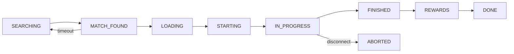
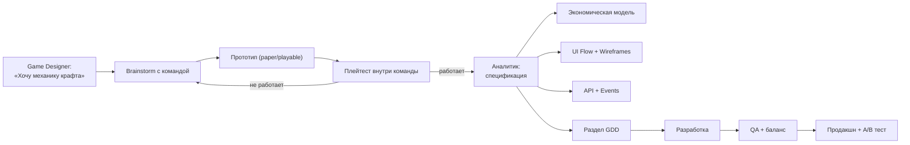

:::info[TL;DR]
В GameDev аналитик не пишет SRS на 100 страниц. Основной артефакт — **GDD (Game Design Document)**: компактный документ (10–30 стр.), описывающий механики, экономику, UI и метрики. Аналитик создаёт экономические таблицы, UI flows, статусные модели, API-спецификации и гайды для LiveOps. Ключевое отличие от Enterprise: в центре документа — **игровой опыт и механики**, а не функциональные требования и бизнес-процессы.
:::

## Для кого эта статья

Middle-аналитик, переходящий из Enterprise в GameDev. После прочтения вы:

- Узнаете структуру GDD и чем она отличается от SRS
- Сможете написать экономический раздел GDD
- Научитесь проектировать UI flows для игровых механик
- Поймёте, какие артефакты нужны гейм-дизайнеру, разработчику и QA

## 1. Чем GDD отличается от SRS

| Параметр | Enterprise SRS | GameDev GDD |
|----------|---------------|-------------|
| **Объём** | 50–200 страниц | 10–30 страниц |
| **Центр внимания** | Функциональные требования | Игровой опыт и механики |
| **Аудитория** | Разработчики, QA, заказчик | Гейм-дизайнеры, программисты, арт-директор |
| **Язык** | Формальный, Use Case, спецификации | Понятный, описательный, схемы, таблицы |
| **Итерации** | Утверждается раз в квартал | Меняется еженедельно (live doc) |
| **Прототипы** | Нет | Да: скетчи, wireframes, playable prototypes |
| **Метрики** | Перечислены как NFR | Встроены в дизайн механик (retention, ARPU) |

> **Правило:** GDD — живой документ. Если в Enterprise изменения SRS — это Change Request, то в GameDev изменения GDD — это норма. Игра меняется каждый день после плейтестов.

## 2. Структура GDD

У каждой студии свой шаблон, но типовой GDD выглядит так:

| Раздел | Что содержит | Кто пишет |
|--------|-------------|-----------|
| **1. Elevator Pitch** | Концепция игры в 3–5 предложениях | Продюсер / Game Designer |
| **2. Core Loop** | Основной цикл: что делает игрок → что получает → куда тратит | Game Designer |
| **3. Механики** | Описание всех механик (прыжок, стрельба, крафт) | Game Designer |
| **4. Экономика** | Валюты, ресурсы, source-sink, прогресс, баланс | **Аналитик** |
| **5. Контент** | Уровни, персонажи, предметы, скины | Content Designer |
| **6. UI/UX** | Экраны, flows, wireframes | UI/UX + **Аналитик** |
| **7. Монетизация** | IAP, реклама, подписки, цены | **Аналитик** |
| **8. LiveOps** | Ивенты, Battle Pass, сезоны, календарь | **Аналитик** |
| **9. Технические требования** | Платформы, SDK, сервер, аналитика | Tech Lead + **Аналитик** |
| **10. Метрики** | Какие KPI, какие евенты трекать | **Аналитик** |
| **11. Roadmap** | Pre-production → Soft launch → Global launch | Продюсер |

**Жирным** выделены разделы, за которые аналитик отвечает напрямую.

## 3. Артефакты аналитика в GameDev

### 3.1 Экономическая модель (Spreadsheet)

Основа GameDev-аналитики. Excel/Google Sheets с десятками листов.

```
Лист 1: Currencies (валюты)
├── Soft:  Gold, XP
├── Hard:  Gems
├── Energy: Stamina
└── Materials: Shards, Cards

Лист 2: Source-Sink (по уровням)
├── Level 1: Source +50G, Sink -20G, Balance +30G
├── Level 5: Source +80G, Sink -100G, Balance -20G
└── Level 10: Source +120G, Sink -250G, Balance -130G

Лист 3: Power Curve (прогресс)
├── XP per level: Base × Level^1.5
├── Enemy HP: Base × Level^1.2
└── Player ATK: Base + Level × 5

Лист 4: Monetization
├── IAP packages (price, gems, bonus)
├── Conversion assumptions
└── ARPU, ARPPU, LTV projection

Лист 5: Time-to-max
├── Days to max without pay: 120
└── Days with $50/month: 45
```

**Как аналитик работает с моделью:**
- Меняет параметры → видит влияние на Time-to-max, Inflation rate, Gini coefficient
- Гейм-дизайнер говорит «хочу, чтобы игрок проходил уровень за 3 минуты» → аналитик считает Energy per battle, XP per battle
- Продюсер спрашивает «сколько месяцев до окупаемости» → аналитик считает LTV / CPI

### 3.2 UI Flow / Wireframes

Игровые UI flows отличаются от Enterprise: вместо «пользователь нажимает кнопку — система сохраняет» здесь «игрок нажимает кнопку — игра показывает анимацию — открывается магазин».

```
[Main Menu]
    ├── [Play] → [Mode Select] → [Matchmaking] → [Battle]
    ├── [Shop] → [Featured] → [IAP Purchase] → [Animations] → [Balance Update]
    ├── [Deck] → [Card Select] → [Upgrade] → [Gold/Gems Check] → [Animation]
    └── [Social] → [Friends] → [Invite] → [Clan] → [Clan War]
```

**Инструменты:** Figma (designed), Draw.io / Miro (flow), Unity Editor (playable).

**Что аналитик специфицирует в UI flow:**
- Переходы между экранами (что и когда показывать)
- Состояния: empty state, loading, error, success
- Анимации: что происходит при покупке, открытии сундука
- Локализация: какие тексты, какой язык по умолчанию

### 3.3 Статусная модель (State Machine)

Каждый объект в игре имеет состояния. Аналитик специфицирует их.

**Пример: статусная модель сессии**


**Пример: статусная модель предмета в инвентаре**
```
OWNED → EQUIPPED → USED → CONSUMED
OWNED → UPGRADING → OWNED (level+1)
OWNED → SELLING → SOLD
```

### 3.4 API-спецификация

Аналитик пишет API для игрового сервера. Формат — OpenAPI или просто markdown.

**Пример: API экономики**

```yaml
POST /economy/spend
  request:
    player_id: string
    currency: "gold" | "gems"
    amount: int
    reason: "upgrade" | "shop" | "fast_forward"
    item_id: string?
  response:
    success: bool
    new_balance: { gold: int, gems: int }
    error?: "insufficient_funds" | "invalid_item"
```

### 3.5 Event-спецификация (для аналитики)

Каждое действие игрока — событие. Аналитик специфицирует схему.

```json
{
  "event": "currency_spend",
  "params": {
    "currency_type": { "type": "string", "values": ["gold", "gems", "energy"] },
    "amount": { "type": "integer", "min": 1 },
    "source": { "type": "string", "description": "почему потратил" },
    "balance_after": { "type": "integer" }
  }
}
```

### 3.6 LiveOps-спецификация (ивент)

```yaml
Event: "Сбор сокровищ"
Duration: 7 days
Mechanic: Собирай предметы на карте (по 1 за бой)
Rewards:
  - 10 items:  +100 gold
  - 25 items:  +1 rare chest
  - 50 items:  +50 gems
  - 100 items: exclusive skin "Pirate"
Economy check:
  - Extra gold per event: 100 (safe: 7000 total)
  - Extra gems: 50 (safe: under 500 threshold)
  - No impact on hard currency inflation
```

## 4. Инструменты GameDev-аналитика

| Инструмент | Зачем | Чем отличается от Enterprise |
|-----------|-------|------------------------------|
| **Google Sheets / Excel** | Экономические модели, source-sink, time-to-max | Непрерывные модели с тысячами строк |
| **Figma** | UI flows, wireframes, screens | Вместо Confluence + Draw.io |
| **Miro** | Брейнстормы, flow-диаграммы | Более свободный формат |
| **Unity Editor** | Проверка спецификаций в игре | Аналитик смотрит, как всё работает в реальности |
| **Confluence / Notion** | GDD и документация | Вместо SRS — живой GDD (wiki-формат) |
| **GameAnalytics / Amplitude** | Проверка метрик после запуска | Real-time дашборды, а не SQL-отчёты раз在 день |

## 5. Типовой процесс: от идеи до спецификации



## 6. Ошибки Enterprise-аналитика в GameDev

1. **«А давайте напишем SRS на 50 страниц»** — нет. Гейм-дизайнер не будет это читать. Максимум — 3 страницы на механику.
2. **«Где функциональные требования?»** — в GDD их нет. Есть «игрок делает X и получает Y». Требования заменяются механиками.
3. **«Где use cases?»** — use cases заменяются core loop. Вместо «актор нажимает кнопку — система валидирует — система сохраняет» — «игрок нажимает кнопку → бабах! → монеты сыплются → приятно».
4. **«Давайте утвердим документ»** — GDD не утверждается раз и навсегда. Он меняется ежедневно после плейтестов.
5. **«Где нефункциональные требования?»** — NFR есть, но в другом формате: «99 перцентиль latency < 100ms», «билд не больше 200MB».

## Ссылки для самостоятельного изучения

| Ресурс | Описание | Ссылка |
|--------|----------|--------|
| Game Design Document Template | Шаблон GDD от GameDevTV | https://www.gamedevtv.com/game-design-document-template/ |
| How to Write a Game Design Document | Статья Gamasutra | https://www.gamedeveloper.com/design/how-to-write-a-game-design-document |
| Game Design Doc Examples | Примеры GDD известных игр | https://www.gamedesigning.org/learn/game-design-document/ |
| Anatomy of a Game Design Document | Подробный разбор структуры | https://gameworldobserver.com/2020/10/12/game-design-document-examples/ |
| Spreadsheet Design for Game Economies | Гайд по экономическим моделям | https://game-developer.com/design/spreadsheet-design-for-game-economies/ |
| Game Analytics Spec Template | Пример event-спецификации | https://gameanalytics.com/docs/event-specification/ |

## Проверь себя

1. **Чем GDD отличается от SRS?**
   *Ответ:* GDD — 10–30 стр., живёт, меняется ежедневно. В центре — игровой опыт и механики. SRS — 50–200 стр., формальный, утверждается раз в квартал. В центре — функциональные требования.

2. **Какие артефакты создаёт аналитик в GameDev?**
   *Ответ:* Экономическая модель (Excel), UI flows, статусные модели, API-спецификации, event-спецификации, разделы GDD (экономика, монетизация, LiveOps, метрики), LiveOps-спеки.

3. **Что такое source-sink модель?**
   *Ответ:* Таблица, где для каждого ресурса считаются источники (source) и траты (sink). Баланс определяет, накапливается ресурс или уходит. Инструмент для балансировки экономики.

4. **Почему GDD — живой документ?**
   *Ответ:* Игра меняется после каждого плейтеста. То, что весело на бумаге, может быть скучно в прототипе. GDD обновляется еженедельно без Change Request.

5. **Какие инструменты использует GameDev-аналитик?**
   *Ответ:* Excel/Sheets (экономика), Figma (UI flows), Miro (диаграммы), Unity Editor (проверка), Confluence/Notion (GDD), GameAnalytics/Amplitude (метрики).
