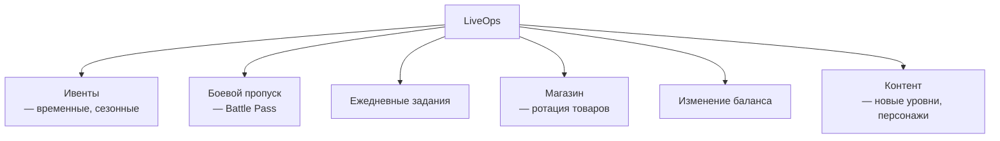
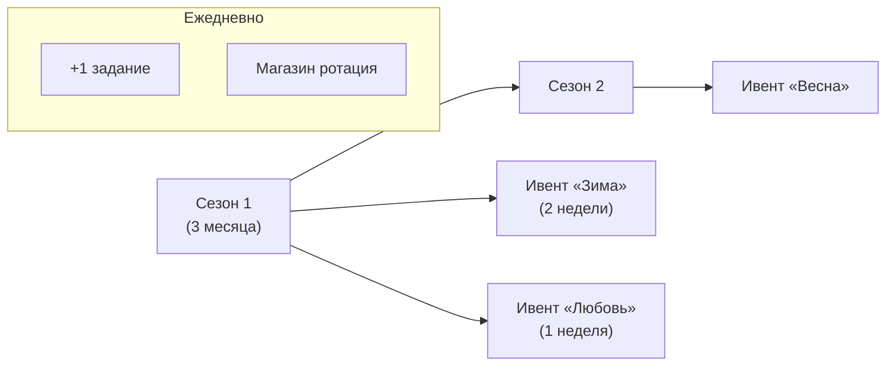

:::info[TL;DR]
LiveOps — непрерывное управление игрой после запуска: ивенты, боевые пропуски, ежедневные задания, сезонный контент. Цель — поддерживать интерес игроков, увеличивать retention и доход. Аналитик проектирует контент-календарь, формулы ивентов и метрики их эффективности.
:::

## Компоненты LiveOps

## Структура ивента

| Параметр | Пример |
|----------|--------|
| **Тип** | PvP-турнир, сбор предметов, boss raid |
| **Длительность** | 3–14 дней |
| **Механика** | Очки за активность, лидерборд |
| **Награды** | Soft currency, premium, эксклюзивный скин |
| **Условия доступа** | Уровень, клан, прогресс |
| **Триггер** | Фиксированные даты или после прохождения |

## LiveOps-календарь

## Что дальше

- [Game Analytics](/docs/specialization/gamedev-analytics)

## Проверь себя

1. **Что такое LiveOps?**
   *Ответ:* Непрерывное управление игрой после запуска: ивенты, боевые пропуски, ежедневки, контент.

2. **Какие компоненты входят в LiveOps?**
   *Ответ:* Ивенты, Battle Pass, ежедневные задания, магазин, баланс, контент.
