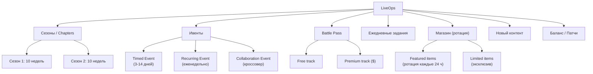
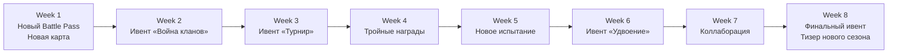
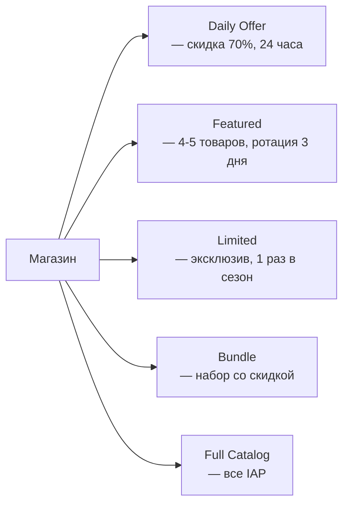

:::info[TL;DR]
LiveOps — непрерывное управление игрой после запуска: ивенты, боевые пропуски (Battle Pass), ежедневные задания, сезонный контент и ротация магазина. Цель — поддерживать интерес игроков, увеличивать retention и доход на протяжении месяцев и лет. Хороший LiveOps превращает игру в «живой сервис» (Games-as-a-Service), где каждый день есть причина зайти. Аналитик проектирует контент-календарь, формулы ивентов, метрики их эффективности и связь с экономикой игры.
:::

## Для кого эта статья

Senior SA, переходящий к Games-as-a-Service модели. После прочтения вы:

- Поймёте, какие компоненты входят в LiveOps и как они связаны
- Сможете спроектировать контент-календарь на сезон
- Узнаете, как считать экономику ивента и балансировать награды
- Поймёте метрики LiveOps и как A/B тестировать ивенты

## 1. Зачем нужен LiveOps

До эры LiveOps игра выпускалась — и всё. После релиза — только баг-фиксы. Сегодня успешные игры живут 3–10+ лет благодаря LiveOps.

| Эпоха | Подход | Пример | Срок жизни |
|-------|--------|--------|-----------|
| **Retail (2000-е)** | Выпустил и забыл | Single-player games | 1–2 месяца |
| **DLC era (2010-е)** | Дополнения раз в год | The Witcher 3 | 1–2 года |
| **Games-as-a-Service (2020+)** | Постоянные ивенты, сезоны, BP | Fortnite, Genshin, Clash Royale | 5–10+ лет |

**Кейс: Fortnite (Epic Games)**
- Релиз: 2017
- Revenue в 2024: ~$6 млрд (кумулятивно)
- Сезонов: 30+ (каждый ~10 недель)
- Контент за сезон: 100+ косметических предметов, карта меняется, новый Battle Pass, 2–3 ивента
- **Секрет:** каждый сезон ощущается как новая игра, но прогресс (скины, V-Bucks) переносится

## 2. Компоненты LiveOps



## 3. Сезоны и контент-календарь

Сезон — основная единица LiveOps. Типичный сезон длится 8–12 недель.

**Структура сезона (Clash Royale — пример):**



**Контент-календарь на месяц (мобильная игра, 1M DAU):**

| Неделя | Пн | Вт | Ср | Чт | Пт | Сб | Вс |
|--------|----|----|----|----|----|----|----|
| 1 | Новый BP | — | Daily bonus | — | Ивент «Сбор сокровищ» | Weekend x2 gold | — |
| 2 | — | Ротация магазина | — | Challenge | — | Турнир | Награды турнира |
| 3 | Новый герой | — | Ивент «Босс-рейд» | — | — | Weekend x2 XP | — |
| 4 | Финальный ивент | — | — | Скидки в магазине | Double rewards | Гранд-финал | Тизер сезона 2 |

## 4. Ивенты: типы и экономика

### Типы ивентов

| Тип | Описание | Длительность | Пример |
|-----|----------|-------------|--------|
| **Collection** | Сбор предметов по карте | 7 дней | Clash Royale: «Собери 10 сундуков» |
| **Leaderboard** | Соревнование по очкам | 3 дня | «Кто наберёт больше XP за выходные» |
| **Boss Raid** | Совместная битва с боссом | 3–5 дней | AFK Arena: «Убей мирового босса» |
| **PvP Tournament** | Турнир на выбывание | 2–3 дня | Brawl Stars: Championship Challenge |
| **Crossover** | Коллаборация с другим IP | 2–4 недели | Fortnite x Marvel, Genshin x McDonalds |
| **Mini-game** | Мини-игра внутри игры | 7–14 дней | Genshin: ловля рыбы, забеги |
| **Double Rewards** | Удвоение всего | 48 часов | Clash of Clans: «Удвоение ресурсов из шахт» |

### Экономика ивента: формула

Ивент не должен «сломать» экономику игры. Если в ивенте раздают слишком много gold — у игроков пропадёт мотивация платить.

**Расчёт наград ивента:**

```
Награды_ивента = Daily_Earnings × Длительность_ивента × Коэффициент_щедрости

Коэффициент_щедрости = 1.5–2.0 (ивент даёт ощутимо больше, чем обычный фарм)
```

**Пример: ивент «Сбор сокровищ» (Clash Royale)**

| Параметр | Значение | Расчёт |
|----------|----------|--------|
| Длительность | 7 дней | — |
| Дневной заработок gold | 2000 | Из сундуков + бои |
| Всего gold — обычный фарм | 14,000 | 2000 × 7 |
| Коэффициент щедрости | 1.5 | Ивент даёт на 50% больше |
| Всего gold — ивент | 21,000 | 14,000 × 1.5 |
| Дополнительно: | — | — |
| — эксклюзивный скин | Бесплатно | Только в ивенте |
| — гемы | 500 | За полное прохождение |

**Проверка:** ивент даёт +7000 gold сверх нормы. Это не сломает экономику, так как:
- Gold тратится на улучшения (sink работает)
- 7000 gold = 3–4 улучшения карт с 10 на 11 уровень — это мало
- Главная ценность — эксклюзивный скин (он не влияет на баланс)

## 5. Battle Pass (боевой пропуск)

Battle Pass — самый эффективный LiveOps-инструмент. Разобран подробно в [Монетизация](/docs/specialization/gamedev-monetization#battle-pass--король-подписок).

### Battle Pass — структура наград

```
Бесплатная дорожка (все):
Уровень 1:  +100 gold
Уровень 2:  5 гемов
Уровень 3:  +200 gold
Уровень 10: редкий скин
...
Уровень 50: 200 гемов

Премиум дорожка ($9.99):
Уровень 1:  эпический скин (эксклюзив)
Уровень 2:  50 гемов
...
Уровень 10: легендарная эмоция
...
Уровень 100: легендарный скин + emotes
```

**Психология Battle Pass уровней:**
- Первые 10 уровней — быстрые и лёгкие (чтобы игрок почувствовал прогресс)
- Уровни 10–70 — средний темп (основная игра)
- Уровни 70–100 — медленные («бонус» для хардкорных игроков)

## 6. Ежедневные и еженедельные задания

Задания — причина заходить в игру каждый день.

| Тип | Частота | Пример | Награда |
|-----|---------|--------|---------|
| **Daily** | Каждый день | «Выиграй 3 боя» | 50 gold |
| **Weekly** | Раз в неделю | «Собери 10 карт в клане» | 100 гемов |
| **Seasonal** | За сезон | «Набери 3000 трофеев» | Эксклюзивный скин |
| **Progressive** | Цепочка | «День 1: зайди; День 2: выиграй 1 бой; День 7: выиграй 10 боёв» | Растёт |

**Метрики заданий:**
- **Daily quest completion rate:** % DAU, выполнивших ежедневку (цель: >60%)
- **Weekly quest completion rate:** цель: >40%
- **Time to complete daily:** сколько минут нужно на ежедневку (цель: 5–15 мин)

## 7. Shop Rotation (магазин)

Магазин — инструмент монетизации через LiveOps.



**Кейс: Clash Royale — магазин**
- Ежедневно: 1 товар со скидкой 70% (gold, gems, wild cards)
- Каждые 3 дня: ротация 4 товаров (скины, сундуки)
- Раз в сезон: эксклюзивный набор («Season Boost»)
- **Метрика:** 25% DAU заходят в магазин ежедневно

## 8. LiveOps-метрики

| Метрика | Описание | Норма |
|---------|----------|-------|
| **Event participation rate** | % DAU, участвующих в ивенте | > 40% |
| **Event completion rate** | % дошедших до конца | > 20% |
| **BP purchase rate** | % купивших BP | 15–30% |
| **BP completion rate** | % прошедших 100 уровней | 40–60% |
| **Daily quest completion rate** | % выполнивших ежедневку | > 60% |
| **Average session length** | Средняя длина сессии | 10–20 мин |
| **Session frequency** | Сколько сессий в день | 2–4 |
| **Revenue per event** | Сколько ивент принёс денег | — |
| **LTV by cohort** | LTV когорты участников ивента vs неучастников | +20–40% |
| **Churn during live event** | Churn во время ивента | Должен быть ниже обычного |

## 9. Типичные ошибки LiveOps

1. **Слишком частые ивенты.** Игроки устают. Оптимум: 1 крупный + 1 мини-ивент в неделю.
2. **Слишком щедрые награды.** Раздают premium валюту → никто не покупает IAP.
3. **Ничего не меняется.** Если каждый ивент одинаковый — игроки перестают участвовать.
4. **Ивент ломает баланс.** Новая карта/герой слишком сильный → PvP становится нечестным.
5. **Нет тизера следующего сезона.** Игроки не знают, стоит ли ждать → могут уйти.

## 10. Кейс: Genshin Impact — контент-календарь

Genshin Impact (miHoYo) — золотой стандарт LiveOps в gacha-играх:

| Цикл | Что происходит | Влияние |
|------|---------------|---------|
| **Каждые 6 недель** | Новый регион/сюжет (major update) | Возвращение lapsed players |
| **Каждые 3 недели** | Новый баннер персонажа (gacha) | Revenue spike |
| **Ежедневно** | Daily commissions (4 задания) | DAU stabilisation |
| **Еженедельно** | Weekly bosses, reputation | Weekly engagement |
| **Каждый сезон** | Battle Pass (free + premium) | Monetisation |
| **Каждый месяц** | Welkin Moon renewable | MRR |
| **События** | Mini-games, races, photography | 2–3 в месяц |

**Результат:** Genshin стабильно зарабатывает $100M+/месяц (>2 года) при retention D30 > 30%.

## Проверь себя

1. **Что такое LiveOps и зачем он нужен?**
   *Ответ:* Непрерывное управление игрой после запуска — ивенты, BP, ежедневки, контент. Превращает игру в «живой сервис» с жизнью 5–10+ лет.

2. **Какие компоненты входят в LiveOps?**
   *Ответ:* Сезоны, ивенты, Battle Pass, ежедневные/еженедельные задания, ротация магазина, новый контент, баланс-патчи.

3. **Как считать экономику ивента, чтобы не сломать игру?**
   *Ответ:* Награды_ивента = Daily_Earnings × Длительность × Коэффициент_щедрости (1.5–2.0). Проверить, что инфляция ресурсов не превышает норму.

4. **Почему Battle Pass повышает retention?**
   *Ответ:* Эффект sunken cost (уже заплатил → надо отыграть), прогресс 100 уровней растянут на сезон, награды мотивируют заходить ежедневно.

5. **Как часто должны быть ивенты?**
   *Ответ:* 1 крупный + 1 мини-ивент в неделю. Слишком часто — усталость, слишком редко — скука. Каждый ивент должен отличаться от предыдущего.
