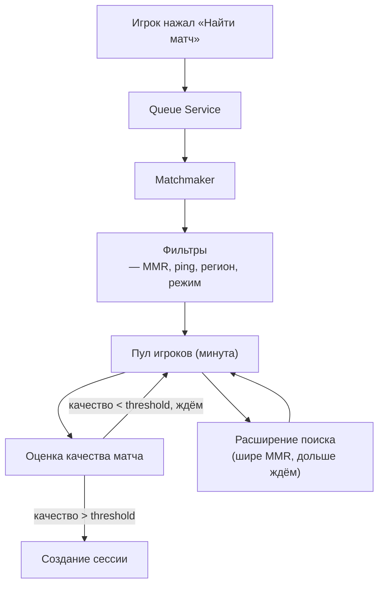
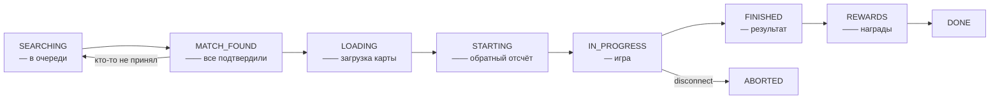

:::info[TL;DR]
Матчмейкинг — система подбора игроков для PvP. Основа: рейтинг (Elo, Glicko, TrueSkill), который оценивает навык игрока. Цель — найти соперников равного уровня за минимальное время. Ключевой компромисс: **качество матча** (точность подбора по рейтингу) vs **время ожидания**. Аналитик проектирует правила подбора, статусную модель сессии, алгоритмы расширения поиска и античит. Особенность отрасли: решение задач оптимизации в реальном времени, где неприемлемо ждать «идеального» соперника дольше 10–30 секунд.
:::

## Для кого эта статья

Senior SA, который хочет проектировать мультиплеерные системы. После прочтения вы:

- Поймёте, как работает Elo, Glicko, TrueSkill — и какой выбрать
- Сможете спроектировать систему матчмейкинга с учётом компромиссов
- Узнаете, как бороться с читерами, смурфами и бустингом
- Сможете специфицировать API сессий и жизненный цикл матча

## 1. Как работает матчмейкинг: общая схема



## 2. Системы рейтинга

### Elo (1895, шахматы)

**Формула:** вероятность победы = 1 / (1 + 10^((R_B - R_A)/400))

**Как работает:** после матча победитель забирает рейтинговые очки у проигравшего. Количество очков зависит от разницы в рейтинге:
- Если сильный (R=1600) победил слабого (R=1400) → +4 очка
- Если слабый победил сильного → +32 очка

**Минус:** не учитывает неуверенность (uncertainty) рейтинга. Новый игрок с R=1200 может быть на самом деле топ-игроком — но Elo будет поднимать его медленно.

### Glicko-2 (используют CS:GO, Dota 2, Valorant)

**Добавляет:** RD (Rating Deviation) — степень уверенности в рейтинге.
- Новый игрок: RD = 350 (высокая неуверенность) → рейтинг меняется быстро
- Ветеран (1000 матчей): RD = 50 (низкая неуверенность) → рейтинг почти не меняется
- Давно не играл: RD → растёт (рейтинг снова «неуверенный»)

### TrueSkill (Microsoft, Halo, Gears of War)

**Добавляет:** учёт команд и мест (не только 1v1, но и 4v4, 8-й игрок в битве). Использует вероятностную модель — рейтинг представляется как гауссиана (μ ± σ).

| Система | Минусы | Где используется |
|---------|--------|-----------------|
| Elo | Нет uncertainty, только 1v1 | Лиги, шахматы |
| Glicko-2 | Сложнее расчётов | CS:GO, Dota 2, Valorant |
| TrueSkill | Патент Microsoft | Halo, Gears, Forza |

## 3. Компромисс: качество vs время

Главная задача матчмейкинга — не «найти идеального соперника», а **найти достаточно хорошего соперника за разумное время**.

| Время ожидания | Допустимое отклонение MMR | Комментарий |
|---------------|--------------------------|-------------|
| 0–5 сек | ±50 | Идеальный матч |
| 5–15 сек | ±150 | Хороший матч |
| 15–30 сек | ±300 | Приемлемо |
| 30+ сек | ±500+ | Плохо, но лучше, чем ничего |
| 60+ сек | Любой | Расширяем до любого рейтинга |

Эти параметры задаются в конфигурации матчмейкера и могут меняться под нагрузкой (ночью — шире диапазон, днём — уже).

## 4. Пул и очередь: детали

```
Queue:
  player_123: { mmr: 1500, rd: 100, ping: 45, region: "eu", mode: "ranked", party_size: 1 }
  player_456: { mmr: 1520, rd: 80,  ping: 30, region: "eu", mode: "ranked", party_size: 1 }
  player_789: { mmr: 1800, rd: 120, ping: 90, region: "eu", mode: "ranked", party_size: 1 }
```

**Matchmaker оценивает пары:**
- 1500 vs 1520 → quality = 0.95 (отлично, оба EU, ping OK)
- 1500 vs 1800 → quality = 0.3 (плохо, большая разница)
- 1520 vs 1500 → аналогично 1500 vs 1520 (создаём матч!)

## 5. Статусная модель сессии



**Таймауты:**
- `MATCH_FOUND`: ждём 10 секунд, пока все игроки нажмут «Принять»
- `LOADING`: макс 30 секунд на загрузку ресурсов
- `STARTING`: 5-секундный отсчёт
- `IN_PROGRESS`: если игрок отключился > 60 секунд → матч прерывается (или AI заменяет)

## 6. Античит в матчмейкинге

| Проблема | Решение |
|----------|---------|
| **Smurf (новый аккаунт сильного игрока)** | Определять по статистике (не в матчах, а в скиллах) и быстро поднимать MMR |
| **Boosting (сильный игрок тащит слабого)** | Учитывать рейтинг пати — средний + бонус |
| **Win-trading (обмен победами)** | Анализ подозрительных матчей (same IP, быстрые матчи) |
| **DDoS соперника** | Автоматическое определение по паттерну отключений |
| **Sandbagging (намеренное проигрывание для снижения рейтинга)** | Обнаружение по аномальной статистике (KDA, damage) |

## 7. API матчмейкинга

| Endpoint | Описание |
|----------|----------|
| `POST /matchmaking/join` | Встать в очередь (режим, party_id) |
| `POST /matchmaking/leave` | Выйти из очереди |
| `GET /matchmaking/status` | Статус (время ожидания, estimated) |
| `GET /session/{id}/state` | Текущее состояние сессии |
| `POST /session/{id}/action` | Действие в матче (см. архитектуру) |
| `GET /session/{id}/result` | Результат матча (победитель, награды) |
| `GET /player/{id}/rating` | Текущий рейтинг и история |

## 8. Метрики матчмейкинга

| Метрика | Что показывает | Целевое значение |
|---------|---------------|------------------|
| **Average queue time** | Среднее время ожидания | < 15 секунд |
| **Quality of match** | Средняя разница MMR в матче | &lt; ±100 MMR |
| **Match success rate** | % созданных матчей от поисков | >95% |
| **Abandon rate** | % игроков, вышедших из очереди | &lt;5% |
| **Disconnect rate** | % прерванных матчей | &lt;1% |
| **Smurf detection rate** | % обнаруженных смурфов | — |

## 9. Кейс из практики: мобильная PvP-игра

**Задача:** Игра 1v1, матч ~3 мин, рейтинговая система. 1M DAU.

**Решение:**
- Рейтинг: Glicko-2 (битвы 1v1, нужен учёт uncertainty)
- Регионы: EU, US, ASIA — с автомиграцией, если в регионе мало игроков
- Максимальное время в очереди: 20 секунд, после — расширение ±500 MMR
- Party size: только 1 (1v1), если есть кланы — возможны 2v2 с другим пулом
- Время матча в прайм-тайм: 3–5 секунд

**Метрики после запуска:**
- Среднее время ожидания: 4.2 сек
- Quality of match: ±45 MMR
- Match success rate: 98.2%

## Проверь себя

1. **Чем Elo отличается от Glicko-2?**
   *Ответ:* Glicko-2 добавляет RD (Rating Deviation) — степень неуверенности. У новых игроков RD высокий, рейтинг меняется быстро.

2. **Какой главный компромисс в матчмейкинге?**
   *Ответ:* Качество матча (точность подбора по MMR) vs время ожидания в очереди.

3. **Как бороться со смурфами?**
   *Ответ:* Анализ статистики (не только побед, но и скилл-показателей), быстрое повышение MMR.

4. **Какие статусы есть у игровой сессии?**
   *Ответ:* SEARCHING → MATCH_FOUND → LOADING → STARTING → IN_PROGRESS → FINISHED → REWARDS → DONE.

5. **Какие метрики матчмейкинга вы будете отслеживать?**
   *Ответ:* Queue time, quality of match, match success rate, abandon rate.
