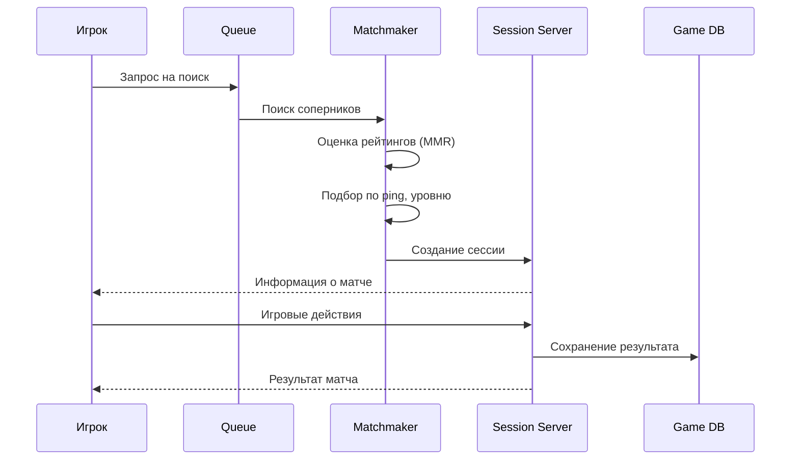
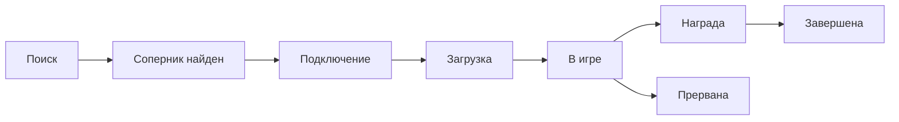

:::info[TL;DR]
Матчмейкинг — подбор игроков для PvP-сессии. Критерии: рейтинг (MMR), ping, время ожидания, уровень. Сессия — lifecycle от поиска до завершения. Аналитик проектирует правила подбора, статусную модель сессии, античит и метрики (queue time, quality of match).
:::

## Процесс матчмейкинга

## Статусы сессии

## Критерии матчмейкинга

| Критерий | Описание | Приоритет |
|----------|----------|-----------|
| **MMR (Skill Rating)** | Рейтинг игрока | Высокий |
| **Ping / Latency** | Задержка до сервера | Высокий |
| **Party size** | Размер группы | Средний |
| **Level / Progression** | Уровень игрока | Средний |
| **Max wait time** | Максимальное время в очереди | Средний |
| **Region** | Регион игрока | Высокий |

## Метрики матчмейкинга

| Метрика | Описание |
|---------|----------|
| **Queue time** | Среднее время ожидания |
| **Quality of match** | Разброс MMR в сессии |
| **Match success rate** | % успешных матчей |
| **Abandon rate** | Игроки покинули очередь |

## Что дальше

- [Социальные механики](/docs/specialization/gamedev-social)
- [Монетизация](/docs/specialization/gamedev-monetization)

## Проверь себя

1. **Как работает матчмейкинг?**
   *Ответ:* Игрок → очередь → оценка MMR/ping → подбор → создание сессии.

2. **Какие критерии подбора игроков?**
   *Ответ:* MMR, ping, уровень, размер группы, регион, макс. время ожидания.
