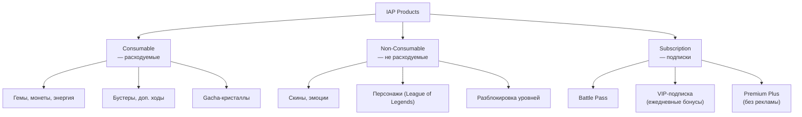
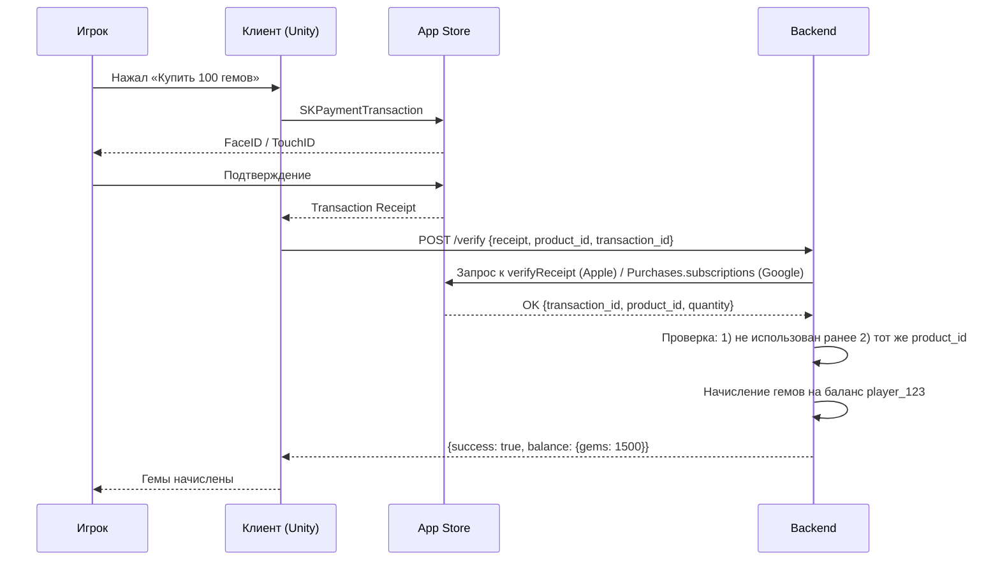
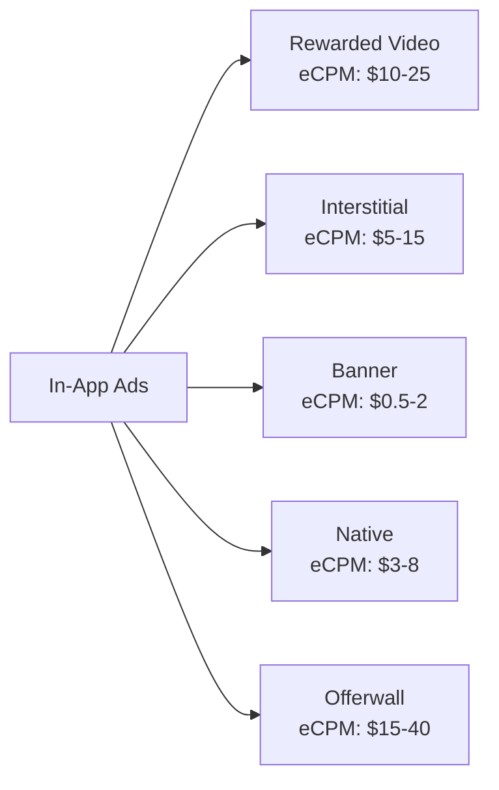

:::info[TL;DR]
Монетизация в играх строится на трёх китах: **IAP** (внутриигровые покупки через App Store / Google Play), **реклама** (rewarded, interstitial, banner) и **подписки**. Ключевые метрики: ARPU, ARPPU, конверсия в платящего (1.5–5%), LTV. Цель аналитика — спроектировать store-интеграцию, рекламные placements, ценообразование и трекинг покупок так, чтобы максимизировать LTV при сохранении хорошего игрового опыта. Главное правило: монетизация не должна ломать геймплей.
:::

## Для кого эта статья

Senior SA, проектирующий монетизацию в F2P-играх. После прочтения вы:

- Поймёте все типы IAP и Ad-форматов, их экономику и best practices
- Узнаете, как устроена receipt validation и борьба с фродом
- Сможете выбирать ценовые стратегии и проектировать промо-акции
- Поймёте метрики монетизации и как они влияют на product decisions

## 1. IAP: детальный разбор

### Типы IAP-продуктов



**Apple App Store** и **Google Play** предоставляют SKU-систему для управления продуктами:

```
Product ID: "com.game.gems_100"
Type: Consumable
Price: $0.99
Display Name: "100 Gems"
Description: "100 gems — start your adventure!"
```

**Наш пример: Clash Royale (Supercell)**

| Продукт | Тип | Цена (USD) | Что даёт |
|---------|-----|-----------|----------|
| 80 Gems | Consumable | $0.99 | 80 гемов |
| 500 Gems | Consumable | $4.99 | 500 гемов (+бонус) |
| 1200 Gems | Consumable | $9.99 | 1200 гемов (+бонус) |
| Pass Royale | Subscription (monthly) | $4.99 | BP + бонусы |
| Emote Pack | Non-Consumable | $2.99 | 5 эмоций |
| Gold | Consumable | $1.99–$49.99 | Золото для улучшений |

### Receipt Validation (проверка покупки)

Когда игрок покупает IAP, App Store возвращает **receipt** — зашифрованный документ. Сервер должен его проверить, иначе читеры могут «накликать» себе гемы:



**Важно:** receipt validation ОБЯЗАТЕЛЬНА на сервере. Клиентскую проверку можно обойти.

### Антифрод в IAP

| Метод | Описание |
|-------|----------|
| **Receipt validation** | Проверка на стороне Apple/Google |
| **Transaction ID dedup** | Нельзя начислить дважды по одному receipt |
| **Server-side unlock** | Даже если клиент «взломал» — сервер не даст |
| **Rate limiting** | Не более N покупок в минуту |
| **Fraud scoring** | Анализ поведения: слишком быстрые покупки, подозрительные аккаунты |

## 2. Реклама в играх

Реклама — второй по величине источник дохода в мобильных играх (после IAP). Для hyper-casual игр — основной.

### Типы рекламных форматов



| Формат | Описание | Пользовательский опыт | eCPM |
|--------|----------|----------------------|------|
| **Rewarded Video** | «Посмотри рекламу — получи бонус» | Позитивный (выбор игрока) | $10–25 |
| **Interstitial** | Полноэкранная реклама между уровнями | Негативный (прерывает) | $5–15 |
| **Banner** | Полоска рекламы внизу экрана | Минимальный, но мешает | $0.5–2 |
| **Native** | Реклама в стиле игры | Нейтральный (вписана) | $3–8 |
| **Offerwall** | Список заданий (установи приложение, заполни опрос) | Агрессивный | $15–40 |

### Rewarded Video — король мобильной рекламы

**Как работает:**
- Игрок САМ выбирает посмотреть рекламу
- За просмотр получает: +1 жизнь, +50 монет, удвоение награды, ускорение таймера
- Длительность: 15–30 секунд
- Frequency cap: не чаще 1 раза в 5 минут

**Кейс: Gardenscapes (Playrix)**
- Rewarded video: +5 ходов за просмотр
- 40% DAU смотрят rewarded video хотя бы раз в день
- Доля ad revenue: ~30% от общего дохода игры
- **Метрика:** ARPDAU (Average Revenue Per Daily Active User) от рекламы = $0.04

### Ad Placement strategy

| Placement | Формат | Частота | Влияние на retention |
|-----------|--------|---------|---------------------|
| Между уровнями | Interstitial | Каждые 3 уровня | -5% retention, если чаще |
| После поражения | Rewarded video | ∞ (с капом) | +10% retention (продление сессии) |
| В магазине | Banner | Всегда | Минимально |
| При открытии сундука | Rewarded video (double) | 3/день | +15% engagement |

**Золотое правило:** реклама не должна появляться во время геймплея. Только в «естественных паузах».

## 3. Подписки

Подписки — тренд 2022+ годов. Они дают предсказуемый MRR (Monthly Recurring Revenue).

| Тип подписки | Пример | Цена | Что даёт |
|-------------|--------|------|----------|
| **Battle Pass** | Fortnite Battle Pass | $9.99/season | 100 уровней наград |
| **VIP Subscription** | Clash Royale Pass Royale | $4.99/month | Эксклюзивные эмоции, бонусы |
| **Ad-free** | Monument Valley | $1.99/month | Без рекламы |
| **Premium currency monthly** | Genshin Impact Welkin Moon | $4.99/month | 3000 гемов за 30 дней |
| **All-access** | Apple Arcade, Netflix Games | По подписке платформы | Полный доступ к играм |

### Battle Pass — король подписок

**Как устроен Fortnite Battle Pass:**

```
Стоимость: 950 V-Bucks (~$9.50)
Длительность: сезон (~10 недель)
Уровней: 100
Free track (все):      каждая 2-я награда
Premium track ($9.50):  каждая награда + эксклюзивный скин
Bonus levels ($):       можно докупить уровни за V-Bucks
```

**Психология Battle Pass:**
1. Игрок платит $9.50 → хочет «отбить» цену → играет чаще (retention!)
2. Если проходит все 100 уровней → получает достаточно V-Bucks на следующий BP → ретеншн на годы
3. Эффект «sunken cost»: уже заплатил — надо доиграть

**Метрики Battle Pass:**
- **BP purchase rate:** % игроков, купивших BP (15–30% от DAU)
- **BP completion rate:** % дошедших до 100 уровня (40–60%)
- **BP influence on retention:** игроки с BP имеют retention D30 +20–30%

## 4. Ценообразование и промо

### Price anchoring

**Как устанавливать цены на IAP:**

```
Маленький пакет:   $0.99   → 80 gems    (0.8 цента за гем) — «попробовать»
Средний пакет:     $4.99   → 500 gems   (1.0 цент/гем)   — основной
Большой пакет:     $9.99   → 1200 gems  (0.8 цент/гем)   — «выгоднее»
Мега-пакет:        $49.99  → 8000 gems  (0.6 цент/гем)   — для китов
```

**Правило:** самый покупаемый — средний пакет. Большой и мега существуют, чтобы средний казался «разумным».

### Промо-акции

| Тип | Механика | Пример |
|-----|----------|--------|
| **First-purchase bonus** | Первая покупка ×2 | «Купи 100 гемов — получи 100 бесплатно!» |
| **Daily offer** | Скидка 70% на 24 часа | «Сегодня: 500 гемов за $1.49» |
| **Bundle** | Несколько товаров в одном | «Стартовый набор: 500 гемов + скин + бустер» |
| **Limited-time** | Эксклюзивный предмет | «Скин «Дракон» доступен 3 дня» |
| **Seasonal** | Праздничные предложения | «Новогодний набор: 2026 гемов за $20.26» |

**Кейс: первый донат — самая важная покупка**

Игроки, совершившие первый донат, с вероятностью 60% совершат второй. Задача: сделать первый донат максимально лёгким и выгодным.

```
Стартовый набор:
Цена: $0.99 (самый низкий порог)
Содержимое: 100 гемов + редкий скин + 3 бустера
Ценность: ~$5.00 (ощущается как «бесплатно»)

Конверсия в первый донат с таким набором: 8–12%
Без набора: 1.5–5%
```

## 5. Метрики монетизации: от ARPU до LTV

| Метрика | Формула | Норма (F2P mobile) |
|---------|---------|-------------------|
| **ARPU** | Revenue / Total Users | $0.10–0.50 |
| **ARPPU** | Revenue / Paying Users | $20–100 |
| **Conversion rate** | Paying Users / Total Users | 1.5–5% |
| **pLTV (7-day)** | ARPU_D1 + ARPU_D7 | $0.02–0.10 |
| **LTV (180-day)** | ∑ ARPU по дням | $2–10 |
| **ARPDAU** | Daily Revenue / DAU | $0.05–0.20 |
| **ROAS (D1/D7/D30)** | Revenue / UA Cost | D1 > 10%, D30 > 100% |
| **Days to pay** | Через сколько дней первый донат | 3–14 дней |
| **Whale ratio** | % игроков с >$1000 Lifetime | 1–2% |

### LTV prediction модель

```
LTV(t) = ∑(ARPU по дням) от D0 до Dt

Прогноз на 180 дней:
pLTV_180 = ARPU_D1 * Multiplier_D1_to_180
         = $0.03 * 30 = $0.90

Multiplier — исторический коэффициент по жанру:
- Hyper-casual: ×5–10
- Casual: ×15–30
- Mid-core: ×30–50
- Hard-core: ×50–100
```

## 6. Кейс: монетизация Genshin Impact (miHoYo)

Genshin Impact — мастер-класс по монетизации:

| Механика | Как работает | Доход |
|----------|-------------|-------|
| **Gacha (Wish system)** | Рандомные персонажи и оружие | 60% revenue |
| **Welkin Moon** | $4.99/мес, 3000 гемов за 30 дней | 20% revenue |
| **Battle Pass** | $9.99/сезон (40 уровней) | 10% revenue |
| **Genesis Crystals** | Прямая покупка гемов (IAP) | 10% revenue |

**Ключевые цифры:**
- ARPU: ~$0.80 (в 4x выше среднего по рынку)
- Conversion rate: ~10% (в 2x выше среднего)
- LTV: ~$50+ на игрока
- Monthly revenue: $100M+ (стабильно)
- **Секрет:** гача-механика с «pity system» (гарантированный персонаж после 90 попыток) создаёт психологию «ещё один pull — и будет гарант»

## Проверь себя

1. **Какие три типа IAP бывают?**
   *Ответ:* Consumable (расходуемые — гемы), Non-Consumable (не расходуемые — скины), Subscription (подписки — Battle Pass, VIP).

2. **Зачем нужна receipt validation на сервере?**
   *Ответ:* Чтобы читеры не могли «накликать» себе гемы, подделав покупку на клиенте. Сервер проверяет receipt в App Store / Google Play.

3. **Какой рекламный формат лучше всего влияет на retention?**
   *Ответ:* Rewarded video — игрок сам выбирает смотреть рекламу, получает бонус. Не прерывает геймплей, а продлевает сессию.

4. **Что такое Battle Pass и почему он повышает retention?**
   *Ответ:* Сезонная подписка с 100 уровнями наград. Игрок платит → хочет «отбить» цену → играет чаще. Эффект sunken cost.

5. **Какой самый важный показатель для оценки монетизации новой игры?**
   *Ответ:* pLTV (прогнозируемый LTV) vs CPI (cost per install). Если LTV > CPI × 3 — игра будет прибыльной.
