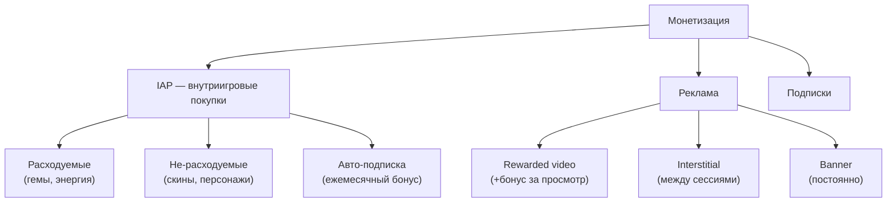
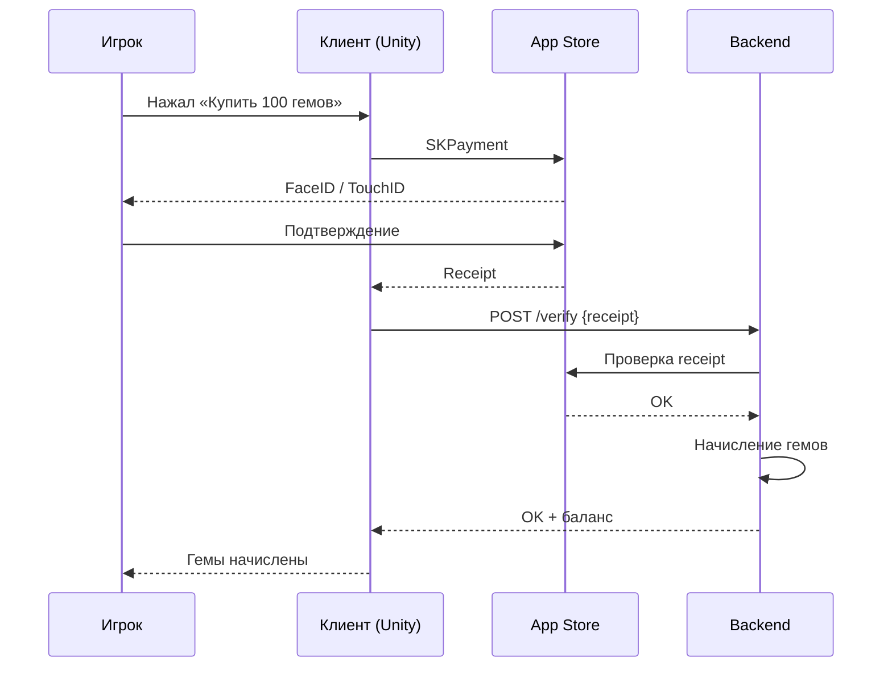

:::info[TL;DR]
Монетизация в играх: IAP (внутриигровые покупки) через App Store / Google Play, реклама (rewarded, interstitial, banner), подписки. Ключевые метрики: ARPU, ARPPU, конверсия в платящего, LTV. Аналитик проектирует store-интеграцию, рекламные placements, ценообразование и трекинг покупок.
:::

## Типы монетизации

## Метрики монетизации

| Метрика | Описание | Кому важна |
|---------|----------|-----------|
| **ARPU** | Средний доход на пользователя | Product |
| **ARPPU** | Средний доход на платящего | Monetization |
| **Conversion rate** | % платящих игроков | Маркетинг |
| **LTV** | Lifetime value игрока | Стратегия |
| **pLTV** | Прогнозируемый LTV (первые 7 дней) | UA |
| **Retention D1/D7/D30** | Возврат игроков | Product |

## Процесс покупки IAP

## Что дальше

- [LiveOps — управление живым продуктом](/docs/specialization/gamedev-liveops)

## Проверь себя

1. **Какие типы IAP бывают?**
   *Ответ:* Расходуемые (гемы), не-расходуемые (скины), подписки.

2. **Какие метрики монетизации самые важные?**
   *Ответ:* ARPU, ARPPU, Conversion rate, LTV, Retention D1/D7/D30.
