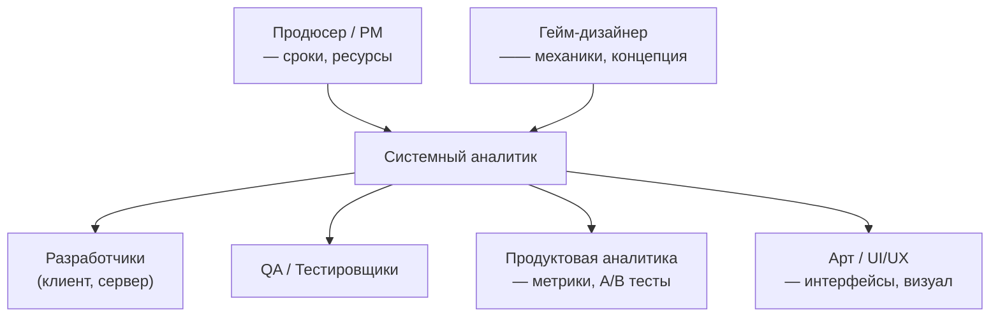

:::info[TL;DR]
GameDev-аналитик — мост между гейм-дизайнерами, продакт-менеджерами и разработкой. Работает с экономическими балансами, матчмейкингом, монетизацией (IAP, реклама), LiveOps (ивенты, боевые пропуска), социальными механиками и игровой аналитикой. В отличие от корпоративной разработки, в играх критичны: real-time сессии, миллионы пользователей, экономические «замкнутые циклы» и A/B-тестирование каждого изменения.
:::

## Для кого эта статья

Ты Middle-аналитик, который хочет перейти в GameDev. Или просто хочешь понять, чем живёт индустрия. К концу статьи ты будешь знать:

- Какие бывают типы игровых компаний и как устроена команда
- Чем GameDev отличается от Enterprise, FinTech, E-commerce
- Какую роль играет аналитик на каждом этапе разработки игры
- Какую терминологию нужно освоить в первую очередь

## 1. Индустрия GameDev: цифры и факты

GameDev — не «детская» индустрия. По размеру рынка она давно обогнала кино и музыку вместе взятые.

| Показатель | Значение |
|-----------|----------|
| Рынок в 2025 | ~250 млрд USD |
| Мобильные игры | ~55% рынка |
| Средний чек платящего игрока (ARPPU) | $20–100 в месяц |
| Конверсия в платящего | 1.5–5% |
| Среднее время в игре в день | 30–60 мин |
| Типичный размер команды мобильной игры | 15–40 человек |
| AAA-проект (консоль/ПК) | 200–500+ человек |

## 2. Типы игровых компаний

Не все GameDev-компании устроены одинаково. От типа компании зависит, чем будет заниматься аналитик.

| Тип | Описание | Примеры | Аналитику |
|-----|----------|---------|-----------|
| **Разработчик (Studio)** | Создаёт игру от идеи до релиза | Supercell, Playrix, ZeptoLab | Полный цикл: дизайн → баланс → запуск → LiveOps |
| **Издатель (Publisher)** | Продвигает и выпускает игры других студий | My.Games, VK Play | Маркетинг, аналитика, монетизация |
| **Hyper-casual студия** | Быстрый выпуск простых игр | Ketchapp, SayGames | A/B тесты, метрики, CPI оптимизация |
| **Outsource / Outstaff** | Разрабатывает часть игры для другой студии | Room 8, Sperasoft | Чёткие спецификации, документирование |
| **Платформа / Инфраструктура** | Создаёт инструменты для игр | Unity, Unreal, Appsflyer | API, SDK, документация для разработчиков |

## 3. Как устроена игровая команда

Роли, с которыми аналитик взаимодействует ежедневно:

**Ключевое отличие от Enterprise:** в GameDev решения принимаются быстрее, документация компактнее (game design doc — 10–30 страниц, а не SRS на 200), и многое решается через прототипы и плейтесты.

## 4. Жизненный цикл игрового проекта

| Фаза | Аналитик делает | Артефакты |
|------|----------------|-----------|
| **Pre-production** | Участвует в brainstorms, оценивает риски, исследует конкурентов | GDD (game design document), концепт |
| **Production** | Детализирует механики, пишет спецификации, балансит экономику | UI flows, экономические таблицы, API specs |
| **Soft launch** | Настраивает аналитику, участвует в A/B тестах, анализирует метрики | Дашборды, отчёты по retention |
| **Global launch** | Оптимизирует монетизацию, готовит LiveOps-календарь | LiveOps calendar, ивент-спеки |
| **LiveOps** | Проектирует ивенты, следит за экономикой, участвует в балансировке | Event specs, balance patches |

## 5. Словарь терминов (must-know)

GameDev использует свою терминологию. Без неё аналитик не сможет общаться с командой.

| Термин | Значение | Пример |
|--------|----------|--------|
| **GDD** | Game Design Document — документ с концепцией игры | Описание механик, сюжет, экономика |
| **Core loop** | Основной цикл игры: действие → награда → прогресс | Убил монстра → получил опыт → прокачал уровень |
| **Metagame** | Прогресс вне основного геймплея | прокачка базы, коллекционирование героев |
| **IAP** | In-App Purchase — внутриигровая покупка | Купить 100 гемов за 199₽ |
| **UA** | User Acquisition — привлечение пользователей | Реклама в Facebook, TikTok |
| **LTV** | Lifetime Value — сколько денег приносит игрок | Средний LTV = $5 за 180 дней |
| **ARPU** | Average Revenue Per User | $0.15 на пользователя |
| **ARPPU** | Average Revenue Per Paying User | $25 на платящего |
| **Retention** | Возврат игроков (D1, D7, D30) | D1 = 40%, D7 = 20%, D30 = 10% |
| **Churn** | Процент ушедших игроков | Churn D1→D7 = 50% (из 100 осталось 50) |
| **Session** | Одна игровая сессия | Средняя сессия = 15 минут |
| **Soft launch** | Запуск в нескольких странах для теста | Запуск в Филиппинах, 100K установок |
| **SOT** | Степень обучения воронки игрока | прохождение туториала → первый уровень |
| **BP / Battle Pass** | Боевой пропуск — сезонный набор наград | Fortnite BP: 100 уровней, 950 V-Bucks |
| **Whale** | Кит — игрок, тратящий очень много | >$1000/мес (1–2% всех игроков дают 50% дохода) |
| **Paywall** | Момент, где игроку предлагают заплатить | Кончилась энергия — купи ещё за 99₽ |

## 6. Что нужно знать аналитику для GameDev

### Hard skills

- **Экономическое моделирование**: Excel/Google Sheets, математические модели циклов
- **SQL и аналитика**: запросы к DWH (ClickHouse, BigQuery), воронки, когорты
- **A/B тестирование**: статистическая значимость, длительность тестов
- **API-дизайн**: REST/GraphQL для игрового бэкенда
- **Знание платформ**: App Store, Google Play, Unity, Unreal — как работают store-интеграции

### Soft skills

- **Гейм-дизайн-мышление**: понимать, что делает игру весёлой и «залипательной»
- **Работа с неопределённостью**: в играх многое меняется после плейтестов
- **Коммуникация с творческими ролями**: гейм-дизайнеры мыслят не «функциональными требованиями», а «механиками и эмоциями»

## 7. Типичные ошибки новичков в GameDev

1. **Перенести Enterprise-подход**: в играх не нужен SRS на 100 страниц. Нужен понятный GDD и конкретные спецификации.
2. **Игнорировать метрики**: «кажется, что баланс норм» — непроверенная гипотеза. Всё надо считать в Excel и проверять A/B тестами.
3. **Не учитывать виральность**: в играх пользователи приводят пользователей. K-factor важен.
4. **Сложная документация для простых механик**: аналитик должен писать так, чтобы гейм-дизайнер понял.

## 8. Практика: с чего начать

1. **Выбери игру, в которую играешь или хорошо знаешь** (или любую популярную F2P)
2. **Распиши её core-loop**: что делает игрок → что получает → куда тратит
3. **Найди экономическую модель**: сколько валют, откуда берутся, где тратятся
4. **Оцени retention**: найди данные по рынку для этого жанра (например, для RPG D1=35%, D7=15%, D30=7%)
5. **Ответь на вопрос**: в каком моменте игрок впервые платит? Сколько стоит первый донат?

## Проверь себя

1. **Какие типы компаний есть в GameDev?**
   *Ответ:* Studio (разработчик), Publisher (издатель), Hyper-casual, Outsource, Платформа.

2. **Чем GameDev-аналитик отличается от Enterprise-аналитика?**
   *Ответ:* Быстрее, компактнее документация, работа с экономическими моделями, метрики и A/B тесты — основа решений.

3. **Что такое core loop и metagame?**
   *Ответ:* Core loop — основной игровой цикл (действие → награда → прогресс). Metagame — всё, что вне core loop (прокачка, коллекции).

4. **Какая конверсия в платящего типична для F2P?**
   *Ответ:* 1.5–5%. 1–2% «китов» дают 50% дохода.

5. **Какие артефакты создаёт аналитик в фазе production?**
   *Ответ:* UI flows, экономические таблицы, API specifications, спецификации механик.
