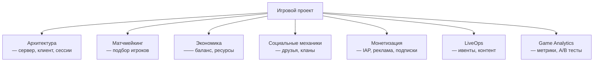

:::info[TL;DR]
GameDev-аналитик работает с игровыми проектами: матчмейкинг, экономика, монетизация (IAP, реклама), LiveOps, социальные механики и аналитика. Специфика: миллионы пользователей, real-time сессии, экономические балансы, A/B тесты, работа с продакт-менеджерами и гейм-дизайнерами.
:::

## Основные домены GameDev

## Карьерный путь

| Этап | Роль | Ключевые навыки |
|------|------|----------------|
| 1 | Junior SA | Документация, гейм-дизайн документы |
| 2 | Middle SA | Экономический баланс, интеграции |
| 3 | Senior SA | Архитектура, LiveOps, аналитика |
| 4 | Lead | Product owner, мета-экономика |

## Что дальше

- [Архитектура игровых проектов](/docs/specialization/gamedev-architecture)
- [Игровая экономика и баланс](/docs/specialization/gamedev-economy)

## Проверь себя

1. **Какие основные домены в GameDev?**
   *Ответ:* Архитектура, матчмейкинг, экономика, соцмеханики, монетизация, LiveOps, аналитика.

2. **Чем GameDev отличается от других отраслей?**
   *Ответ:* Real-time сессии, экономические балансы, миллионы пользователей, A/B тесты, работа с гейм-дизайнерами.
