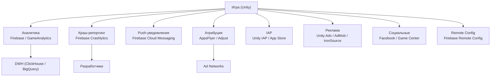
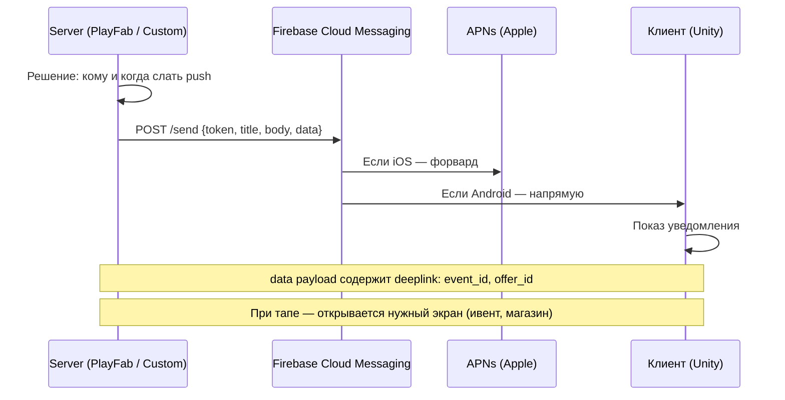
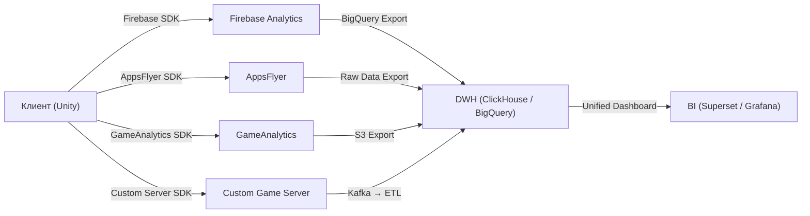

:::info[TL;DR]
Мобильная игра — не изолированное приложение. Она интегрирует 5–10+ SDK (Analytics, Push, Crash, Monetization, Attribution). Аналитик проектирует, какие SDK нужны, какие события они шлют, как данные текут от клиента в DWH и какие риски у каждой интеграции. Главное: **SDK — это код в клиенте**, его надо тестировать, обновлять и мониторить. Ошибка в SDK может стоить revenue (потерянные события) или рейтинга (краш).
:::

## Для кого эта статья

Middle/Senior SA, проектирующий интеграции в мобильных играх. После прочтения вы:

- Поймёте, какие SDK используются в стандартном игровом стеке
- Сможете спроектировать схему интеграции SDK и event flow
- Узнаете, как тестировать SDK-интеграции и отлавливать потери событий
- Поймёте риски: SDK spoofing, утечка данных, замедление билда

## 1. Типовой SDK-стек мобильной игры



### Обязательные SDK для любой мобильной игры

| SDK | Зачем | Альтернативы | Бесплатно? |
|-----|-------|-------------|-----------|
| **Firebase Analytics** | Базовая аналитика, события, user properties | Amplitude, Mixpanel | Да (безлимит) |
| **Firebase Crashlytics** | Краш-репортинг, логи, ассерты | Sentry, Bugfender | Да |
| **Firebase Remote Config** | A/B тесты, ивенты, параметры без апдейта | Split, LaunchDarkly | Да |
| **AppsFlyer / Adjust** | Атрибуция, трекинг UA | Singular, Branch | Да (до 20K MAU) |
| **Unity IAP** | Внутриигровые покупки | Purchases (RevenueCat) | Да |

### Дополнительные (в зависимости от типа игры)

| SDK | Когда нужно | Зачем |
|-----|-------------|-------|
| **Unity Ads / AdMob** | Есть реклама в игре | Показ и монетизация рекламы |
| **IronSource / AppLovin** | Mediation (несколько ad networks) | Максимизация ad revenue |
| **Facebook SDK** | Есть вход через Facebook / соц. фичи | Авторизация, friends |
| **Game Center / Google Play Games** | Лидерборды, achievements | Социальные функции |
| **RevenueCat** | Сложная подписочная модель | Управление подписками cross-platform |
| **PlayFab / UGS** | Есть бэкенд для LiveOps | Экономика, ивенты, лидерборды |

## 2. Firebase — центральный SDK

Firebase (Google) — стандарт де-факто для мобильных игр. Не аналитическая платформа, а экосистема:

| Firebase-продукт | Использование в играх |
|-----------------|----------------------|
| **Analytics** | События (tutorial, level, purchase), user properties (level, country, payer status) |
| **Crashlytics** | Краш-репортинг с логированием перед крашем |
| **Remote Config** | A/B тесты, ивент-параметры, цены, промо-флаги |
| **Cloud Messaging (FCM)** | Push-уведомления (retention, ретаргетинг) |
| **Performance Monitoring** | Лаги, загрузка уровней, network latency |
| **Cloud Firestore / Realtime Database** | Сохранения, синхронизация между устройствами |
| **Authentication** | Анонимная авторизация + Google/Facebook |

### Как Firebase интегрируется в Unity

```
Unity SDK (Firebase Unity SDK v12+)
    ↓
Android: Firebase Android SDK (AAR)
iOS: Firebase iOS SDK (CocoaPods / SPM)
    ↓
Google Services JSON/PLIST (конфиг проекта)
    ↓
Firebase Console — дашборды, события, краш-логи
```

**Ключевые файлы:**
- `google-services.json` — для Android (кладётся в Assets/)
- `GoogleService-Info.plist` — для iOS
- `FirebaseManager.cs` — инициализация и трекинг

### События Firebase Analytics в играх

Firebase определяет **рекомендованные события** для игр:

| Событие | Параметры | Автоматическое? |
|---------|-----------|-----------------|
| `level_up` | level, character | Нет (вызывается кодом) |
| `post_score` | score, level | Нет |
| `unlock_achievement` | achievement_id | Нет |
| `tutorial_begin` | — | Нет |
| `tutorial_complete` | — | Нет |
| `spend_virtual_currency` | item_name, value, virtual_currency_name | Нет |
| `earn_virtual_currency` | item_name, value, virtual_currency_name | Нет |
| `screen_view` | screen_name, screen_class | Да (авто) |
| `app_open` | — | Да |
| `user_engagement` | — | Да (авто, каждые 10 мин) |
| `first_open` | — | Да (один раз) |

**User Properties (фильтры для сегментации):**
```
firebase_user_properties:
  - level (int)
  - player_type (whale / spender / f2p)
  - clan (string)
  - region (string)
  - last_purchase_days_ago (int)
```

## 3. Push-уведомления

Push — главный инструмент удержания. Игра без push = retention на 10–20% ниже.

### Как работают push в играх



### Типы push-уведомлений в играх

| Тип | Пример | Частота | Эффект на retention |
|-----|--------|---------|-------------------|
| **Retention** | «Ты давно не заходил! Тебя ждёт подарок» | Раз в 3 дня | +5–10% D7 |
| **Event** | «Ивент «Сокровища пиратов» начался!» | Раз в ивент | +15–30% participation |
| **Promo** | «Скидка 70% на стартовый набор — сегодня!» | Раз в неделю | +10% revenue |
| **Social** | «Тебя пригласили в клан!» | По событию | +20% clan join |
| **Energy refill** | «У тебя полная энергия! Возвращайся!» | Каждые 6 часов | +8% session frequency |

**Правила хороших push (best practices):**
- Не чаще 2 раз в день на пользователя
- Персонализация: обращаться по имени персонажа, напоминать о прогрессе
- Deep link: тап → открывается конкретный экран
- A/B тестируй тексты и время отправки
- Opt-in/out: дать игроку выбрать типы push

### Метрики push

| Метрика | Описание | Норма |
|---------|----------|-------|
| **Delivery rate** | % доставленных | > 95% |
| **Open rate** | % открывших | 15–30% |
| **Conversion rate** | % совершивших целевое действие | 5–15% |
| **Opt-out rate** | % отписавшихся | < 5% в месяц |

## 4. GameAnalytics

GameAnalytics — бесплатная платформа, специализированная для игр (в отличие от Firebase, которая универсальна).

| Параметр | Firebase Analytics | GameAnalytics |
|----------|-------------------|---------------|
| **Бесплатный лимит** | Безлимит | 200K MAU (бесплатно) |
| **Специализация** | Универсальная | Только игры |
| **Когорты** | Базовые | Advanced (retention, LTV) |
| **Funnels** | Да | Да |
| **Raw data export** | BigQuery (платно) | S3, BigQuery (платно) |
| **Игровые шаблоны** | Нет | Да (уровни, ресурсы, ивенты) |

**Когда использовать GameAnalytics:**
- Нужна игровая аналитика «из коробки» (retention, воронки, когорты)
- Нет бюджета на Amplitude/Mixpanel ($50K+/год)
- Хочешь быстро запустить аналитику без настройки DWH

**Когда Firebase Analytics:**
- Уже используешь Firebase (Crashlytics, Remote Config)
- Нужен экспорт в BigQuery
- Нужны user properties и интеграция с Google Ads

**Лучшая практика:** использовать оба — Firebase для Crashlytics + Remote Config, GameAnalytics (или Amplitude) для глубокой аналитики.

## 5. Интеграция SDK в Unity: чек-лист для аналитика

При проектировании интеграции нового SDK аналитик проверяет:

```
[ ] 1. Какие разрешения (permissions) добавляет SDK?
     - Интернет (обязательно)
     - Push-уведомления (если есть)
     - Access advertising ID (ATT на iOS)

[ ] 2. Какой размер SDK?
     - Firebase Analytics: ~2MB
     - Unity Ads: ~3MB
     - AppsFlyer: ~500KB
     - Общий: может добавить 10-20MB к билду

[ ] 3. Какие события шлёт SDK?
     - Автоматические (app_open, first_open)
     - Требуют ручного вызова (level_complete, purchase)

[ ] 4. Как SDK влияет на производительность?
     - Crashlytics: не должен крашить (логируются краши)
     - Push: не должен задерживать загрузку

[ ] 5. Есть ли SDK spoofing риск?
     - Можно ли подделать отправку событий?
     - Нужна ли server-side валидация?

[ ] 6. Соответствие GDPR/COPPA/CCPA?
     - SDK собирает IDFA / GAID?
     - Есть ли consent popup?

[ ] 7. Обновление SDK?
     - Кто отвечает за обновление?
     - Как часто выходят мажорные версии?
```

## 6. Event Flow: от SDK до DWH



**Важно:** у каждого SDK свой формат данных, свой loss rate, своя задержка.

| SDK | Задержка данных | Loss rate (типичный) |
|-----|----------------|---------------------|
| Firebase Analytics | 1–4 часа (batch) | &lt;1% |
| AppsFlyer | Real-time + 24h (SKAN) | &lt;1% (детерминированная) |
| GameAnalytics | 15 минут | &lt;2% |
| Custom Server | Real-time | &lt;0.1% |

## 7. Типичные проблемы с SDK

1. **SDK конфликты.** Два разных ad SDK могут конфликтовать. Используй mediation (IronSource, AppLovin MAX).
2. **SDK Spoiling.** Вредоносное приложение может эмулировать отправку событий. Защита: server-side валидация receipt.
3. **ATT (iOS 14.5+).** SDK не может получить IDFA без согласия. Настраивай ATT popup правильно.
4. **Размер билда.** Каждый SDK добавляет 1–5MB. 10 SDK = 10–50MB к билду (критично для emerging markets).
5. **Google Play policy.** SDK не должен собирать данные без согласия. GDPR/COPPA compliance обязателен.
6. **SDK обновления.** Старый SDK может перестать работать (Firebase устаревшие версии блокируют события).

## Ссылки для самостоятельного изучения

| Ресурс | Описание | Ссылка |
|--------|----------|--------|
| Firebase Documentation | Полная документация Firebase | https://firebase.google.com/docs |
| Firebase Unity SDK | Интеграция Firebase с Unity | https://firebase.google.com/docs/unity/setup |
| Firebase Analytics for Games | Игровые события (рекомендованные) | https://firebase.google.com/docs/analytics/event-parameters-gaming |
| Firebase Cloud Messaging | Push-уведомления | https://firebase.google.com/docs/cloud-messaging |
| GameAnalytics Docs | Документация GameAnalytics SDK | https://docs.gameanalytics.com/ |
| GameAnalytics Unity SDK | Интеграция с Unity | https://docs.gameanalytics.com/sdk-setup/unity |
| Unity SDK Best Practices | Как работать с SDK в Unity | https://unity.com/how-to/integrate-third-party-sdks-unity |
| RevenueCat Docs | Подписки cross-platform | https://www.revenuecat.com/docs/ |
| Google Play SDK Index | Совместимость SDK с Android | https://play.google.com/sdks/ |
| ATT Consent Flow | App Tracking Transparency — гайд | https://developer.apple.com/documentation/apptrackingtransparency |

## Проверь себя

1. **Какие SDK обязательны для любой мобильной игры?**
   *Ответ:* Firebase Analytics + Crashlytics + Remote Config, AppsFlyer/Adjust (атрибуция), Unity IAP (покупки). Дополнительно: Ad SDK, Push.

2. **Чем Firebase Analytics отличается от GameAnalytics?**
   *Ответ:* Firebase — универсальная (бесплатно, BigQuery export, Crashlytics). GameAnalytics — специализированная для игр (шаблоны, когорты, воронки). Лучшая практика — оба.

3. **Как push-уведомления влияют на retention?**
   *Ответ:* Правильные push повышают retention на 10–20%. Но слишком частые или нерелевантные — увеличивают opt-out и churn. Max 2/день, персонализация, deep link.

4. **Какие риски есть у SDK-интеграций?**
   *Ответ:* Размер билда, конфликты SDK, потеря событий, SDK spoofing, GDPR/COPPA compliance, устаревание SDK.

5. **Как устроен event flow от игры до DWH?**
   *Ответ:* Клиент (Unity) → SDK (Firebase, AppsFlyer, GameAnalytics) + Custom Server → Kafka/ETL → DWH (ClickHouse) → BI. У каждого SDK своя задержка и loss rate.
