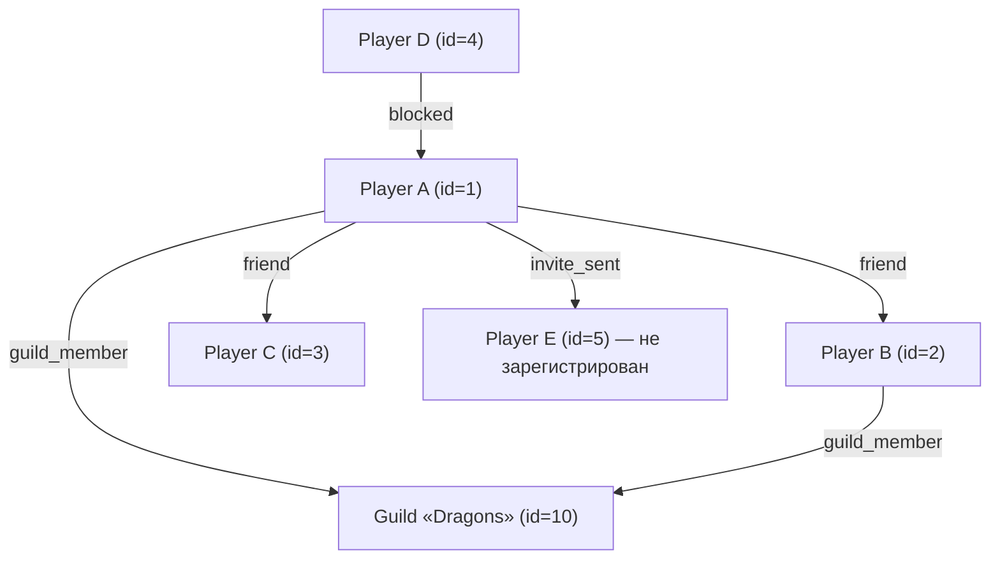
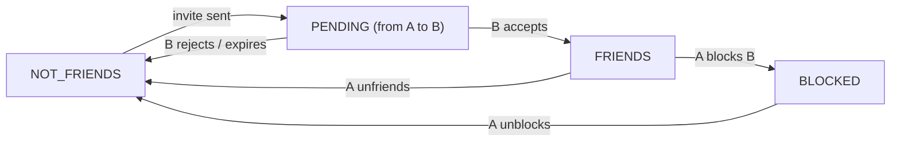
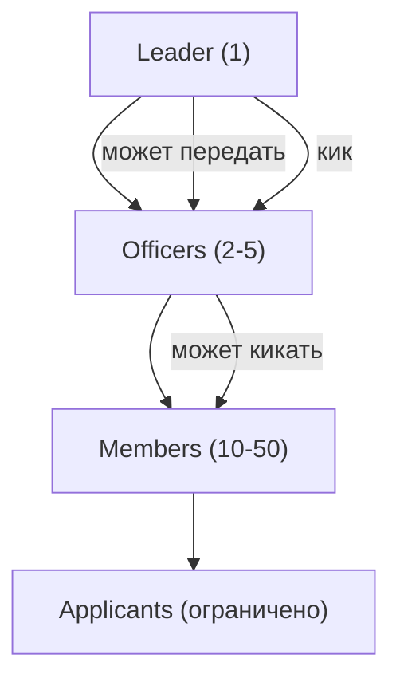
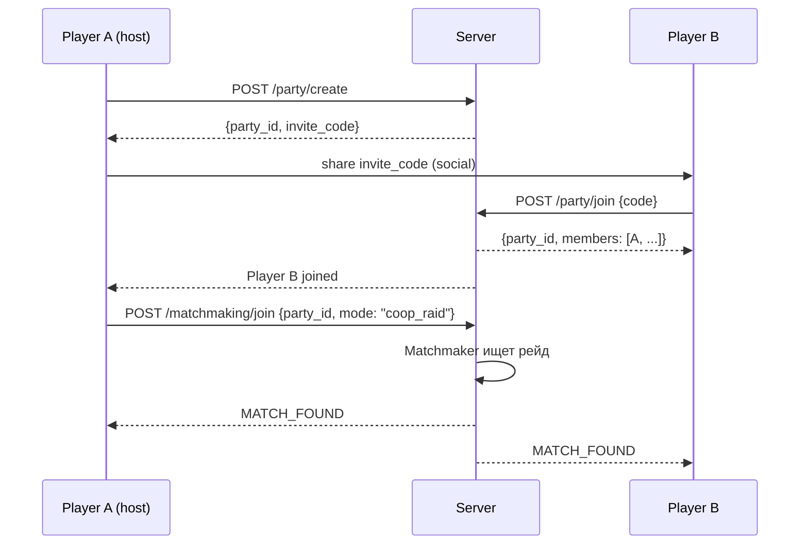

:::info[TL;DR]
Социальные механики — ключевой драйвер retention и виральности в играх. Друзья, кланы/гильдии, чат, PvP-лиги, турниры и механика приглашений превращают одиночную игру в социальный опыт. Игроки, у которых есть друзья в игре, показывают retention D30 на 30–50% выше, чем одиночки. Аналитик проектирует социальный граф, систему приглашений (invite), совместные активности (co-op рейды, вечеринки) и механизмы вирального роста (share, invite, gifting).
:::

## Для кого эта статья

Middle/Senior SA, который проектирует социальные механики в играх. После прочтения вы:

- Поймёте, как устроен social graph в играх и какие данные он хранит
- Сможете спроектировать систему друзей, кланов и приглашений
- Узнаете, как виральные механики влияют на K-factor и органический рост
- Сможете специфицировать API социальных функций

## 1. Зачем играм социальные механики

Социальные функции — не «плюшка», а стратегический инструмент:

| Эффект | Описание | Пример |
|--------|----------|--------|
| **Retention** | Друзья создают обязательства: «меня ждут в клане» | Retention D30 у членов клана на 40% выше |
| **Virality** | Игрок приводит друзей → органический рост | K-factor > 1 = вирусный рост |
| **Monetization** | Gifting, клановые бонусы, соревнования | Clash Royale: клановые запросы карт → донат |
| **Engagement** | Co-op, PvP, турниры — глубже, чем одиночная игра | World of Warcraft: рейды держат игроков годами |
| **User-generated content** | Игроки создают контент друг для друга | Mario Maker, Roblox, Dreams |

**Конкретные цифры:**
- Fortnite: 78% игроков играют с друзьями
- Clash of Clans: клановые игроки имеют LTV в 2.5x выше, чем соло-игроки
- Pokémon GO: виральный K-factor = 1.8 на старте (каждый игрок приводил 1.8 друзей)

## 2. Social Graph: как устроен



**Данные social graph:**

| Сущность | Поля | 
|----------|------|
| **Friendship** | player_id_1, player_id_2, status (pending/active/blocked), created_at |
| **Guild** | id, name, level, members_count, min_trophies, description |
| **GuildMember** | guild_id, player_id, role (leader/officer/member), joined_at |
| **Invite** | from_player, to_player_or_phone, status (sent/accepted/expired), reward_claimed |

**На практике:** social graph хранится в Redis (для fast reads) и Postgres (persistence). Тысячи запросов в секунду на чтение списка друзей.

## 3. Система друзей: дизайн и API

### Статусная модель дружбы



**Детали реализации:**
- Invite живёт 7 дней, после — expires
- Максимум друзей: 200 (может зависеть от уровня)
- При удалении из друзей — уведомление не шлётся (privacy)
- Cross-platform: игроки с iOS и Android видят друг друга

**Типовой API:**

| Endpoint | Метод | Описание |
|----------|-------|----------|
| `POST /friends/invite` | Отправить запрос | body: `{player_id, message?}` |
| `POST /friends/accept/{invite_id}` | Принять запрос | — |
| `POST /friends/reject/{invite_id}` | Отклонить запрос | — |
| `POST /friends/remove/{player_id}` | Удалить из друзей | — |
| `POST /friends/block/{player_id}` | Заблокировать | blocked не видит игрока |
| `GET /friends/list` | Список друзей | ?status=online (фильтр) |
| `GET /friends/pending` | Входящие запросы | — |
| `GET /friends/suggestions` | Рекомендации друзей | по общим друзьям, клану |

### Интеграция с платформами

Для мобильных игр важно подключать друзей из:
- **Facebook API** — friends who also play (требует user_friends permission)
- **Game Center** (iOS) — GKLocalPlayer.loadRecentPlayers
- **Google Play Games** — PlayersClient.loadFriends
- **Адресная книга** — найти друзей по номеру телефона

**Важно (GDPR/COPPA):** нельзя шарить список друзей без согласия. Facebook с 2018 ограничил friends API.

## 4. Кланы / Гильдии

Клан — «вторая семья» для игрока. Игроки в кланах показывают retention D90 в 2–3x выше.

### Структура клана



**Функции клана:**

| Функция | Описание | Как влияет на метрики |
|---------|----------|----------------------|
| **Clan chat** | Общий чат | Retention + |
| **Clan wars** | Соревнование кланов | Engagement ++ |
| **Clan donations** | Обмен ресурсами/картами | Monetization + |
| **Clan perks** | Бонусы за уровень клана | Retention ++ |
| **Clan boss / Raid** | Co-op битва | Engagement +++ |

**Конкретный пример: Clash of Clans**
- Клан до 50 человек
- Clan Wars: 15v15 или 30v30, длительность 2 дня
- Clan Games: еженедельные задания клана
- Clan Capital (2022): общая база клана для развития
- **Метрика:** клановые игроки тратят на 40% больше (higher ARPPU)

## 5. Co-op механики

### Party / Вечеринка



**Party lifecycle:**
- Создаётся на 30 минут (если нет активности — disband)
- Host может kick, change mode, start search
- Max party size: 2–4 (зависит от режима)
- При disconnect: reconnect в течение 60 секунд

### Raid / Совместный бой

**Пример: World of Warcraft — рейды**
- 10–25 человек в рейде
- Длительность: 30–60 минут
- Роли: Tank, Healer, DPS (Damage)
- Награды: эпическое снаряжение (только в рейде)
- **Ключевое:** рейд — социальное событие, которое нельзя «пропустить». Игроки подстраивают расписание под рейд.

**В мобильных играх** рейды проще: 3–5 минут, автоматизация (AFK Arena), награды по урону (Clash of Clans — Clan War).

## 6. Виральность (Virality)

Виральные механики — единственный способ получить органический рост без платного трафика.

### K-factor

```
K-factor = Количество_приглашений * Конверсия_в_регистрацию

K > 1 → вирусный рост
K = 1 → стабильный приток
K < 1 → затухание (нужен UA)
```

**Пример:**
- Каждый игрок отправляет 3 приглашения
- Конверсия в регистрацию: 40%
- K-factor = 3 * 0.4 = 1.2 (рост!)

### Типы invite-механик

| Механика | Описание | Пример |
|----------|----------|--------|
| **Direct invite** | Отправить ссылку другу | «Приведи друга — получи 100 гемов» |
| **Gift invite** | Подарок за регистрацию друга | Pokémon GO: пригласи друга — оба получим покеболы |
| **Challenge invite** | Вызов на битву | «Я набрал 1000 очков — побей мой рекорд!» |
| **Share to unlock** | Расшарить результат в соцсеть | «Я прошёл уровень! Помоги мне — нажми ссылку» |
| **Deep link** | Ссылка с параметрами (utm) | Кто привёл, какой уровень и т.д. |

**Конкретный кейс: Candy Crush**
- После прохождения уровня: «Поделись результатом с друзьями — получи +5 ходов»
- Share в Facebook → друзья видят пост → некоторые устанавливают игру
- **Метрика:** ~15% установок приходят от share-механик

### Трекинг invite

```
Event: invite_sent
params: {invite_id, from_player_id, method: "facebook"|"link"|"phone", timestamp}

Event: invite_reward_claimed
params: {invite_id, from_player_id, new_player_id, reward_type, reward_amount}
```

## 7. Gifting (Подарки)

Gifting — социальная механика, которая напрямую влияет на монетизацию.

| Тип подарка | Описание | Платит ли отправитель? |
|-------------|----------|----------------------|
| **Free gift** | Ежедневный подарок другу | Нет (soft currency) |
| **Premium gift** | Покупка подарка для друга | Да (hard currency) |
| **Gacha pull** | Подарить случайный предмет | Да (hard currency) |

**Пример: Pokémon GO — Gifts**
- Игрок собирает Gifts в PokéStops
- Может отправить другу (бесплатно)
- Друг открывает — получает предметы + яйца
- **Механика:** лимит 20 открытых подарков в день → игрок логинится ежедневно (retention!)

## 8. Социальные метрики

| Метрика | Описание | Цель |
|---------|----------|------|
| **% players with friends** | Сколько игроков имеют хотя бы одного друга | > 50% на D7 |
| **% players in clan** | Сколько вступили в клан | > 30% |
| **Invites sent per player** | Среднее число приглашений | > 1 |
| **Invite conversion rate** | % приглашённых, которые зарегистрировались | > 20% |
| **K-factor** | Виральность | > 1 |
| **Social DAU/MAU** | % активных, кто использует соц. функции | > 40% |
| **Gift acceptance rate** | % принятых подарков | > 70% |
| **Clan retention D30** | Retention членов клана | > 50% |

## 9. Кейс: Pokemon GO — социальные механики как основа игры

Pokémon GO перевернула представление о социальных механиках в мобильных играх:

| Механика | Как работает | Эффект |
|----------|-------------|--------|
| **Gyms** | 3 команды (Valor/Mystic/Instinct) — захват башен | Социальная идентичность |
| **Friends** | Обмен подарками, торговля покемонами | Retention + |
| **Raid Battles** | Co-op битвы с боссами (до 20 человек) | Социальные встречи в парках |
| **Community Day** | Ежемесячное событие в реальном мире | IRL community |
| **Gifts** | Подарки из PokéStops | Daily login мотивация |

**Результат:** Pokémon GO — одна из немногих игр, где retention D90 превышает 30% (норма для мобильных игр — 10–15%).

## Проверь себя

1. **Как социальные механики влияют на retention?**
   *Ответ:* Игроки с друзьями/в клане имеют retention D30/D90 в 2–3x выше. Друзья создают социальные обязательства («меня ждут»).

2. **Что такое K-factor и какое значение нужно для вирусного роста?**
   *Ответ:* K-factor = приглашения × конверсия. K > 1 — вирусный рост, K = 1 — стабильно, K < 1 — затухание.

3. **Какие данные хранит social graph?**
   *Ответ:* Friendships (player_id_1, player_id_2, status), Guilds (id, name, level, members), Invites (from, to, status), Blocks.

4. **Чем полезны кланы для монетизации?**
   *Ответ:* Клановые войны стимулируют траты (улучшения для клана), donation-механики создают социальное давление «отдавать» ресурсы, а клановые бонусы мотивируют покупать Battle Pass.

5. **Почему Candy Crush предлагает поделиться результатом?**
   *Ответ:* Share → друзья видят в соцсети → часть устанавливает игру (виральный рост). Игрок получает +5 ходов за share — выгода для обеих сторон.
