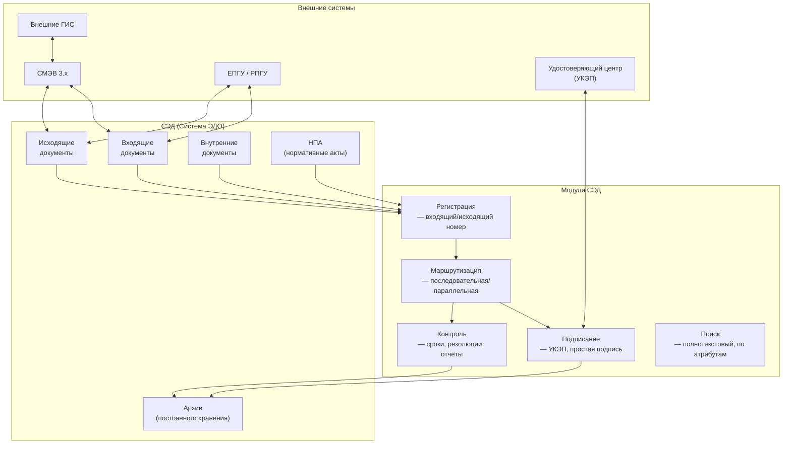
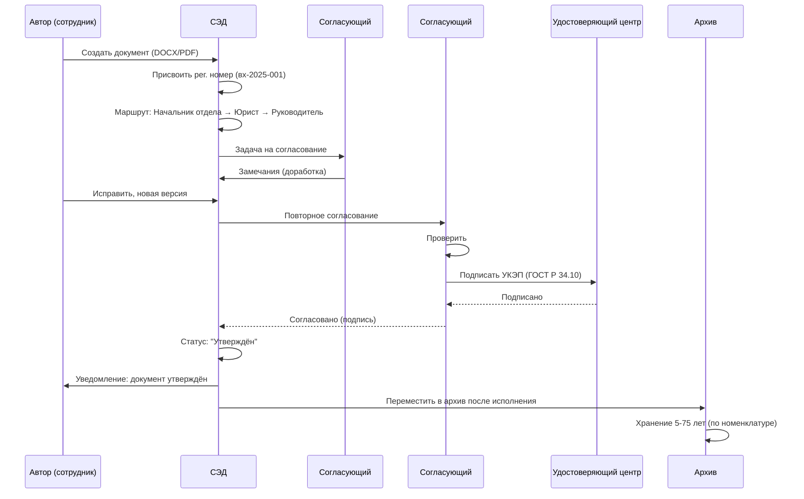

:::info[TL;DR]
ЭДО (электронный документооборот) в госсекторе — не просто обмен файлами. Это юридически значимый документооборот с УКЭП (усиленной квалифицированной электронной подписью по ГОСТ Р 34.10), СМЭВ-интеграцией, архивированием (5-75 лет) и строгими сроками по 59-ФЗ (30 дней). Типы: внутренний (ведомство), ведомственный (подведомственные), межведомственный (СМЭВ), с гражданами (ЕПГУ), с бизнесом (отчётность). Ключевые вендоры СЭД: Directum, TESSA, 1С:Документооборот, «Дело». Аналитик специфицирует маршруты согласования (последовательные/параллельные), формат документов (PDF/A, XML с УКЭП) и интеграцию с Удостоверяющим центром.
:::

## Для кого эта статья

Senior SA, проектирующий СЭД для госоргана. После прочтения вы:

- Поймёте типы ЭДО в госсекторе и их юридическую силу
- Узнаете архитектуру СЭД: маршруты, УКЭП, архив, СМЭВ
- Сможете специфицировать форматы документов: PDF/A, XML (УПД), SIG
- Поймёте требования: 59-ФЗ (сроки), архивное законодательство (5-75 лет)

## 1. Типы ЭДО в госсекторе

| Тип | Участники | Протокол | Юридическая сила | Объём (2024) |
|-----|-----------|----------|-----------------|--------------|
| **Внутренний ЭДО** | Отделы ведомства | СЭД (внутренняя шина) | УКЭП или простая подпись | 500M+ док/год |
| **Ведомственный** | Ведомство ↔ подведомственные | СЭД ↔ СЭД (API) | УКЭП | 200M+ |
| **Межведомственный** | Ведомство ↔ ведомство | СМЭВ 3.x (REST/JSON) | УКЭП + СМЭВ | 1B+ запросов |
| **С гражданами** | Ведомство ↔ гражданин | ЕПГУ (портал) | Простая ЭП / УКЭП | 500M+ заявлений |
| **С бизнесом** | Ведомство ↔ юрлицо | ЛК юрлица / СБИС / Диадок | УКЭП | 200M+ |

## 2. Архитектура СЭД



## 3. Жизненный цикл документа



## 4. Форматы документов

| Формат | Для чего | УКЭП | Объём | Срок хранения |
|--------|----------|------|-------|--------------|
| **PDF/A** (ISO 19005) | Архивные копии, юридическая значимость | Откреплённая (.sig) | 1-10 MB | 75 лет |
| **XML (УПД, УКД)** | Бухгалтерские документы (ФНС) | Встроенная | 10-50 KB | 5 лет |
| **DOCX** | Черновики, внутренняя переписка | По требованию | 0.1-1 MB | 1-3 года |
| **SIG (КриптоПро)** | Откреплённая подпись к любому файлу | Откреплённая | 1-5 KB | С файлом |
| **PDF + SIG** | Юридически значимый документ | Откреплённая | 1-10 MB | 5-75 лет |
| **TIF** | Отсканированные бумажные документы | Откреплённая | 10-100 MB | 5-75 лет |

## 5. УКЭП в ЭДО

Усиленная квалифицированная электронная подпись — аналог собственноручной.

### Типы УКЭП

| Тип | Стандарт | Ключ | Срок действия | Где применяется |
|-----|----------|------|---------------|----------------|
| **Подпись физического лица** | ГОСТ Р 34.10 | 2048 бит | 1-3 года | Госслужащий |
| **Подпись юрлица** | ГОСТ Р 34.10 | 2048 бит | 1-3 года | Организация |
| **МЧД** (машиночитаемая доверенность) | XMLDSig | 2048 бит | До 1 года | Сотрудник от юрлица |

### Процесс подписания УКЭП

```
1. Пользователь → СЭД: «Подписать документ»
2. СЭД → криптопровайдер (КриптоПро CSP): вычислить хеш (ГОСТ Р 34.11)
3. Криптопровайдер → USB-токен (Рутокен / JaCarta): подписать хеш
4. USB-токен → Криптопровайдер: подпись (base64 .sig)
5. СЭД → УЦ: проверить подпись (OCSP)
6. УЦ → СЭД: подпись действительна
7. СЭД: прикрепить .sig к документу
```

## 6. Маршруты согласования

| Тип маршрута | Описание | Когда использовать |
|-------------|----------|-------------------|
| **Последовательный** | A → B → C (один за другим) | Договоры, приказы (каждый видит) |
| **Параллельный** | A, B, C одновременно | Согласование разными отделами |
| **Смешанный** | A → (B и C) → D | Сложные документы |
| **Свободный** | Инициатор выбирает маршрут | Низкий риск |
| **Условный** | Если сумма > 1M → A+B, иначе → C | По параметрам документа |

## 7. Ключевые термины

| Термин | Пояснение |
|--------|-----------|
| **СЭД** | Система электронного документооборота |
| **УКЭП** | Усиленная квалифицированная электронная подпись (аналог собственноручной) |
| **МЧД** | Машиночитаемая доверенность — право сотрудника подписывать от юрлица |
| **УЦ** | Удостоверяющий центр — выдаёт и проверяет сертификаты УКЭП |
| **Номенклатура дел** | Сроки хранения документов (5, 10, 75 лет) |
| **Резолюция** | Поручение руководителя на документе |
| **Контроль** | Отслеживание сроков исполнения документов |

## 8. Требования к СЭД

| Параметр | Требование | Пояснение |
|----------|-----------|-----------|
| **Юридическая сила** | УКЭП (ГОСТ Р 34.10) | Аналог собственноручной подписи |
| **Маршруты** | Последовательные, параллельные, условные | Гибкость бизнес-процессов |
| **Сроки** | По 59-ФЗ: до 30 дней (до 15 для отдельных) | Автоматический контроль |
| **Архив** | 5, 10, 25, 50, 75 лет | По номенклатуре дел |
| **Интеграции** | СМЭВ, ЕПГУ, УЦ | Межведомственное взаимодействие |
| **ЭП** | УКЭП + простая ЭП | Разные уровни значимости |
| **Поиск** | Полнотекстовый, по реквизитам, по смыслу | 10M+ документов |
| **Масштаб** | 1K-50K сотрудников, 100M+ док/год | Федеральные ведомства |

## Практический кейс: Внедрение СЭД Directum в Росреестре

**Проблема:** Росреестр — 50 000 сотрудников, 2 000 офисов, 100M+ документов/год. Бумажный документооборот — 80%, срок обработки запроса — 30 дней, потери документов — 5%.

**Решение — Directum:**
1. **Единая СЭД:** все документы в электронном виде, 50K рабочих мест
2. **УКЭП:** каждое действие — подпись (КриптоПро, Рутокен)
3. **СМЭВ:** автоматический обмен со смежными ведомствами (МВД, ФНС)
4. **Архив:** PDF/A, 5-75 лет хранения
5. **Контроль:** автоматическое отслеживание сроков по 59-ФЗ

**Результат:**
- Бумага → электронный: 80% → 10%
- Срок обработки: 30 дней → 5 дней
- Потери документов: 5% → 0.1%
- Экономия: 2 млрд ₽/год (бумага, доставка, хранение)

## Ссылки для самостоятельного изучения

| Ресурс | Описание | Ссылка |
|--------|----------|--------|
| Directum — документация | СЭД для госсектора | https://www.directum.ru |
| TESSA — документация | Low-code платформа СЭД | https://tessa.ru |
| 1С:Документооборот | СЭД от 1С | https://v8.1c.ru/dokumentooborot/ |
| «Дело» — ЭОС | СЭД для госорганов | https://www.eos.ru |
| КриптоПро — УКЭП | Криптопровайдер | https://www.cryptopro.ru |
| Рутокен — токен УКЭП | USB-токен для подписи | https://www.rutoken.ru |
| 59-ФЗ о порядке обращений | Сроки ответа | https://www.consultant.ru |
| Архивное законодательство (125-ФЗ) | Сроки хранения | https://www.consultant.ru |

## Проверь себя

1. **Какие типы ЭДО бывают в госсекторе?**
   *Ответ:* Внутренний (отделы ведомства), ведомственный (с подведомственными), межведомственный (СМЭВ), с гражданами (ЕПГУ), с бизнесом. У каждого — свой протокол, юридическая сила и объём.

2. **Какой формат используется для юридически значимых документов?**
   *Ответ:* PDF/A (ISO 19005) + откреплённая УКЭП (.sig от КриптоПро). Либо XML с встроенной УКЭП (УПД, УКД для ФНС). DOCX — только для черновиков.

3. **Как работает УКЭП в СЭД?**
   *Ответ:* Пользователь → «Подписать» → КриптоПро CSP вычисляет хеш (ГОСТ Р 34.11) → USB-токен (Рутокен) подписывает → УЦ проверяет → .sig прикрепляется к документу.

4. **Какие маршруты согласования бывают?**
   *Ответ:* Последовательный (A→B→C), параллельный (A, B, C одновременно), смешанный, свободный, условный (по сумме/типу). Выбор — по типу документа и риску.

5. **Какие метрики эффективности СЭД?**
   *Ответ:* Доля электронных документов (цель: > 90%), срок обработки (59-ФЗ: 30 дней → факт 5 дней), потеря документов (< 1%), экономия (бумага, доставка, хранение: - 2B ₽/год для крупного ведомства).
