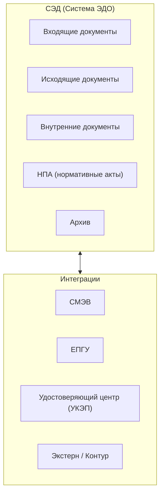
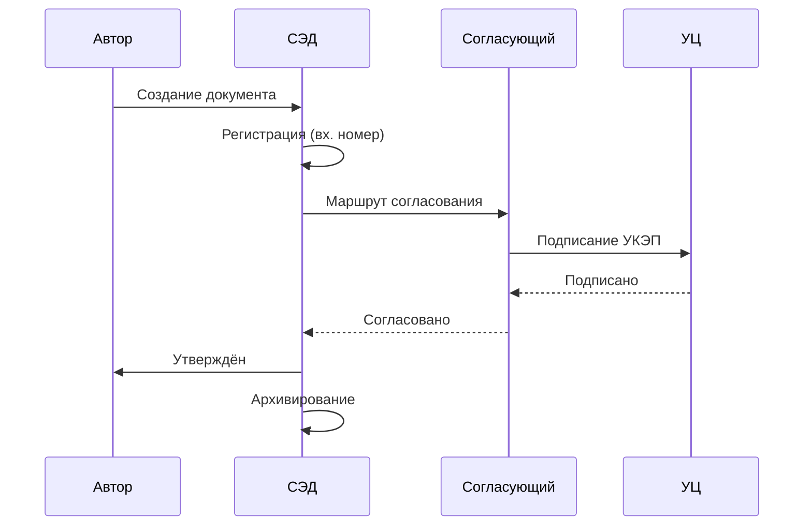

:::info[TL;DR]
ЭДО (электронный документооборот) в госсекторе — не просто обмен файлами. Это юридически значимый документооборот с УКЭП (усиленной квалифицированной электронной подписью), СМЭВ-интеграцией, архивированием и строгими сроками хранения. Аналитик специфицирует маршруты согласования, формат документов и интеграцию с внешними системами.
:::

## Типы ЭДО в госсекторе

| Тип | Описание | НПА |
|-----|----------|-----|
| **Внутренний ЭДО** | Между отделами одного ведомства | Приказ ведомства |
| **Ведомственный ЭДО** | Между подведомственными организациями | 59-ФЗ |
| **Межведомственный ЭДО** | Через СМЭВ | СМЭВ 3 |
| **ЭДО с гражданами** | Госуслуги, заявления | 59-ФЗ, 210-ФЗ |
| **ЭДО с бизнесом** | Отчётность, лицензии, разрешения | — |

## Архитектура СЭД

## Жизненный цикл документа

## Форматы документов

| Формат | Для чего | УКЭП |
|--------|----------|------|
| **PDF/A** | Архивирование, юридическая значимость | Да |
| **XML (Torg12, UPD)** | Бухгалтерские документы | Да |
| **DOCX** | Черновики, внутренние | По требованию |
| **SIG (КриптоПро)** | Откреплённая подпись | Да |

## Требования к ЭДО

| Параметр | Пример |
|----------|--------|
| Юридическая сила | УКЭП (ГОСТ Р 34.10) |
| Маршруты | Последовательное / параллельное согласование |
| Сроки | По 59-ФЗ: до 30 дней |
| Архив | 5–75 лет в зависимости от типа документа |
| Интеграции | СМЭВ, ЕПГУ, УЦ |
| Контроль | Журнал регистрации, отчётность, поиск |

## Что дальше

- [Безопасность и аттестация](/docs/specialization/govtech-security) — подробно про УКЭП и СЗИ

## Проверь себя

1. **Какие типы ЭДО бывают в госсекторе?**
   *Ответ:* Внутренний, ведомственный, межведомственный (СМЭВ), с гражданами (ЕПГУ), с бизнесом.

2. **Какой формат используется для юридически значимых документов?**
   *Ответ:* PDF/A + откреплённая УКЭП (SIG), либо XML с УКЭП (UPD, Torg12).
