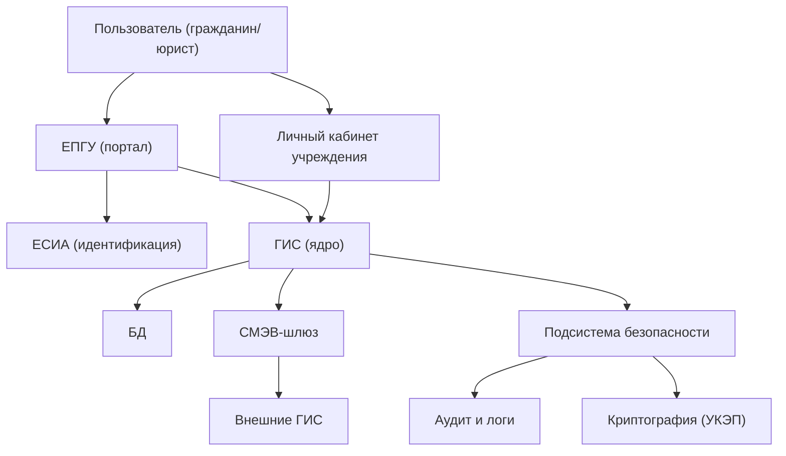

:::info[TL;DR]
ГИС (государственная информационная система) — ИС для оказания госуслуг, исполнения госфункций или межведомственного взаимодействия. Архитектура ГИС включает: внешний портал, личный кабинет, СМЭВ-шлюз, ЕСИА-интеграцию, БД и подсистему безопасности. Обязательна аттестация по требованиям ФСТЭК.
:::

## Принципы архитектуры ГИС

| Принцип | Описание |
|---------|----------|
| **Открытость** | API для межведомственного и внешнего взаимодействия |
| **Безопасность** | Защита ПД, криптография, аттестация |
| **Непрерывность** | 24/7, SLA 99.9%+ |
| **Импортонезависимость** | Реестр ПО, Open Source или отечественное |
| **Масштабируемость** | Нагрузка от пилотных до федеральных |

## Типовая архитектура ГИС

## Компоненты ГИС

| Компонент | Назначение |
|-----------|-----------|
| **Портал / ЕПГУ** | Фронтенд для граждан и юрлиц |
| **Личный кабинет** | Для сотрудников госоргана |
| **ЕСИА** | Аутентификация через Госуслуги |
| **СМЭВ** | Обмен данными с другими ГИС |
| **БД** | Хранение данных (реестры, документы) |
| **Аудит** | Логирование всех действий (ФСТЭК) |
| **Криптография** | УКЭП, шифрование каналов, ГОСТ |

## Требования к архитектуре

| Параметр | Пример |
|----------|--------|
| Доступность | 99.9% (федеральная) |
| RTO | < 4 часа |
| RPO | < 1 час |
| Аттестация | УЗ-1 / УЗ-2 (ФСТЭК) |
| Реестр ПО | Все компоненты из реестра |
| Хранение | Локализация в РФ, 152-ФЗ |

## Что дальше

- [Госуслуги и порталы](/docs/specialization/govtech-portal)
- [СМЭВ](/docs/specialization/govtech-smev)

## Проверь себя

1. **Из каких компонентов состоит типичная ГИС?**
   *Ответ:* Портал, ЕСИА, СМЭВ-шлюз, ядро ГИС, БД, подсистема безопасности.

2. **Что такое аттестация ГИС?**
   *Ответ:* Сертификация ИС на соответствие требованиям ФСТЭК по защите информации.
