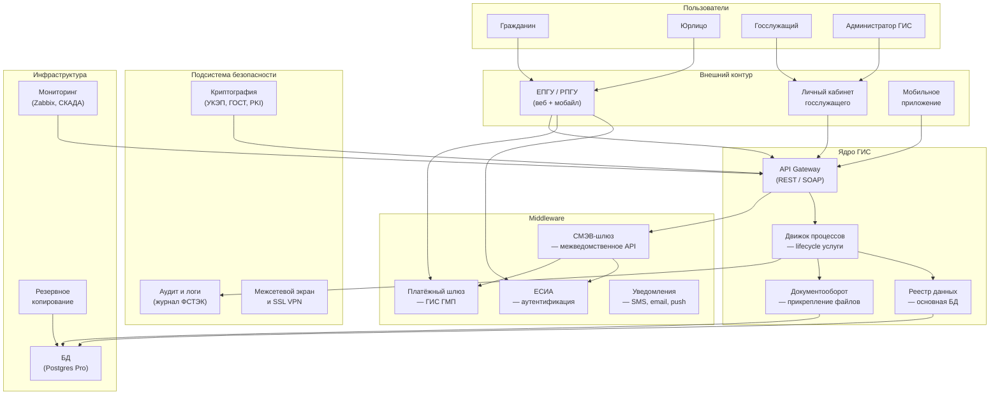
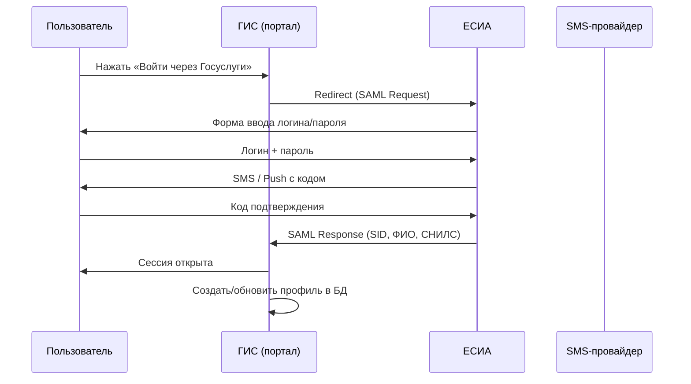

:::info[TL;DR]
ГИС (государственная информационная система) — ИС для оказания госуслуг, исполнения госфункций или межведомственного взаимодействия. Архитектура ГИС включает: внешний портал, личный кабинет, СМЭВ-шлюз, ЕСИА-интеграцию, БД и подсистему безопасности. Обязательна аттестация по требованиям ФСТЭК (УЗ-1 или УЗ-2). В РФ — 40 000+ ГИС, крупнейшие: ЕПГУ (110M+ пользователей), ГИС ГМП (500M+ платежей/год), ЕГИССО (100M+ записей).
:::

## Для кого эта статья

Senior SA, проектирующий ГИС. После прочтения вы:

- Поймёте типовую архитектуру ГИС: портал, ЕСИА, СМЭВ, БД, безопасность
- Узнаете требования к архитектуре: доступность 99.9%, RTO < 4ч, RPO < 1ч
- Сможете проектировать ГИС с учётом аттестации ФСТЭК и импортозамещения
- Поймёте отличия архитектуры ГИС от enterprise-систем

## 1. Что такое ГИС

ГИС — государственная информационная система. Определение из 149-ФЗ: «совокупность содержащейся в базах данных информации и обеспечивающих её обработку информационных технологий и технических средств».

**Виды ГИС:**

| Тип | Описание | Пример |
|-----|----------|--------|
| **Федеральная** | Для всей РФ | ЕПГУ, ЕСИА, ГИС ГМП |
| **Региональная** | Для субъекта РФ | РПГУ Московской области |
| **Ведомственная** | Для ведомства | ГИС Росреестра, ЕМИАС |
| **Муниципальная** | Для муниципалитета | ГИС ЖКХ муниципалитета |

**Масштаб ГИС:**

| Параметр | Малая (регион) | Средняя (ведомство) | Крупная (федеральная) |
|----------|---------------|---------------------|----------------------|
| DAU | 1K-10K | 10K-100K | 1M-110M |
| Бюджет | 10-50M ₽ | 50-500M ₽ | 1B+ ₽ |
| Срок | 6-12 мес | 12-24 мес | 24-48 мес |
| Команда | 10-30 чел | 30-100 чел | 100-500 чел |
| Уровень аттестации | УЗ-1 | УЗ-1 / УЗ-2 | УЗ-2 |

## 2. Принципы архитектуры ГИС

| Принцип | Описание | Почему это важно |
|---------|----------|-----------------|
| **Открытость** | API для межведомственного и внешнего взаимодействия | СМЭВ, интеграция с ведомствами |
| **Безопасность** | Защита ПД, криптография, аттестация | 152-ФЗ, ФСТЭК, утечки |
| **Непрерывность** | 24/7, SLA 99.9%+ | Госуслуги — критическая инфраструктура |
| **Импортонезависимость** | Реестр ПО, отечественное или Open Source | Указ Президента №166, 2025 target |
| **Масштабируемость** | От пилота до федерального уровня | Z-образный рост нагрузки |
| **Аудит** | Логирование всех действий | ФСТЭК: кто, когда, что делал в системе |
| **Юридическая значимость** | УКЭП, хранение документов | Суд: документ из ГИС = доказательство |

## 3. Типовая архитектура ГИС

## 4. Компоненты ГИС — детально

### 4.1 ЕСИА (Единая система идентификации)

Обеспечивает аутентификацию пользователей через Госуслуги.

| Параметр | Значение |
|----------|----------|
| Пользователей | 120M+ учётных записей |
| Аутентификация | Логин/пароль + SMS/биометрия/УКЭП |
| Протокол | SAML 2.0, OAuth 2.0, OpenID Connect |
| Уровни | Упрощённая, стандартная, подтверждённая |
| Интеграция | Redirect browser → ESIA → callback |

**Процесс аутентификации через ЕСИА:**

### 4.2 СМЭВ-шлюз

Обеспечивает межведомственные запросы (см. [СМЭВ](/docs/specialization/govtech-smev)).

### 4.3 Подсистема безопасности

| Компонент | Назначение | Требование ФСТЭК |
|-----------|-----------|------------------|
| **Межсетевой экран** | Разделение контуров (внешний/внутренний) | Обязательно |
| **СЗИ от НСД** | Защита от несанкционированного доступа | Dallas Lock, Secret Studio |
| **Криптография** | Шифрование каналов, УКЭП | КриптоПро CSP, VipNet |
| **Аудит** | Логирование всех действий | Хранение 1-5 лет |
| **Антивирус** | Защита рабочих станций | Kaspersky, Dr.Web |
| **VPN** | Защищённый канал между ГИС | SSL VPN, IPSec |

### 4.4 База данных

| Параметр | Требование | Пояснение |
|----------|-----------|-----------|
| **СУБД** | Из реестра ПО | Postgres Pro, СУБД Ред База Данных |
| **Локализация** | В РФ (152-ФЗ) | Дата-центры на территории РФ |
| **Резервирование** | Master-slave / кластер | RPO < 1 час |
| **Шифрование** | ПД в покое (at rest) | Transparent Data Encryption |

## 5. Требования к архитектуре

### SLA и отказоустойчивость

| Параметр | Федеральная | Региональная | Ведомственная |
|----------|-------------|--------------|---------------|
| Availability | 99.95% | 99.9% | 99.8% |
| RTO | < 2 часа | < 4 часа | < 8 часов |
| RPO | < 15 мин | < 1 час | < 4 часа |
| Допустимый даунтайм/год | 4.3 часа | 8.7 часов | 17.5 часов |

### Аттестация

Уровни защищённости ГИС (ФСТЭК):

| Уровень | Какие данные | Что нужно | Срок аттестации | Бюджет |
|---------|-------------|-----------|-----------------|--------|
| **УЗ-1** | ОПД (общедоступные) | СЗИ НСД, антивирус, МЭ | 2-4 мес | 500K-2M |
| **УЗ-2** | ПД, врачебная тайна | + Криптография, VPN, СОВ | 4-8 мес | 2-10M |
| **УЗ-3** | Гостайна | + Аттестованные СКЗИ, ФСБ | 6-12 мес | 10M+ |

## 6. Архитектурные шаблоны для ГИС

| Шаблон | Описание | Когда применять |
|--------|----------|----------------|
| **API Gateway** | Единая точка входа для всех клиентов (портал, мобайл, СМЭВ) | Всегда — разграничение доступа |
| **Backend for Frontend (BFF)** | Отдельный API для портала, отдельный — для ЛК госслужащего | Разные интерфейсы = разный API |
| **Saga / Outbox** | Распределённая транзакция через СМЭВ | Интеграция с внешними ГИС |
| **CQRS** | Разделение чтения и записи | Высокая нагрузка на реестры |
| **Event Sourcing** | Хранение событий вместо состояния | Аудит — неизменяемая цепочка |
| **Strangler Fig** | Постепенная миграция с legacy на новую ГИС | Импортозамещение: Oracle → Postgres Pro |

## 7. Метрики качества ГИС

| Метрика | Описание | Хорошо | Плохо |
|---------|----------|--------|-------|
| **Доступность** | Uptime за месяц | > 99.9% | < 99.5% |
| **Время ответа API** | P95 latency | < 500 ms | > 2 sec |
| **Процент ошибок** | 5xx / всего запросов | < 0.1% | > 1% |
| **SLA СМЭВ-запросов** | % ответов за < 10 сек | > 95% | < 80% |
| **Покрытие услуги** | % электронных vs бумажных | > 80% | < 50% |
| **NPS** | Индекс удовлетворённости | > 60 | < 30 |

## Практический кейс: Проектирование архитектуры ЕМИАС (Москва)

**Проблема:** Москва 2013 — бумажные карты, запись к врачу через регистратуру, 4+ часа ожидания. Нужна Единая медицинская информационно-аналитическая система (ЕМИАС).

**Архитектура ЕМИАС:**
1. **Портал** mos.ru + мобильное приложение — запись к врачу
2. **ЕСИА** — аутентификация (полис ОМС + паспорт)
3. **Ядро** — реестр пациентов (1.5M записей/мес), расписание врачей
4. **СМЭВ** — запрос полиса из ФОМС, СНИЛС из ПФР
5. **ГИС ГМП** — оплата услуг (платные приёмы)
6. **Аттестация** — УЗ-2 (ПД, врачебная тайна)

**Результат:**
- Запись к врачу онлайн: 0 → 80% (2024)
- Время записи: 4 часа → 5 минут
- ЕМИАС — эталон для регионов (80+ регионов внедрили)

## Ссылки для самостоятельного изучения

| Ресурс | Описание | Ссылка |
|--------|----------|--------|
| ФСТЭК — методические документы по ГИС | Требования к защите ГИС | https://fstek.ru/technical-protection/documents |
| Минцифры — архитектура ГИС | Методические рекомендации | https://digital.gov.ru |
| ЕСИА — методические рекомендации | Интеграция с ЕСИА | https://esia.gosuslugi.ru |
| ГОСТ 34.601-90 — стадии создания АС | Стандарт разработки | https://docs.cntd.ru |
| 149-ФЗ об информации и ГИС | Федеральный закон | https://www.consultant.ru |
| Постановление №1119 о ПД | Требования к защите ПД | https://fstek.ru/ |
| Техническая документация ЕМИАС | Архитектура ЕМИАС Москвы | https://emias.mos.ru |

## Проверь себя

1. **Из каких компонентов состоит типовая ГИС?**
   *Ответ:* Портал (ЕПГУ/РПГУ), Личный кабинет, ЕСИА (аутентификация), СМЭВ-шлюз (межведомственные запросы), API Gateway, ядро (реестр, документооборот), подсистема безопасности (аудит, криптография), БД (Postgres Pro). Все компоненты из реестра ПО.

2. **Что такое аттестация ГИС и какие уровни бывают?**
   *Ответ:* Сертификация на соответствие ФСТЭК. Уровни: УЗ-1 (ОПД — СЗИ НСД + антивирус), УЗ-2 (ПД — + криптография + VPN + СОВ), УЗ-3 (гостайна — + СКЗИ ФСБ). Срок: 2-12 мес, бюджет: 500K-10M+.

3. **Как ЕСИА обеспечивает аутентификацию в ГИС?**
   *Ответ:* Redirect: ГИС → SAML Request → ЕСИА (ввод данных) → SAML Response (SID, ФИО, СНИЛС) → ГИС (сессия). Поддерживает уровни: упрощённая, стандартная (SMS), подтверждённая (паспорт + УКЭП).

4. **Какие архитектурные шаблоны применимы для ГИС?**
   *Ответ:* API Gateway (единый вход), BFF (разные API для портала/ЛК), Saga/Outbox (транзакции через СМЭВ), CQRS (высокая нагрузка на реестры), Event Sourcing (аудит), Strangler Fig (импортозамещение).

5. **Какие требования к инфраструктуре ГИС?**
   *Ответ:* Доступность 99.9%+ (федеральная), RTO < 2 часа, RPO < 15 мин, локализация БД в РФ (152-ФЗ), СУБД из реестра ПО (Postgres Pro), резервирование Master-slave. Все компоненты должны быть аттестованы ФСТЭК.
