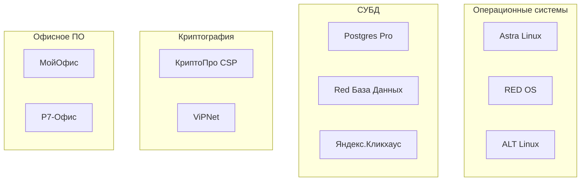

:::info[TL;DR]
Импортозамещение — обязательное требование для ГИС: все компоненты должны быть из реестра отечественного ПО. Ключевые технологии: Astra Linux (ОС), Postgres Pro (СУБД), «КриптоПро» (криптография), «1С», «МойОфис»/«Р7» (офис). Для аналитика — учёт реестровых требований в спецификации.
:::

## Нормативная база

| НПА | Описание |
|-----|----------|
| **Приказ Минцифры № 486** | Правила формирования реестра ПО |
| **Постановление № 1236** | Запрет на закупку иностранного ПО для госнужд |
| **Постановление № 1744** | Требования к радиоэлектронике и ПО |
| **Указ № 166** | Импортозамещение в критической инфраструктуре |

## Реестр отечественного ПО

**Обязанности аналитика:** при проектировании ГИС проверить, что каждый компонент есть в реестре (reestr.digital.gov.ru).

## Имортозамещение на практике

| Этап | Что делаем | Срок |
|------|-----------|------|
| Аудит | Определить используемое иностранное ПО | 1–2 мес |
| Выбор | Подобрать аналоги из реестра | 1 мес |
| Миграция | Перенос данных, настройка совместимости | 3–12 мес |
| Тестирование | Функциональное + нагрузочное | 2–4 мес |
| Аттестация | Переаттестация ИС на новом стеке | 2–6 мес |

## Требования к системе

| Параметр | Пример |
|----------|--------|
| ОС | Astra Linux Special Edition |
| СУБД | Postgres Pro Enterprise |
| Криптография | КриптоПро CSP / ViPNet |
| Офис | МойОфис / Р7 |
| Браузер | Яндекс.Браузер / Атом |
| Виртуализация | zVirt / Arenadata |

## Что дальше

- [Безопасность и аттестация](/docs/specialization/govtech-security)

## Проверь себя

1. **Какие ОС используются для импортозамещения?**
   *Ответ:* Astra Linux (основная), RED OS, ALT Linux.

2. **Где проверять, есть ли компонент в реестре?**
   *Ответ:* reestr.digital.gov.ru.
