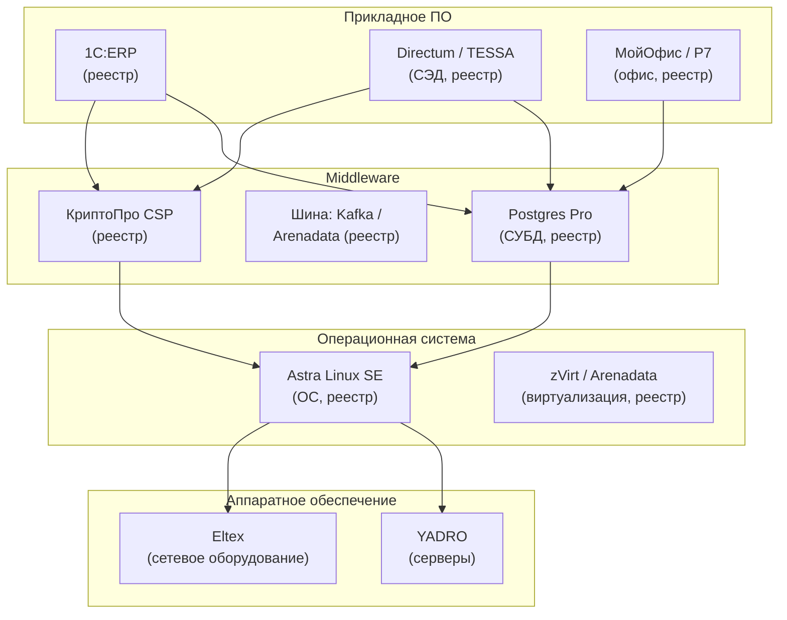
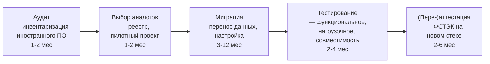

:::info[TL;DR]
Импортозамещение — обязательное требование для ГИС: все компоненты должны быть из реестра отечественного ПО (reestr.digital.gov.ru). Ключевые технологии: Astra Linux Special Edition (ОС, 80% госорганов), Postgres Pro (СУБД, 70%+), «КриптоПро CSP» (криптография, 95%+), «1С» (учёт), «МойОфис»/«Р7-Офис» (офис). Указ Президента № 166 (2022) — критическая инфраструктура должна перейти на отечественное ПО к 2025. Рынок: 200+ млрд ₽ (2024), 10 000+ продуктов в реестре. Аналитик должен проверить каждый компонент системы на наличие в реестре и учесть это в спецификации.
:::

## Для кого эта статья

Middle SA, участвующий в проектах импортозамещения ГИС. После прочтения вы:

- Поймёте нормативную базу: Указ №166, ПП №1236, ПП №1744
- Узнаете стек импортозамещения: ОС, СУБД, криптография, офис
- Сможете проверить компоненты по реестру и составить карту миграции
- Поймёте риски: совместимость, производительность, сроки

## 1. Нормативная база

| НПА | Описание | Что требует |
|-----|----------|-------------|
| **Указ № 166** (2022) | Импортозамещение в КИИ | К 2025 — переход на отечественное ПО |
| **ПП № 1236** (2016) | Запрет на закупку иностранного ПО для госнужд | Все закупки — только из реестра |
| **ПП № 1744** (2022) | Радиоэлектроника и ПО | Утверждён перечень КИИ |
| **Приказ № 486** | Правила формирования реестра ПО | Экспертиза, класс ПО |
| **ПП № 325** (2022) | Ускоренное импортозамещение | Сокращённые сроки: 3-6 мес |

**Штрафы за нарушение:**

| Нарушение | Штраф |
|-----------|-------|
| Закупка иностранного ПО без обоснования | 500K-1M ₽ (юридическое лицо) |
| Эксплуатация ГИС на импортном ПО | Блокировка сайта + 300K-500K ₽ |
| Невыполнение Указа № 166 | Дисквалификация руководителя |

## 2. Реестр отечественного ПО

Реестр — reestr.digital.gov.ru, 10 000+ продуктов.

**Классы ПО в реестре:**

| Класс | Примеры | Доля |
|-------|---------|------|
| **ОС** | Astra Linux, RED OS, ALT Linux | 15 |
| **СУБД** | Postgres Pro, Red База Данных, Arenadata DB | 200+ |
| **Криптография** | КриптоПро CSP, ViPNet, JCP | 50+ |
| **Офис** | МойОфис, Р7-Офис, Яндекс.360 | 30 |
| **Платформы** | 1С, Directum, TESSA | 500+ |
| **СЗИ** | Dallas Lock, Secret Studio, Kaspersky | 300+ |

## 3. Ключевые технологии

### ОС: Astra Linux Special Edition

- 80% госорганов РФ
- Сертифицирована ФСТЭК (УЗ-1, УЗ-2)
- Совместимость с 1С, Postgres Pro, КриптоПро
- Два режима: «Смоленск» (макс. безопасность), «Орёл» (базовая)

### СУБД: Postgres Pro

- Форк PostgreSQL с enterprise-функциями
- Совместимость: Oracle-совместимый режим (синтаксис PL/SQL)
- Кластеризация: Patroni, pg_probackup
- Сертификация ФСТЭК

### Криптография: КриптоПро CSP

- 95%+ госорганов
- ГОСТ Р 34.10-2012 (УКЭП), ГОСТ 28147-89 (шифрование)
- Интеграция: 1С, Directum, браузеры (Яндекс.Браузер, Атом)
- Версии: CSP (Linux/Windows), JCP (Java)

### Офис: МойОфис / Р7-Офис

| Параметр | МойОфис | Р7-Офис |
|----------|---------|---------|
| **Форматы** | ODF, DOCX, XLSX | ODF, DOCX, OOXML |
| **Совместимость с MS Office** | 80% | 70% |
| **Серверная версия** | Да (частное облако) | Да |
| **Интеграция** | 1С, Directum | 1С |
| **Доля рынка** | 40% | 30% |

## 4. Процесс импортозамещения

**Типовые сложности:**

| Этап | Риск | Решение |
|------|------|---------|
| **Аудит** | Не все компоненты учтены | Инвентаризация + автоматический сбор |
| **Выбор** | Аналога нет в реестре | Обоснование: нет отечественного аналога |
| **Миграция** | Oracle → Postgres Pro: несовместимость процедур | ORM / middleware слой |
| **Миграция** | Windows → Astra Linux: не все приложения портированы | Контейнеризация (Docker) |
| **Тестирование** | Производительность ниже на 20-30% | Оптимизация запросов, апгрейд HW |
| **Аттестация** | Новый стек = новая аттестация (2-6 мес) | Заложить в план |

## 5. Метрики импортозамещения

| Метрика | Формула | Цель 2025 |
|---------|---------|-----------|
| **% импортозамещённых ГИС** | кол-во ГИС на отеч. ПО / всего | 100% |
| **% компонентов из реестра** | компоненты из реестра / всего | 100% |
| **Экономия бюджета** | разница стоимости лицензий | 20-40% |
| **Время миграции** | Oracle → Postgres Pro | < 6 мес |
| **Совместимость** | % тестов, пройденных после миграции | > 95% |

## 6. Исключения: когда можно использовать импортное ПО

1. **Нет отечественного аналога** — нужно обоснование (заключение Минцифры)
2. **Свободное ПО (Open Source)** — PostgreSQL, Linux — разрешено (но нужно из реестра: Postgres Pro — форк PostgreSQL)
3. **Уже закуплено до вступления в силу** — «дедушкина оговорка» до окончания лицензии
4. **Критическая инфраструктура — временное разрешение** — до 2025 (Указ №166)

## Практический кейс: Миграция ФНС с Oracle на Postgres Pro

**Проблема:** ФНС — крупнейшая ГИС РФ (1B+ запросов/год, 10+ петабайт данных на Oracle). Лицензии Oracle — 3B+ ₽/год. Указ №166 — переход до 2025.

**Решение — поэтапная миграция:**
1. **Аудит (6 мес):** инвентаризация — 500+ схем, 20 000+ stored procedures на PL/SQL
2. **Пилот (6 мес):** миграция 1 подсистемы (камеральные проверки) на Postgres Pro
3. **Тиражирование (12 мес):** 80% схем мигрировано, PL/SQL → PL/pgSQL (автоматическая конвертация)
4. **Параллельный режим (6 мес):** Oracle ← sync → Postgres Pro — для rollback

**Результат:**
- Oracle: 3B+ ₽/год → Postgres Pro: 500M ₽/год (-83%)
- Производительность: -10% (критично для 5% запросов) → оптимизация индексов
- Доля переселения: 95% за 2 года (2022-2024)
- Сроки: 24 мес (против запланированных 36)

## Ссылки для самостоятельного изучения

| Ресурс | Описание | Ссылка |
|--------|----------|--------|
| Реестр отечественного ПО | Поиск и проверка компонентов | https://reestr.digital.gov.ru |
| Указ № 166 об импортозамещении в КИИ | Правовая база | https://www.consultant.ru |
| ПП № 1236 — запрет импортного ПО | Постановление правительства | https://www.consultant.ru |
| Astra Linux — документация | ОС для госсектора | https://astralinux.ru |
| Postgres Pro — документация | СУБД из реестра | https://postgrespro.ru |
| КриптоПро — документация | Криптография | https://www.cryptopro.ru |
| МойОфис — документация | Офисный пакет | https://myoffice.ru |
| Р7-Офис — документация | Офисный пакет | https://r7-office.ru |
| Минцифры — импортозамещение | Методические рекомендации | https://digital.gov.ru |

## Проверь себя

1. **Какие ОС используются для импортозамещения?**
   *Ответ:* Astra Linux Special Edition (80% госорганов, сертифицирована ФСТЭК), RED OS, ALT Linux. Astra — основной стандарт для ГИС.

2. **Где проверять, есть ли компонент в реестре?**
   *Ответ:* reestr.digital.gov.ru. При проектировании ГИС — проверить каждый компонент (ОС, СУБД, криптографию, офис, СЗИ) на наличие в реестре.

3. **Что делать, если аналога нет в реестре?**
   *Ответ:* Обосновать отсутствие аналога (заключение Минцифры). Использовать Open Source (PostgreSQL, Linux — разрешено, но через реестр). «Дедушкина оговорка» — до окончания лицензии.

4. **Какие риски при миграции Oracle → Postgres Pro?**
   *Ответ:* Несовместимость PL/SQL → PL/pgSQL (20-30% процедур требуют переписывания), производительность (-10-20% на сложных запросах), сроки (6-24 мес), необходимость переаттестации ФСТЭК.

5. **Какие метрики импортозамещения важны?**
   *Ответ:* % компонентов из реестра (цель: 100%), экономия бюджета (20-40%), время миграции, совместимость (> 95% тестов), % импортозамещённых ГИС (цель: 100% к 2025).
