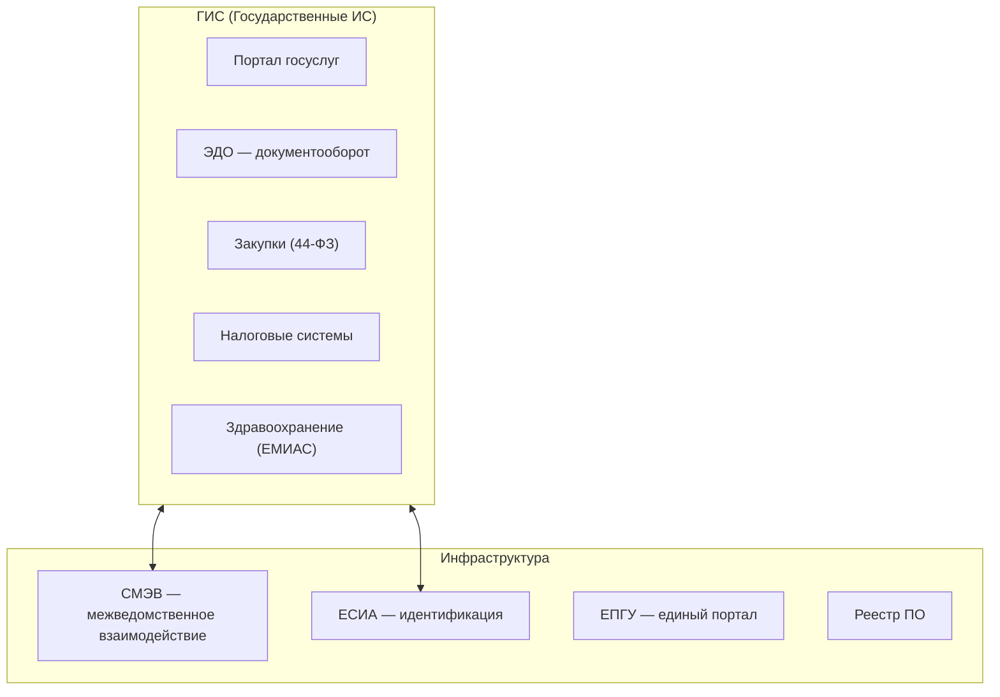

:::info[TL;DR]
GovTech-аналитик работает с государственными информационными системами (ГИС): порталы госуслуг, межведомственное взаимодействие (СМЭВ), электронный документооборот, импортозамещение. Специфика: жёсткая регуляция (ФСТЭК, 152-ФЗ, 44-ФЗ), импортозамещение, длинные тендерные циклы и работа с ГИС-операторами.
:::

## Чем GovTech отличается от других отраслей

GovTech (государственные технологии) — разработка и поддержка ИС для госорганов.

| Особенность | Описание |
|-------------|----------|
| **Регуляция** | ФСТЭК, ФСБ, Минцифры, 152-ФЗ, 44-ФЗ |
| **Импортозамещение** | Реестр отечественного ПО, Astra Linux, СУБД Postgres Pro |
| **Тендеры** | Разработка через 44-ФЗ и 223-ФЗ (долгий цикл) |
| **ГИС** | Системы для госуслуг, налогов, здравоохранения |
| **СМЭВ** | Межведомственное взаимодействие — API между ГИС |
| **Аттестация** | Обязательная сертификация по безопасности |

## Основные подсистемы GovTech

## Типовые проекты GovTech-аналитика

1. Разработка регионального портала госуслуг
2. Интеграция ГИС с СМЭВ
3. Импортозамещение: миграция с Oracle/SAP на Postgres Pro/Astra Linux
4. Аттестация ИС по требованиям ФСТЭК
5. Внедрение ЭДО в госоргане
6. Проектирование системы закупок (44-ФЗ)
7. Модернизация ЕСИА для нового вида услуг

## Что нужно знать

- **Архитектура:** ГИС, микросервисы, СМЭВ (SOAP/REST), ЕСИА (SAML/OAuth)
- **Безопасность:** ФСТЭК, аттестация, криптография (УКЭП, PKI, ГОСТ)
- **Регуляция:** 44-ФЗ, 223-ФЗ, 152-ФЗ, 59-ФЗ, приказы Минцифры
- **Импортозамещение:** Реестр ПО, Astra Linux, Postgres Pro, «КриптоПро»
- **Стандарты:** СМЭВ 3.x, ГОСТ Р 34.10 (ЭП), OAuth 2.0, SAML

## Карьерный путь

| Этап | Роль | Ключевые навыки |
|------|------|----------------|
| 1 | Junior SA в госпроекте | Документация, 44-ФЗ |
| 2 | Middle SA | СМЭВ, ЕСИА, ГИС |
| 3 | Senior SA | Архитектура ГИС, импортозамещение |
| 4 | Lead / Architect | Безопасность, аттестация |

## Что дальше

- [Архитектура ГИС](/docs/specialization/govtech-gis-architecture)

## Проверь себя

1. **Чем GovTech отличается от коммерческой разработки?**
   *Ответ:* Регуляция (ФСТЭК, 44-ФЗ), импортозамещение, обязательная аттестация, тендерные циклы.

2. **Что такое СМЭВ?**
   *Ответ:* Система межведомственного электронного взаимодействия — шина для обмена данными между ГИС.
