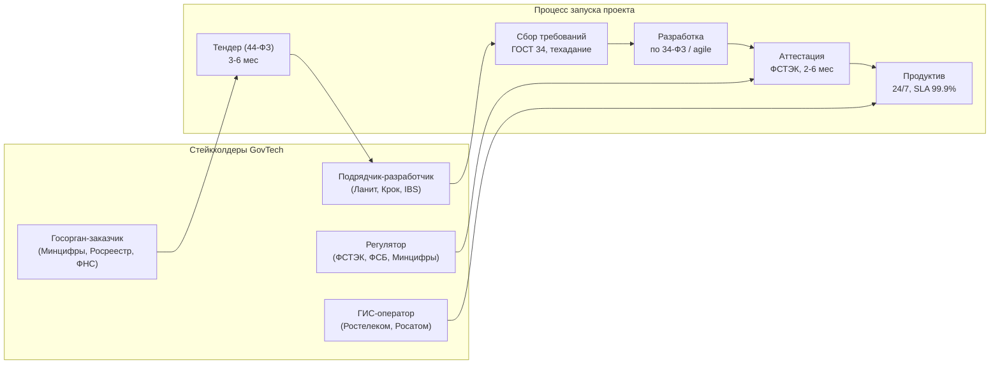

:::info[TL;DR]
GovTech-аналитик работает с государственными информационными системами (ГИС): порталы госуслуг, межведомственное взаимодействие (СМЭВ), электронный документооборот, импортозамещение. Специфика: жёсткая регуляция (ФСТЭК, 152-ФЗ, 44-ФЗ), импортозамещение, длинные тендерные циклы и работа с ГИС-операторами. Рынок GovTech в РФ — 350+ млрд ₽ (2024), CAGR 25%, основной драйвер — цифровая трансформация госуслуг и импортозамещение.
:::

## Для кого эта статья

Middle SA, рассматривающий переход в госсектор. После прочтения вы:

- Поймёте отличия GovTech от коммерческой разработки: регуляция, аттестация, тендеры
- Узнаете ключевые системы: ЕПГУ, ЕСИА, СМЭВ, реестр ПО
- Сможете оценить карьерный путь: Junior SA → Lead/Architect
- Поймёте риски: длинные циклы, бюрократия, импортозамещение

## 1. Что такое GovTech

GovTech (Government Technologies) — сегмент IT, где заказчик — государство (федеральные/региональные органы, ведомства, ГИС-операторы). В отличие от коммерческой разработки, здесь:

| Параметр | GovTech | Коммерция |
|----------|---------|-----------|
| **Бюджет** | Тендер (44-ФЗ, 223-ФЗ), цикл 3-6 мес | Внутренний бюджет, цикл 1-4 нед |
| **Регуляция** | ФСТЭК, ФСБ, 152-ФЗ, приказы Минцифры | NFR, best practices |
| **Технологии** | Реестр ПО (Astra Linux, Postgres Pro) | Любые |
| **Сроки** | Жёстко фиксированы, штрафы за срыв | Гибкие, agile |
| **Аттестация** | Обязательная (УЗ-1, УЗ-2) | Опционально |
| **Ставка аналитика** | 150-250K ₽ (middle) | 200-300K ₽ (middle) |

**Рынок:** 350+ млрд ₽ (2024), 40 000+ ГИС, 25%+ госорганов всё ещё используют импортное ПО.

## 2. Специфика работы

**Ключевые отличия процесса:**

| Этап | Время | Риск |
|------|-------|------|
| Тендер | 3-6 мес | Обжалование (ФАС), перенос |
| Сбор требований | 2-4 мес | Нет чёткого понимания у заказчика |
| Разработка | 6-18 мес | Изменение 44-ФЗ, новые требования регулятора |
| Аттестация | 2-6 мес | Система не проходит ФСТЭК (50%+ с первого раза) |

## 3. Ключевые системы GovTech

| Система | Назначение | Масштаб |
|---------|------------|---------|
| **ЕПГУ** (Госуслуги) | Федеральный портал, 110M+ пользователей | 110M+ пользователей, 100K+ услуг |
| **ЕСИА** | Единая система идентификации | 120M+ учётных записей |
| **СМЭВ** | Межведомственное взаимодействие | 25 000+ ГИС, 1B+ запросов/год |
| **ЕГИССО** | Социальное обеспечение | 100M+ записей |
| **ФРИ** | Федеральный реестр инвалидов | 10M+ граждан |
| **ГИС ГМП** | Госмуниципальные платежи | 500M+ платежей/год |
| **ГАС «Правосудие»** | Судебная система | 50M+ дел |
| **ГИС ЖКХ** | Жилищно-коммунальное хозяйство | 150M+ лицевых счетов |

## 4. Типовые проекты GovTech-аналитика

1. **Разработка регионального портала госуслуг** — РПГУ на базе платформы «ГосТех» (200М+ ₽, 12-18 мес)
2. **Интеграция ГИС с СМЭВ 3.x** — межведомственные запросы по СМЭВ 3.3.1 (REST, JSON, OAuth 2.0)
3. **Импортозамещение** — миграция с Oracle/SAP на Postgres Pro/Astra Linux (средний проект: 50-200М ₽, 6-12 мес)
4. **Аттестация ИС** по требованиям ФСТЭК (УЗ-1: 3-6 мес, УЗ-2: 6-12 мес)
5. **Внедрение ЭДО** — переход на юридически значимый документооборот (Диадок, СБИС, 1С-ЭДО)
6. **Проектирование системы закупок** (44-ФЗ, ЕИС, электронные площадки: Сбербанк-АСТ, РТС-тендер)
7. **Модернизация ЕСИА** — подключение нового способа аутентификации (биометрия, МЧД)

## 5. Ключевые термины

| Термин | Пояснение |
|--------|-----------|
| **ГИС** | Государственная информационная система — ИС для госфункций |
| **ЕПГУ / РПГУ** | Единый/Региональный портал госуслуг |
| **ЕСИА** | Единая система идентификации и аутентификации |
| **СМЭВ** | Система межведомственного электронного взаимодействия |
| **ФСТЭК** | Федеральная служба по техническому и экспортному контролю |
| **УЗ-1 / УЗ-2** | Уровни защищённости ГИС (ФСТЭК) |
| **44-ФЗ** | Закон о госзакупках (тендеры) |
| **КЭП / УКЭП** | Квалифицированная (усиленная) электронная подпись |
| **Реестр ПО** | Единый реестр отечественного ПО (налоговая льгота) |

## 6. Карьерный путь

| Этап | Роль | Опыт | Зарплата | Ключевые навыки |
|------|------|------|----------|----------------|
| 1 | Junior SA в госпроекте | 0-2 года | 100-150K ₽ | Документация, 44-ФЗ, основы ЕСИА |
| 2 | Middle SA | 2-4 года | 150-250K ₽ | СМЭВ, ЕСИА, ГИС, ТЗ по ГОСТ 34 |
| 3 | Senior SA | 4-7 лет | 250-350K ₽ | Архитектура ГИС, импортозамещение, ФСТЭК |
| 4 | Lead / Architect | 7+ лет | 350-500K ₽ | Безопасность, аттестация, стратегия |

## 7. Метрики GovTech-проекта

| Метрика | Описание | GovTech | Коммерция |
|---------|----------|---------|-----------|
| **Time-to-market** | Время от идеи до релиза | 12-24 мес | 3-6 мес |
| **SLA** | Доступность системы | 99.9%+ | 99.5%+ |
| **NPS госуслуги** | Удовольствие гражданина | > 60 | > 50 |
| **% электронных услуг** | Цифровизация | 70%+ (2024 target) | — |
| **Экономия бюджета** | Снижение затрат на IT | 20-40% за счёт импортозамещения | — |

## Практический кейс: Миграция на «ГосТех» в регионах

**Проблема:** 85 регионов развивают РПГУ самостоятельно — дублирование затрат (5-10 млрд ₽/год), разные архитектуры, сложная интеграция с федеральными ГИС.

**Решение — платформа «ГосТех»:**
1. Единая платформа для всех ГИС (федеральных + региональных)
2. Общие компоненты: ЕСИА, СМЭВ, оплата, уведомления
3. Конструктор услуг — без кода, через конфигуратор
4. Облачная инфраструктура (Гособлако)

**Результат:**
- Стоимость разработки новой услуги: 50M → 5M ₽ (-90%)
- Time-to-market новой услуги: 12 мес → 3 мес
- 50+ регионов на ГосТехе к 2025
- Экономия бюджета: 30 млрд ₽ за 3 года

## Ссылки для самостоятельного изучения

| Ресурс | Описание | Ссылка |
|--------|----------|--------|
| Минцифры РФ — ГосТех | Платформа «ГосТех» | https://digital.gov.ru/gostech |
| ФСТЭК — требования к ГИС | Нормативные документы | https://fstek.ru |
| ЕПГУ (Госуслуги) | Федеральный портал | https://gosuslugi.ru |
| ЕСИА — документация | Техническая документация ЕСИА | https://esia.gosuslugi.ru |
| СМЭВ — методические рекомендации | Документация СМЭВ 3.x | https://smev.gosuslugi.ru |
| 44-ФЗ о госзакупках | Федеральный закон | https://zakupki.gov.ru |
| Реестр отечественного ПО | Реестр Минцифры | https://reestr.digital.gov.ru |
| ГОСТ 34 — разработка АС | Стандарт на ТЗ и документацию | https://docs.cntd.ru |

## Проверь себя

1. **Чем GovTech отличается от коммерческой разработки?**
   *Ответ:* Регуляция (ФСТЭК, 44-ФЗ), импортозамещение, обязательная аттестация, тендерные циклы (3-6 мес), фиксированные сроки, реестр ПО. Зарплаты ниже на 20-30%, но стабильность выше.

2. **Что такое СМЭВ и зачем он нужен?**
   *Ответ:* Система межведомственного электронного взаимодействия — шина для обмена данными между ГИС. Позволяет одной ГИС запрашивать данные из другой (например, паспорт из ФМС, ИНН из ФНС) через стандартизованные запросы (СМЭВ 3.x, REST, JSON).

3. **Какие этапы проходит GovTech-проект?**
   *Ответ:* Тендер (44-ФЗ, 3-6 мес) → Сбор требований (ТЗ по ГОСТ 34, 2-4 мес) → Разработка (6-18 мес) → Аттестация ФСТЭК (2-6 мес) → Продуктив (24/7, SLA 99.9%).

4. **Что такое «ГосТех» и зачем он нужен?**
   *Ответ:* Единая платформа для разработки ГИС. Цель — устранить дублирование (85 регионов = 85 РПГУ), снизить стоимость услуги с 50M до 5M ₽, ускорить запуск с 12 до 3 мес.

5. **Какие риски в GovTech-проектах?**
   *Ответ:* Изменение 44-ФЗ (заморозка тендера), обжалование в ФАС (перенос на 3 мес+), новые требования ФСТЭК (доработка аттестации), импортозамещение (не всё ПО есть в реестре), текучка заказчика (новый руководитель — новые требования).
