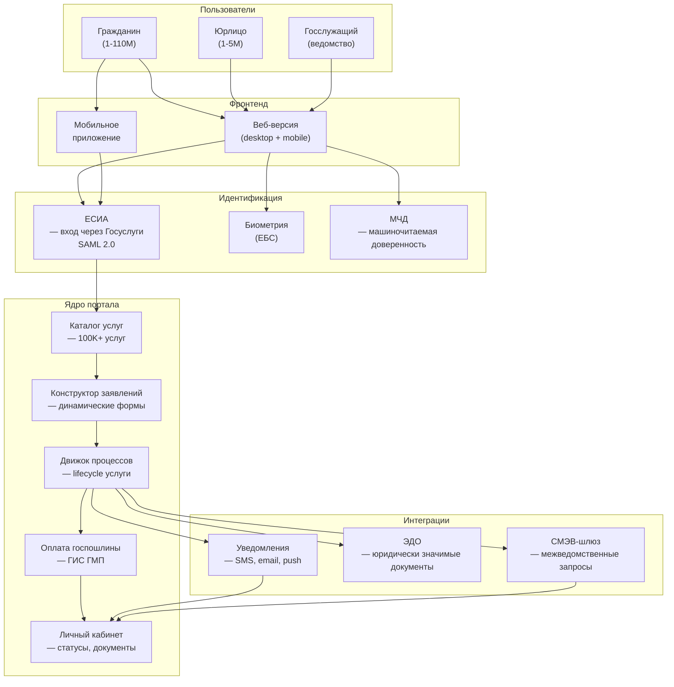
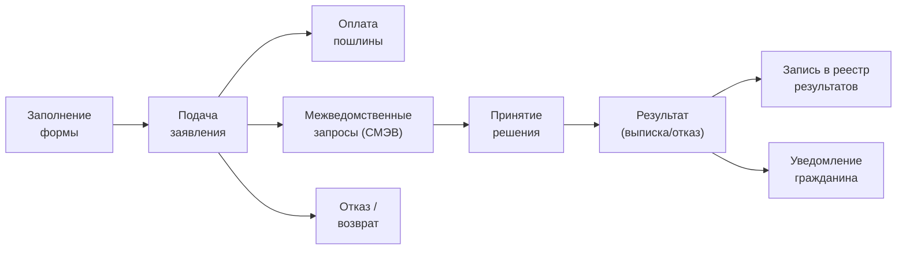

:::info[TL;DR]
Проектирование портала госуслуг — это не просто «формочка для заявлений». Нужно учесть ЕСИА (аутентификацию через Госуслуги), СМЭВ (межведомственные запросы), статусы услуги, прикрепление документов, юридически значимый ЭДО, оплату госпошлины (ГИС ГМП) и требования 59-ФЗ (сроки ответа: 30 дней). ЕПГУ (gosuslugi.ru) — 110M+ пользователей, 100K+ услуг, нагрузка до 10 000 заявлений/час в пике.
:::

## Для кого эта статья

Middle SA, проектирующий портал госуслуг (федеральный или региональный). После прочтения вы:

- Поймёте типы порталов: ЕПГУ, РПГУ, ведомственные
- Узнаете архитектуру: ЕСИА → каталог услуг → форма → СМЭВ → платёж → ЛК
- Сможете проектировать жизненный цикл услуги (8+ статусов)
- Поймёте требования: SLA, 59-ФЗ, хранение данных, нагрузка

## 1. Типы порталов госуслуг

| Тип | Описание | Пример | Масштаб |
|-----|----------|--------|---------|
| **Федеральный (ЕПГУ)** | Единый портал всей РФ | gosuslugi.ru | 110M+ пользователей |
| **Региональный (РПГУ)** | Портал субъекта РФ | mos.ru, uslugi.mosreg.ru | 1-15M пользователей |
| **Ведомственный** | ЛК для конкретной услуги | Налоговая, Росреестр, ФССП | 100K-5M пользователей |
| **Специализированный** | Для профессионалов | ГИС ЖКХ, ЕГИССО | Отраслевой |

**Распределение нагрузки (2024, ЕПГУ):**

| Услуга | Заявлений/мес | Пик |
|--------|--------------|-----|
| Запись к врачу | 15M+ | Сезон гриппа: +50% |
| Загранпаспорт | 2M+ | Лето: +100% |
| Справки (СНИЛС, ИНН) | 10M+ | Равномерно |
| Регистрация авто | 1M+ | Сезонно |

## 2. Архитектура портала госуслуг

## 3. Жизненный цикл услуги

**Статусная модель услуги:**

| Статус | Описание | Кто меняет |
|--------|----------|-----------|
| **Черновик** | Форма заполняется, не отправлена | Гражданин |
| **Подано** | Заявление отправлено, пошлина оплачена | Система |
| **На рассмотрении** | Ведомство приняло к обработке | Ведомство |
| **Ожидание СМЭВ** | Межведомственные запросы в работе | СМЭВ-шлюз |
| **Решение принято** | Положительное решение | Ведомство |
| **Решение готово** | Документ подписан УКЭП | Ведомство |
| **Отказ** | Может быть на любом этапе | Ведомство |
| **Оказана** | Результат выдан (выписка, сертификат) | Система |

## 4. Требования к порталу

### Функциональные требования

| Требование | Описание | Пример |
|-----------|----------|--------|
| **Каталог услуг** | Поиск/фильтрация по жизненной ситуации | Рождение ребёнка → 5 услуг |
| **Профиль пользователя** | ФИО, СНИЛС, ИНН из ЕСИА | Автозаполнение |
| **Форма заявления** | Адаптивная, прикрепление файлов | PDF, JPEG, до 10 MB |
| **Статус услуги** | Real-time обновление | SMS при смене статуса |
| **Личный кабинет** | История заявлений, результаты | Все услуги в одном месте |
| **Платёжный шлюз** | Оплата госпошлины онлайн | ГИС ГМП, СБП, карта |

### Нефункциональные требования

| Параметр | Значение | Пояснение |
|----------|----------|-----------|
| **Доступность (SLA)** | 99.9% | 8.7 часов даунтайма/год |
| **Время ответа (P95)** | < 2 сек | Страница должна открываться быстро |
| **Пиковая нагрузка** | 10 000 заявлений/час | Новый год, 1 сентября |
| **ЕСИА-аутентификация** | Обязательно | Без входа через Госуслуги — нельзя |
| **59-ФЗ** | Срок ответа 30 дней (до 15 — для некоторых) | Отслеживание просрочек |
| **Хранение документов** | 5+ лет | Архивное законодательство |
| **Безопасность** | HTTPS (TLS 1.2+), УКЭП, аудит | ФСТЭК |
| **Доступность (ДИТ)** | WCAG 2.1 (A+AA) | Для слабовидящих |

## 5. Интеграции портала

| Система | Назначение | Протокол | Сценарий |
|---------|------------|----------|----------|
| **ЕСИА** | Аутентификация | SAML 2.0 / OAuth 2.0 | Вход, получение профиля |
| **СМЭВ 3.x** | Межведомственные запросы | REST / JSON | Запрос справок, проверка данных |
| **ГИС ГМП** | Оплата госпошлины | Система 1 (начисление) | Создание начисления, чек |
| **Единый реестр ЗАГС** | Запись актов гражданского состояния | СМЭВ | Рождение, брак, смерть |
| **Почта России** | Отправка уведомлений | API | Заказное письмо |
| **СМЭВ-уведомления** | Push/SMS о статусе | REST | Смена статуса услуги |

## 6. Метрики портала

| Метрика | ЕПГУ (2024) | Региональный |
|---------|-------------|--------------|
| **DAU** | 25M+ | 100K-1M |
| **Заявлений/сутки** | 500K+ | 5K-50K |
| **Среднее время услуги** | 7-14 дней | 5-10 дней |
| **% электронных услуг** | 85% | 50-80% |
| **NPS** | 65 | 40-60 |
| **Доля возвратов** | 5-10% | 10-20% |
| **Конверсия в статус «Оказана»** | 80% | 60-75% |

## Практический кейс: «Мои документы» на mos.ru

**Проблема:** 150+ услуг правительства Москвы — 20 разных порталов, 5 разных входов. Гражданин не знает, где и как получить справку.

**Решение — суперсервис «Мои документы» (2022-2024):**
1. **Единая точка входа:** mos.ru → все услуги в одном ЛК
2. **Цифровой профиль:** данные из ЕСИА + история заявлений + результаты
3. **Конструктор услуг:** каталог по жизненным ситуациям (рождение, переезд, утеря документов)
4. **Предзаполнение:** 80% полей — из ЕСИА и СМЭВ (автоматически)
5. **Уведомления:** Push в приложение москвы, SMS, email
6. **Платёжный шлюз:** ГИС ГМП + СБП + карта

**Результат:**
- Время заполнения заявления: 15 мин → 3 мин (-80%)
- Доля возвратов на доработку: 20% → 5%
- NPS: 45 → 72
- 90% услуг доступны онлайн (было 40%)

## Ссылки для самостоятельного изучения

| Ресурс | Описание | Ссылка |
|--------|----------|--------|
| ЕПГУ — портал госуслуг | Федеральный портал | https://gosuslugi.ru |
| ЕСИА — документация | Интеграция с ЕСИА | https://esia.gosuslugi.ru |
| ГИС ГМП — документация | Платёжный шлюз | https://portal-gmp.info/ |
| 59-ФЗ о порядке обращений граждан | Сроки ответа | https://www.consultant.ru |
| WCAG 2.1 — стандарт доступности | Доступность порталов | https://www.w3.org/TR/WCAG21/ |
| mos.ru — портал мэра Москвы | Региональный портал | https://www.mos.ru |
| Постановление № 384 о ЕПГУ | Правовая база | https://digital.gov.ru |
| ГосТех — платформа | Платформа для ГИС | https://gostech.digital.gov.ru |

## Проверь себя

1. **Какие бывают типы порталов госуслуг?**
   *Ответ:* Федеральные (ЕПГУ — gosuslugi.ru, 110M+ пользователей), региональные (РПГУ — mos.ru), ведомственные (Налоговая, Росреестр), специализированные (ГИС ЖКХ).

2. **Как портал взаимодействует с СМЭВ?**
   *Ответ:* При подаче заявления портал отправляет межведомственные запросы через СМЭВ-шлюз: запрос СНИЛС в ПФР, ИНН в ФНС, паспорт в МВД. Формат: REST/JSON (СМЭВ 3.x). Асинхронно — callback при ответе от ведомства.

3. **Какие статусы проходит услуга на портале?**
   *Ответ:* Черновик → Подано → На рассмотрении → Ожидание СМЭВ → Решение принято → Решение готово → Оказана. Любой этап → Отказ/Возврат. Важно: отслеживать просрочку по 59-ФЗ (30 дней).

4. **Какие метрики важны для портала?**
   *Ответ:* Доступность (99.9%+), P95 latency (< 2 сек), пиковая нагрузка (10K заявлений/час), NPS (> 60), конверсия в «Оказана» (> 80%), доля возвратов (< 10%), время заполнения формы.

5. **Что такое суперсервис «Мои документы»?**
   *Ответ:* Единая точка входа для всех услуг — каталог по жизненным ситуациям, предзаполнение полей из ЕСИА/СМЭВ (-80% времени), push-уведомления, платёжный шлюз. Результат: NPS 45→72, 90% услуг онлайн.
