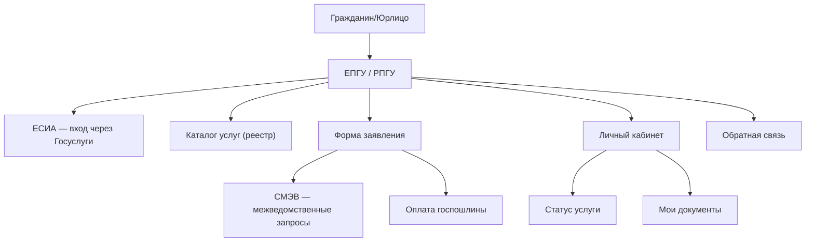
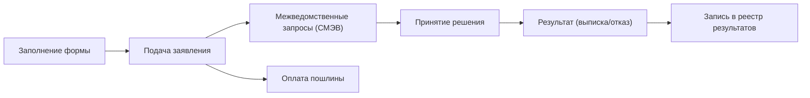

:::info[TL;DR]
Проектирование портала госуслуг — это не просто «формочка для заявлений». Нужно учесть ЕСИА (аутентификацию), СМЭВ (межведомственные запросы), статусы услуг, прикрепление документов, юридически значимый ЭДО и требования 59-ФЗ (сроки ответа).
:::

## Типы порталов

| Тип | Описание | Пример |
|-----|----------|--------|
| **Федеральный** | ЕПГУ (Госуслуги) | gosuslugi.ru |
| **Региональный** | РПГУ — портал региона | mos.ru, uslugi.mosreg.ru |
| **Ведомственный** | ЛК для определённой услуги | Налоговая, Росреестр |

## Архитектура портала госуслуг

## Жизненный цикл услуги

## Требования к порталу

| Параметр | Пример |
|----------|--------|
| SLA | 99.9% |
| Заявлений в час | 10 000+ (для массовых услуг) |
| Время ответа | < 2 сек на страницу |
| ЕСИА | Обязательная аутентификация |
| 59-ФЗ | Срок ответа: 30 дней (до 15 для отдельных) |
| Хранение | 5+ лет по архивному законодательству |

## Что дальше

- [СМЭВ — межведомственное взаимодействие](/docs/specialization/govtech-smev)

## Проверь себя

1. **Какие бывают типы порталов госуслуг?**
   *Ответ:* Федеральные (ЕПГУ), региональные (РПГУ), ведомственные.

2. **Как портал взаимодействует с СМЭВ?**
   *Ответ:* При подаче заявления портал отправляет межведомственные запросы через СМЭВ, чтобы получить данные из других ГИС.
