:::info[TL;DR]
44-ФЗ — госзакупки для бюджетных учреждений (строгие процедуры, аукционы, конкурсы, обязательное ТЗ, сроки 30-90 дней). 223-ФЗ — для госкомпаний (гибче, свои положения, 15-45 дней). Аналитик на стороне заказчика пишет ТЗ, обосновывает НМЦК, проверяет заявки. На стороне исполнителя — анализирует ТЗ, оценивает объём, готовит техпредложение. ЕИС (zakupki.gov.ru) — единый портал закупок, публикуются все тендеры. Рынок госзакупок IT в РФ — 500+ млрд ₽/год.
:::

## Для кого эта статья

Middle SA, участвующий в госзакупках (заказчик или исполнитель). После прочтения вы:

- Поймёте разницу 44-ФЗ и 223-ФЗ, сроки и процедуры
- Узнаете структуру ТЗ на IT-систему (8 разделов)
- Сможете обосновать НМЦК и подготовить тендерную документацию
- Поймёте риски: обжалование ФАС, изменение требований, срыв сроков

## 1. 44-ФЗ vs 223-ФЗ

| Параметр | 44-ФЗ (бюджетники) | 223-ФЗ (госкомпании) |
|----------|--------------------|---------------------|
| **Заказчики** | Бюджетные, казённые, муниципальные учреждения | Госкомпании (РЖД, Ростелеком, Росатом), монополии |
| **Процедура** | Строгая: аукцион (электронный), конкурс, запрос котировок | Гибче: своё положение о закупке |
| **Сроки** | 30-90 дней (аукцион) | 15-45 дней |
| **ТЗ** | Обязательно, жёсткие требования к составу | Есть, но гибче |
| **Участники** | Любые + квота СМП (15%) | Определённые положением |
| **Площадки** | 8 федеральных: Сбербанк-АСТ, РТС-тендер, ЕЭТП, etc. | Те же + собственные |
| **Изменения** | Нельзя менять после публикации | Можно, с обоснованием |
| **Обжалование** | ФАС, 10 дней | ФАС, 30 дней |

**Объём рынка IT-закупок (2024):**

| Тип | Объём | Доля IT |
|-----|-------|---------|
| 44-ФЗ (всего) | 12 трлн ₽ | ~200 млрд ₽ IT |
| 223-ФЗ (всего) | 30 трлн ₽ | ~300+ млрд ₽ IT |

## 2. Процесс закупки (44-ФЗ, электронный аукцион)

```mermaid
flowchart LR
    PLAN["Планирование<br/>— формирование плана-графика<br/>на год"] --> TZ["Разработка ТЗ<br/>— функциональные,<br/>технические требования"]
    TZ --> NMCK["Обоснование НМЦК<br/>— начальной цены<br/>контракта"]
    NMCK --> PUB["Публикация<br/>в ЕИС (zakupki.gov.ru)<br/>+ на площадке"]
    PUB --> BID["Приём заявок<br/>— 30 дней"]
    BID --> WIN["Рассмотрение<br/>и определение<br/>победителя"]
    WIN --> CONT["Заключение<br/>контракта<br/>— 10-20 дней"]
    CONT --> EXEC["Исполнение<br/>— разработка,<br/>поставка, внедрение"]
    EXEC --> ACCEPT["Приёмка<br/>— экспертиза,<br/>закрывающие документы"]
    ACCEPT --> PAY["Оплата<br/>— в течение<br/>30 дней"]
```



**Сроки этапов:**

| Этап | Рабочих дней | Ответственный |
|------|-------------|--------------|
| Планирование | 30-60 | Заказчик |
| Разработка ТЗ | 20-40 | Аналитик (заказчик) |
| Обоснование НМЦК | 5-10 | Заказчик |
| Публикация → приём заявок | 30 (аукцион) / 20 (конкурс) | ЕИС |
| Рассмотрение | 3-7 | Комиссия заказчика |
| Заключение контракта | 10-20 | Заказчик + Исполнитель |
| Исполнение | 90-365 | Исполнитель |
| Приёмка | 10-20 | Аналитик (заказчик) |
| Оплата | 30 | Заказчик |

## 3. Структура ТЗ на IT-систему по ГОСТ 34

| № | Раздел | Содержание | Обязательно? |
|---|--------|-----------|-------------|
| 1 | **Общие сведения** | Наименование, шифр, заказчик, разработчик, сроки | Да |
| 2 | **Назначение и цели** | Для чего система, какие проблемы решает | Да |
| 3 | **Характеристика объекта** | Текущее состояние, объёмы, пользователи | Да |
| 4 | **Требования к системе** | Функциональные (что делает), нефункциональные (производительность, безопасность) | Да |
| 5 | **Требования к архитектуре** | Состав подсистем, интеграции (СМЭВ, ЕСИА, ЕПГУ) | Да |
| 6 | **Требования к безопасности** | Уровень УЗ, СЗИ, криптография, аттестация | Да |
| 7 | **Требования к импортозамещению** | Стек из реестра ПО (Astra Linux, Postgres Pro, КриптоПро) | Да |
| 8 | **Состав и содержание работ** | Этапы, контрольные точки, документация | Да |
| 9 | **Порядок сдачи и приёмки** | Критерии, виды испытаний, объём документации | Да |
| 10 | **Требования к документированию** | Состав документации (ТЗ, РД, ПМИ) | Да |

## 4. Обоснование НМЦК (начальной цены контракта)

**Методы расчёта НМЦК для IT:**

| Метод | Описание | Когда применять |
|-------|----------|----------------|
| **Анализ рынка** | Сбор коммерческих предложений (3+ поставщика) | Основной метод |
| **Нормативный** | По нормативам (например, стоимость ПО из реестра) | Если есть утверждённые цены |
| **Тарифный** | По тарифам (например, сопровождение) | Для услуг |
| **Сметный** | Смета (ФОТ + накладные + прибыль) | Для разработки |
| **Затратный** | Фактические затраты + норматив | Для специфических работ |

**Пример расчёта НМЦК (разработка ГИС):**

```
1. ФОТ (12 мес × 15 чел):
   - 1 PM (300K × 12) = 3.6M
   - 2 SA (250K × 2 × 12) = 6.0M
   - 5 Dev (300K × 5 × 12) = 18.0M
   - 3 QA (200K × 3 × 12) = 7.2M
   - 2 DevOps (350K × 2 × 12) = 8.4M
   Итого ФОТ: 43.2M

2. Накладные (30%): 13.0M
3. Прибыль (15%): 8.4M
4. НДС (20%): 12.9M

ИТОГО НМЦК: 77.5M ₽ (≈ 77.5M ₽)
```

## 5. Задачи аналитика

### На стороне заказчика

| Задача | Артефакт | Срок |
|--------|----------|------|
| Сбор требований от бизнеса и регуляторов | Реестр требований | 2-4 недели |
| Написание ТЗ (техническая часть) | ТЗ по ГОСТ 34 | 4-6 недель |
| Обоснование НМЦК | Смета + коммерческие предложения | 1-2 недели |
| Проверка заявок участников на соответствие ТЗ | Заключение по каждой заявке | 3-5 дней |
| Участие в приёмке | Акт приёмки, протокол испытаний | 2-4 недели |

### На стороне исполнителя

| Задача | Артефакт | Срок |
|--------|----------|------|
| Анализ ТЗ (gap analysis) | Соответствие/несоответствие | 3-5 дней |
| Оценка объёмов и сроков | WBS, календарный план | 1-2 недели |
| Подготовка техпредложения | Том 2 (техническая часть) | 2-3 недели |
| Обоснование цены | Смета | 1 неделя |
| Защита на комиссии | Презентация | 1 день |

## 6. Риски госзакупок

| Риск | Вероятность | Последствие | Митигация |
|------|-------------|-------------|-----------|
| **Обжалование в ФАС** | Средняя | Сдвиг на 2-4 мес | Качественное ТЗ, прозрачные критерии |
| **Изменение требований** | Высокая | Доп. соглашение + цена | Чёткий процесс change management |
| **Срыв сроков исполнителем** | Средняя | Штрафы, расторжение | Аванс ≤ 30%, регулярные отчёты |
| **Импортозамещение (новый компонент не в реестре)** | Высокая | Замена стека | Проверить реестр до публикации |
| **Бюджет сокращён** | Средняя | Урезание функционала | Приоритезация MVP в ТЗ |

## 7. Метрики закупки

| Метрика | Формула | Норма |
|---------|---------|-------|
| **Снижение НМЦК** | (НМЦК — контракт) / НМЦК | 5-15% |
| **Срок от публикации до контракта** | Дата контракта — публикация | < 60 дней |
| **% обжалованных закупок** | жалобы / всего | < 5% |
| **Доля СМП** | контракты с СМП / всего | ≥ 15% |
| **Исполнение бюджета** | оплачено / запланировано | > 90% |

## Практический кейс: ТЗ на РПГУ (региональный портал)

**Проблема:** Субъект РФ — 3M жителей, 50 услуг онлайн из 200. Бюджет — 200M ₽. Цель: 150 услуг онлайн за 18 мес.

**Разработка ТЗ:**
1. **Функциональные требования:** 150 услуг, интеграция с ЕСИА, СМЭВ 3.x, ГИС ГМП, «Мои документы»
2. **Архитектура:** ЕПГУ-совместимая, шлюз СМЭВ, Postgres Pro, Astra Linux
3. **Безопасность:** УЗ-2, КриптоПро, ViPNet
4. **Импортозамещение:** все компоненты из реестра
5. **Состав работ:** 6 этапов, 18 мес, 25 человек

**Результаты:**
- Закупка: 2 участника, победитель — 185M ₽ (-7.5% от НМЦК)
- Срок: 18 мес (факт: 20 — сдвиг на 2 мес из-за изменения СМЭВ)
- Услуг онлайн: 150 (100% от плана)

## Ссылки для самостоятельного изучения

| Ресурс | Описание | Ссылка |
|--------|----------|--------|
| ЕИС — zakupki.gov.ru | Единая информационная система закупок | https://zakupki.gov.ru |
| 44-ФЗ — полный текст | Федеральный закон о госзакупках | https://www.consultant.ru |
| 223-ФЗ — полный текст | О закупках госкомпаний | https://www.consultant.ru |
| Сбербанк-АСТ | Электронная площадка | https://www.sberbank-ast.ru |
| РТС-тендер | Электронная площадка | https://www.rts-tender.ru |
| ГОСТ 34.601-90 — АС | Стандарт разработки АС | https://docs.cntd.ru |
| ФАС — обжалование | Порядок обжалования | https://fas.gov.ru |

## Проверь себя

1. **Чем 44-ФЗ отличается от 223-ФЗ?**
   *Ответ:* 44-ФЗ — для бюджетников (строгий, аукцион/конкурс, 30-90 дней). 223-ФЗ — для госкомпаний (гибче, своё положение, 15-45 дней). 44-ФЗ: ТЗ обязательно, изменения нельзя. 223-ФЗ: можно изменить.

2. **Какие разделы обязательно включить в ТЗ на IT-систему?**
   *Ответ:* 8 разделов: общие сведения, назначение, характеристика объекта, требования (функциональные + нефункциональные + архитектура + безопасность + импортозамещение), состав работ, приёмка, документирование.

3. **Как обосновывается НМЦК для IT-разработки?**
   *Ответ:* Основной метод — анализ рынка (3+ коммерческих предложения). Альтернатива — сметный (ФОТ + накладные 30% + прибыль 15% + НДС 20%). Для ГИС — обязательно отразить ФСТЭК и импортозамещение в смете.

4. **Какие риски при госзакупке IT?**
   *Ответ:* Обжалование ФАС (сдвиг 2-4 мес), изменение требований (цена/срок), срыв сроков (штрафы), импортозамещение (компонент не в реестре), сокращение бюджета (cut функционала).

5. **Какие метрики эффективности закупки?**
   *Ответ:* Снижение НМЦК (5-15%, норма), срок от публикации до контракта (< 60 дней), % обжалованных закупок (< 5%), доля СМП (≥ 15%), исполнение бюджета (> 90%).
