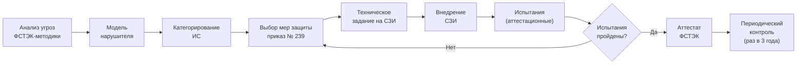

:::info[TL;DR]
Любая ГИС обязана пройти аттестацию по требованиям ФСТЭК России. Аттестация включает: анализ угроз, модель нарушителя, категорирование ИС, выбор мер защиты (приказ № 239), внедрение СЗИ, испытания. Без аттестата ГИС нельзя эксплуатировать — штраф до 500K ₽ + блокировка. Уровни защищённости: УЗ-1 (ОПД), УЗ-2 (ПД, госуслуги), УЗ-3 (ведомственные). Аналитик специфицирует требования безопасности: идентификация (ЕСИА/УКЭП), управление доступом (RBAC), аудит, антивирус, криптография (ГОСТ).
:::

## Для кого эта статья

Senior SA, участвующий в аттестации ГИС. После прочтения вы:

- Поймёте процесс аттестации: угрозы → категорирование → меры → испытания
- Узнаете классы защищённости: УЗ-1, УЗ-2, УЗ-3 — требования и различия
- Сможете специфицировать меры защиты по приказу ФСТЭК № 239
- Поймёте криптографию: УКЭП (ГОСТ Р 34.10), шифрование (ГОСТ 28147-89), PKI

## 1. Регуляторы и нормативная база

| Регулятор | Полномочия | Документы |
|-----------|-----------|-----------|
| **ФСТЭК России** | Техническая защита информации, аттестация | Приказ № 239 (меры защиты), Методики оценки угроз |
| **ФСБ России** | Криптография, УКЭП, шифрование | ГОСТ Р 34.10, ГОСТ 28147-89 |
| **Минцифры** | Координация цифровизации | Приказы по ЕСИА, СМЭВ, импортозамещению |
| **Роскомнадзор** | Персональные данные (152-ФЗ) | План проверок, штрафы |

**Основные НПА:**

| Документ | Что регулирует |
|----------|---------------|
| **152-ФЗ** | Персональные данные — любая ГИС с ПД |
| **Приказ ФСТЭК № 239** | Меры защиты информации в ГИС |
| **Приказ ФСТЭК № 21** | Состав и содержание оргмер по защите ПД |
| **ГОСТ Р 34.10-2012** | Криптография: электронная подпись |
| **ГОСТ 28147-89** | Шифрование (симметричное, 256 бит) |

## 2. Уровни защищённости ГИС (УЗ)

ФСТЭК классифицирует ГИС по трём уровням:

| Параметр | УЗ-1 | УЗ-2 | УЗ-3 |
|----------|------|------|------|
| **Какие данные** | ОПД (общедоступные) | ПД, врачебная тайна | Внутренние, без ПД |
| **Пример** | Портал открытых данных | ЕПГУ, ЕМИАС, ЕСИА | Ведомственная система |
| **Меры защиты** | Базовые (8 мер) | Средние (14 мер) | Максимальные (18 мер) |
| **СЗИ НСД** | Dallas Lock / Secret Studio | Dallas Lock / Secret Studio | Secret Studio / СБ |
| **Криптография** | Опционально | Обязательно | Обязательно + ФСБ |
| **Срок аттестации** | 2-4 мес | 4-8 мес | 6-12 мес |
| **Бюджет** | 500K-2M ₽ | 2M-10M ₽ | 10M-50M ₽ |
| **Переаттестация** | Раз в 3 года | Раз в 3 года | Ежегодно |

## 3. Процесс аттестации

### Этап 1: Анализ угроз

Определяются актуальные угрозы безопасности:

| Угроза | Источник | Вероятность | Ущерб |
|--------|----------|-------------|-------|
| Утечка ПД через SQL-инъекцию | Внешний нарушитель | Высокая | Критический |
| Перехват трафика | Внешний (сеть) | Средняя | Высокий |
| НСД через учётку администратора | Внутренний | Низкая | Критический |
| Вредоносное ПО | Внешний + Внутренний | Средняя | Высокий |
| Социальная инженерия | Внешний (звонок) | Высокая | Средний |

### Этап 2: Модель нарушителя

| Тип нарушителя | Описание | Потенциал |
|---------------|----------|-----------|
| **Н1** | Внешний, без доступа к системе | Низкий |
| **Н2** | Пользователь ГИС (гражданин) | Низкий |
| **Н3** | Госслужащий с ограниченным доступом | Средний |
| **Н4** | Администратор ГИС | Высокий |
| **Н5** | Разработчик / подрядчик | Средний |

### Этап 3: Выбор мер защиты (приказ № 239)

Приказ № 239 выделяет 8 групп мер:

| Группа | Мера | Описание | Пример реализации |
|--------|------|----------|------------------|
| **ИАФ** | Идентификация и аутентификация | Кто заходит в систему | ЕСИА, УКЭП, пароль + SMS |
| **УПД** | Управление доступом | Кто что может делать | RBAC, ABAC, мандатный доступ |
| **ОЛС** | Ограничение программной среды | Белые списки ПО | Astra Linux (режим «Смоленск») |
| **ЗИС** | Защита среды виртуализации | Безопасность VM | zVirt, KVM |
| **ЗНИ** | Защита сети | МЭ, IDS, VPN | ViPNet, UserGate |
| **ЗСВ** | Защита средств криптографии | УКЭП, шифрование | КриптоПро CSP |
| **РСБ** | Регистрация событий и аудит | Логирование | journald, Zabbix, СКАДА |
| **АВЗ** | Антивирусная защита | Вредоносное ПО | Kaspersky, Dr.Web |

## 4. Криптография в ГИС

| Технология | Стандарт | Применение |
|-----------|----------|------------|
| **УКЭП** | ГОСТ Р 34.10-2012 | Подписание документов, СМЭВ-запросы |
| **Шифрование каналов** | ГОСТ 28147-89 (Кузнечик) | TLS, VPN (ViPNet) |
| **Шифрование данных** | ГОСТ 28147-89 | Шифрование БД, дисков |
| **PKI** | ГОСТ Р 34.10 | Сертификаты Удостоверяющего центра |
| **КриптоПро CSP** | Вендор | Библиотека криптоопераций для 1С |
| **КриптоПро JCP** | Вендор | Криптография для Java |

## 5. Требования к системе

### Спецификация для УЗ-2 (типовая ГИС)

| Компонент | Требование | Пример |
|-----------|-----------|--------|
| **Аутентификация** | Пароль (8+ символов) + УКЭП / ЕСИА | ЕСИА (SAML 2.0) |
| **Управление доступом** | RBAC, 3+ роли | Админ, Оператор, Аудитор |
| **Аудит** | Все действия, хранение 5 лет | JSON-логи, journald |
| **Антивирус** | Сертифицирован ФСТЭК | Kaspersky Endpoint Security |
| **МЭ** | Разделение контуров (внешний/внутренний) | ViPNet Coordinator HW |
| **VPN** | Шифрование каналов (ГОСТ) | ViPNet Client, SSL VPN |
| **СЗИ НСД** | Защита от НСД к ОС | Dallas Lock, Secret Studio |
| **Криптография** | УКЭП, шифрование БД | КриптоПро CSP |
| **Физическая безопасность** | СКУД, видеонаблюдение | Data-центр уровня TIER III |

## 6. Типовые ошибки при аттестации

| Ошибка | Последствие | Как избежать |
|--------|-------------|-------------|
| **Модель угроз не учитывает все сценарии** | Пропущенная угроза → утечка | Использовать ФСТЭК-методику |
| **СЗИ несовместимы с ПО** (Astra Linux + КриптоПро) | Ошибки на этапе испытаний | Совместимость — тест до внедрения |
| **Логи не хранятся 5 лет** | Несоответствие требованиям | Аудит с ротацией |
| **Нет разделения контуров** (внешний = внутренний) | СМЭВ → прямой доступ к БД | ViPNet, МЭ |
| **Парольная политика не соблюдается** | НСД через слабый пароль | Интеграция с ЕСИА/УКЭП |

## Практический кейс: Аттестация ЕПГУ (УЗ-2)

**Проблема:** ЕПГУ — 110M+ пользователей, обработка ПД (СНИЛС, ИНН, паспорт). Уровень защищённости — УЗ-2. Аттестация — 6 мес.

**Ключевые меры:**
1. **ЕСИА** — двухфакторная аутентификация (пароль + SMS/биометрия)
2. **RBAC** — 5 ролей, строгое разграничение
3. **Аудит** — 1B+ событий/день, хранение 5 лет (ClickHouse)
4. **Криптография** — УКЭП для юридически значимых действий
5. **ViPNet** — защита каналов со СМЭВ
6. **Dallas Lock** — защита рабочих станций госслужащих

**Результат:**
- Аттестат получен (6 мес)
- 0 инцидентов за 3 года
- Ежегодный контроль — без замечаний

## Ссылки для самостоятельного изучения

| Ресурс | Описание | Ссылка |
|--------|----------|--------|
| ФСТЭК — методические документы | Угрозы, модели, меры | https://fstek.ru/technical-protection/documents |
| Приказ ФСТЭК № 239 (меры защиты) | Полный перечень мер | https://fstek.ru |
| 152-ФЗ о персональных данных | Закон о ПД | https://www.consultant.ru |
| КриптоПро CSP — документация | Криптография | https://www.cryptopro.ru |
| Dallas Lock — СЗИ НСД | Защита от НСД | https://dallaslock.ru |
| ViPNet — защита сети | VPN, МЭ | https://infotecs.ru |
| ГОСТ Р 34.10-2012 (УКЭП) | Стандарт электронной подписи | https://docs.cntd.ru |
| Astra Linux — безопасность | Режимы защиты ОС | https://astralinux.ru |

## Проверь себя

1. **Что такое УЗ-1, УЗ-2, УЗ-3?**
   *Ответ:* Уровни защищённости ГИС по ФСТЭК. УЗ-1 — базовый (ОПД, 8 мер), УЗ-2 — средний (ПД, 14 мер + криптография), УЗ-3 — максимальный (гостайна, 18 мер). Бюджет: 500K-50M ₽.

2. **Какие меры защиты включает приказ № 239?**
   *Ответ:* 8 групп: ИАФ (идентификация), УПД (доступ), ОЛС (среда), ЗИС (виртуализация), ЗНИ (сеть), ЗСВ (криптография), РСБ (аудит), АВЗ (антивирус). Для УЗ-2 — 14 мер, для УЗ-3 — 18 мер.

3. **Как проходит аттестация ГИС?**
   *Ответ:* Анализ угроз → Модель нарушителя → Категорирование ИС → Выбор мер (№239) → ТЗ на СЗИ → Внедрение → Испытания → Аттестат. Срок: 2-12 мес. Переаттестация: раз в 3 года.

4. **Какие криптографические стандарты применяются в ГИС?**
   *Ответ:* УКЭП — ГОСТ Р 34.10-2012 (подпись), Шифрование — ГОСТ 28147-89 / «Кузнечик» (каналы, БД), PKI — ГОСТ Р 34.10 (сертификаты). Вендоры: КриптоПро CSP (Windows/Linux), JCP (Java).

5. **Что будет, если ГИС не аттестована?**
   *Ответ:* Нельзя эксплуатировать. Штраф до 500K ₽, блокировка сайта, дисквалификация руководителя. Утечка ПД — уголовная ответственность (ст. 137 УК РФ).
