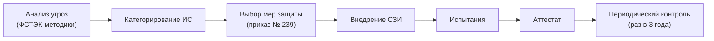

:::info[TL;DR]
Любая ГИС обязана пройти аттестацию по требованиям ФСТЭК России. Аттестация включает: анализ угроз, модель нарушителя, категорирование ИС, технические меры (СЗИ), организационные меры. Без аттестата ГИС нельзя эксплуатировать. Аналитик специфицирует требования безопасности к системе.
:::

## Классы защищённости ГИС

ФСТЭК классифицирует ГИС по уровням защищённости (УЗ):

| УЗ | Для кого | Требования |
|-----|----------|-----------|
| **УЗ-1** | Персональные данные, особо важные | Максимум |
| **УЗ-2** | Госуслуги, типовые ГИС | Средние |
| **УЗ-3** | Ведомственные без ПД | Минимальные |

## Процесс аттестации

## Типовые меры защиты (из приказа ФСТЭК № 239)

| Мера | Описание |
|------|----------|
| **ИАФ** | Идентификация и аутентификация (пароль, УКЭП, ЕСИА) |
| **УПД** | Управление доступом (RBAC, мандатный доступ) |
| **ОЛС** | Ограничение программной среды (белые списки ПО) |
| **ЗИС** | Защита среды виртуализации |
| **ЗНИ** | Защита сети (МЭ, IDS, VPN) |
| **ЗСВ** | Защита СКЗИ (шифрование, УКЭП) |
| **РСБ** | Регистрация событий и аудит |
| **АВЗ** | Антивирусная защита |

## Криптография

| Технология | Стандарт | Применение |
|-----------|----------|------------|
| **УКЭП** | ГОСТ Р 34.10 | Подписание документов |
| **Шифрование** | ГОСТ 28147-89 | Каналы связи, диски |
| **PKI** | ГОСТ Р 34.10 | Сертификаты УЦ |
| **КриптоПро** | CSP / JCP | Библиотека криптоопераций |

## Требования к системе (спецификация)

| Параметр | Пример |
|----------|--------|
| Класс защищённости | УЗ-2 |
| СЗИ | Secret Studio / Dallas Lock |
| Аутентификация | Пароль + УКЭП / ЕСИА |
| Аудит | Все действия, хранение 5 лет |
| Антивирус | Kaspersky / Dr.Web (из реестра) |

## Что дальше

- [Госзакупки (44-ФЗ, 223-ФЗ)](/docs/specialization/govtech-procurement)

## Проверь себя

1. **Что такое УЗ-1, УЗ-2, УЗ-3?**
   *Ответ:* Уровни защищённости ГИС по ФСТЭК. УЗ-1 — максимальный (ПД), УЗ-2 — средний (госуслуги), УЗ-3 — минимальный.

2. **Какие меры защиты включает приказ № 239?**
   *Ответ:* ИАФ, УПД, ОЛС, ЗИС, ЗНИ, ЗСВ, РСБ, АВЗ — от аутентификации до антивируса.
