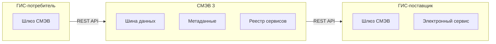

:::info[TL;DR]
СМЭВ — это «шина» для обмена данными между государственными информационными системами. Версия 3 работает через REST и JSON (ранее SOAP/XML). Для аналитика важно понимать: виды сведений, электронные сервисы, метаданные, SLA и юридически значимый документооборот.
:::

## Зачем нужен СМЭВ

До СМЭВ каждый госорган собирал данные с граждан самостоятельно. Сейчас — одно заявление через портал, остальные данные запрашиваются через СМЭВ.

**Пример:** Заявление на загранпаспорт → портал запрашивает через СМЭВ:
- МВД: отсутствие судимости
- ФНС: ИНН
- ПФР: СНИЛС
- ФССП: отсутствие долгов

## Версии СМЭВ

| Параметр | СМЭВ 2 | СМЭВ 3 |
|----------|--------|--------|
| Транспорт | SOAP 1.2 | REST (HTTP/2) |
| Формат | XML | JSON / XML |
| Аутентификация | УКЭП подпись | OAuth 2.0 + УКЭП |
| Асинхронность | Нет (синхронный) | Асинхронный (callback) |
| Коннектор | ViPNet Coordinator | Шлюз (любой) |

## Архитектура СМЭВ 3

## Электронные сервисы СМЭВ

ГИС-поставщик публикует электронные сервисы (API):

| Сервис | Описание |
|--------|----------|
| **Запрос сведений** | Получение данных (СНИЛС, ИНН, паспорт) |
| **Постановка на учёт** | Регистрация события (роды, смерть) |
| **Внесение изменений** | Обновление данных |
| **Услуга** | Полный жизненный цикл услуги |

## Требования к интеграции со СМЭВ

| Параметр | Пример |
|----------|--------|
| Транспорт | REST / HTTP/2 |
| Аутентификация | OAuth 2.0 + УКЭП |
| Формат | JSON (СМЭВ 3) |
| SLA | 5–30 сек на запрос |
| Асинхронность | Callback для долгих операций |
| Коннектор | Сертифицированный шлюз |

## Что дальше

- [Импортозамещение](/docs/specialization/govtech-import-substitution)

## Проверь себя

1. **Чем СМЭВ 3 отличается от СМЭВ 2?**
   *Ответ:* REST вместо SOAP, JSON вместо XML, OAuth 2.0 вместо УКЭП на каждый запрос, асинхронность.

2. **Как происходит межведомственный запрос?**
   *Ответ:* ГИС → СМЭВ-шлюз → шина СМЭВ → ГИС-поставщик → ответ (синхронно или асинхронно).
