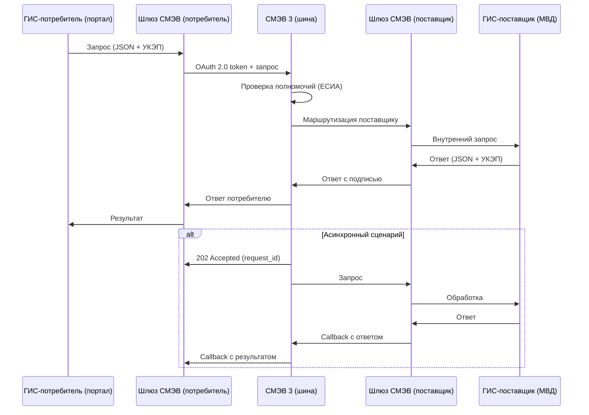
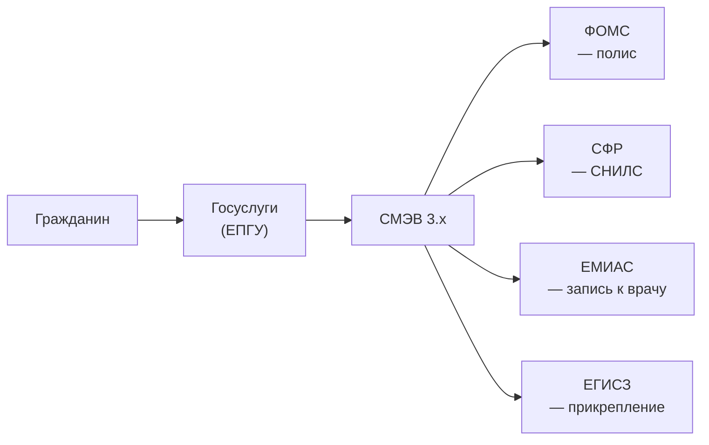

:::info[TL;DR]
СМЭВ — «шина» для обмена данными между государственными информационными системами. Версия 3 (текущая) работает через REST и JSON (ранее SOAP/XML). Через СМЭВ проходят 1B+ запросов/год, 25 000+ подключённых ГИС. Аналитик описывает: вид сведения (что запрашиваем), электронный сервис (как запрашиваем), метаданные (формат), SLA (время ответа: 5-30 сек), юридическую значимость (УКЭП). Ключевые провайдеры: ЕСИА (аутентификация + метаданные), шлюз СМЭВ (ViPNet, криптография).
:::

## Для кого эта статья

Senior SA, проектирующий интеграцию ГИС с СМЭВ. После прочтения вы:

- Поймёте архитектуру СМЭВ 3.x: потребитель → шина → поставщик
- Узнаете типы электронных сервисов: запрос сведений, постановка на учёт, услуга
- Сможете проектировать СМЭВ-запрос: метаданные, OAuth 2.0, УКЭП, SLA
- Поймёте разницу СМЭВ 2 (SOAP/XML) vs СМЭВ 3 (REST/JSON)

## 1. Зачем нужен СМЭВ

До СМЭВ каждый госорган собирал данные с граждан самостоятельно: паспорт — МВД, ИНН — ФНС, СНИЛС — ПФР. Гражданин приносил бумажные справки. Сейчас — одно заявление через портал, остальные данные запрашиваются через СМЭВ «под капотом».

**Пример:** Заявление на загранпаспорт → портал запрашивает через СМЭВ:
- **МВД:** отсутствие судимости
- **ФНС:** ИНН
- **ПФР (СФР):** СНИЛС
- **ФССП:** отсутствие долгов
- **Военкомат:** отношение к воинской обязанности

**Эффект от СМЭВ:**

| Показатель | До СМЭВ | После СМЭВ |
|-----------|---------|------------|
| Время получения справок | 2-4 недели | 5-30 секунд |
| Количество визитов гражданина | 5-8 | 1 (на портал) |
| Операционные затраты ведомств | 100% | 30-50% |
| Ошибки (человеческий фактор) | 5-10% | < 0.1% |
| Количество запросов/год | — | 1B+ |

## 2. Архитектура СМЭВ

### 2.1 Версии

| Параметр | СМЭВ 2 (2013) | СМЭВ 3 (2020+) |
|----------|--------------|----------------|
| **Транспорт** | SOAP 1.2 (XML) | REST (HTTP/2) |
| **Формат** | XML | JSON / XML |
| **Аутентификация** | УКЭП (подпись каждого запроса) | OAuth 2.0 + УКЭП |
| **Асинхронность** | Нет (синхронный) | Асинхронный (callback) |
| **Коннектор** | ViPNet Coordinator (обязателен) | Шлюз СМЭВ (любой сертифицированный) |
| **SLA** | 30 сек | 5-30 сек |
| **Маршрутизация** | Жёсткая (по ID) | Гибкая (реестр сервисов + метаданные) |

### 2.2 Схема взаимодействия (СМЭВ 3)



## 3. Электронные сервисы СМЭВ

ГИС-поставщик публикует электронные сервисы — API для других ГИС.

### Типы сервисов

| Тип сервиса | Описание | Пример | Синхронность |
|-------------|----------|--------|-------------|
| **Запрос сведений** | Получение данных | СНИЛС, ИНН, паспорт | Синхронно (< 10 сек) |
| **Постановка на учёт** | Регистрация события | Регистрация рождения | Асинхронно |
| **Внесение изменений** | Обновление данных | Смена фамилии в ЕСИА | Асинхронно |
| **Услуга** | Полный lifecycle услуги | Запись к врачу, загранпаспорт | Гибрид |

### Пример: Запрос сведений о гражданине

**Запрос (ГИС-потребитель → СМЭВ):**

```json
{
  "request_id": "REQ-2025-01-01-12345",
  "sender": "7701777777-GIS-Портал",
  "recipient": "7701888888-GIS-МВД",
  "service_code": "SMEV-MVD-001",
  "data": {
    "document_type": "PASSPORT_RF",
    "document_series": "4501",
    "document_number": "123456",
    "surname": "Иванов",
    "first_name": "Иван"
  },
  "signature": "base64(УКЭП)"
}
```

**Ответ (СМЭВ → ГИС-потребитель):**

```json
{
  "request_id": "REQ-2025-01-01-12345",
  "status": "SUCCESS",
  "data": {
    "snils": "123-456-789 01",
    "inn": "123456789012",
    "registration_address": "г. Москва, ул. Ленина, д. 10, кв. 5",
    "birth_date": "1990-01-01"
  },
  "signature": "base64(УКЭП поставщика)",
  "timestamp": "2025-01-01T10:00:00Z"
}
```

## 4. Технические требования к интеграции

### Транспорт и безопасность

| Параметр | Требование |
|----------|-----------|
| **Транспорт** | REST / HTTP/2 (HTTPS, TLS 1.2+) |
| **Аутентификация** | OAuth 2.0 Client Credentials Grant |
| **Подпись** | УКЭП (ГОСТ Р 34.10-2012) |
| **Формат подписи** | PKCS#7 / CMS detached signature |
| **Формат данных** | JSON (RFC 7159) |
| **Кодировка** | UTF-8 |
| **HTTP-методы** | POST (запрос), GET (статус) |
| **Content-Type** | application/json; charset=utf-8 |

### SLA и таймауты

| Тип запроса | Таймаут | Кол-во retry | Стратегия |
|-------------|---------|--------------|-----------|
| **Синхронный** | 10 сек | 2 раза | Если таймаут → переключиться на асинхронный |
| **Асинхронный** | 24 часа | — | Callback от поставщика |
| **Массовый (batch)** | 72 часа | — | Пул запросов, callback |
| **Срочный** | 5 сек | 3 раза | Exponential backoff |

## 5. Метрики СМЭВ

| Метрика | Описание | Хорошо | Плохо |
|---------|----------|--------|-------|
| **Доступность шины** | Uptime СМЭВ | > 99.95% | < 99.5% |
| **Время ответа (синхр.)** | P50 / P95 | < 3 сек / < 8 сек | > 10 сек / > 30 сек |
| **% успешных запросов** | (успех / всего) × 100 | > 98% | < 90% |
| **% асинхронных callback** | callback получен вовремя | > 95% | < 80% |
| **Средний размер ответа** | JSON | < 50 KB | > 500 KB |
| **Количество отказов** | 4xx / 5xx | < 0.5% | > 5% |

## 6. Ключевые термины СМЭВ

| Термин | Пояснение |
|--------|-----------|
| **Вид сведения** | Тип данных, которые запрашиваются (СНИЛС, ИНН, паспортные данные) |
| **Электронный сервис** | API ГИС-поставщика для запроса сведений |
| **Метаданные** | Описание вида сведения: формат, поля, типы |
| **ЕСИА-полномочия** | Право ГИС-потребителя запрашивать данный вид сведения |
| **Шлюз СМЭВ** | Сертифицированный ViPNet Coordinator или альтернатива |
| **УКЭП** | Усиленная квалифицированная электронная подпись |
| **Реестр сервисов** | Справочник всех опубликованных электронных сервисов |

## Практический кейс: СМЭВ в ЕПГУ — запись к врачу

**Проблема:** Гражданин записывается к врачу через Госуслуги. Нужно проверить полис ОМС, прикрепить поликлинику и записать к свободному врачу.

**СМЭВ-запросы в процессе записи:**
1. **СМЭВ → ФОМС:** Проверка полиса ОМС (серия, номер → статус «действителен/не действителен»)
2. **СМЭВ → СФР:** СНИЛС гражданина
3. **СМЭВ → ЕМИАС:** Расписание приёма врачей, свободные слоты
4. **СМЭВ → ЕГИСЗ:** Прикрепление к поликлинике

**Архитектура:**



**Результат:**
- Время записи: 4 часа → 5 минут (через портал)
- Все проверки — за 3-5 секунд (через СМЭВ)
- Отказ в приёме без полиса — исключён (проверка онлайн)
- Уровень цифровизации: 95% записей онлайн

## Ссылки для самостоятельного изучения

| Ресурс | Описание | Ссылка |
|--------|----------|--------|
| СМЭВ 3 — методические рекомендации | Документация СМЭВ 3.x | https://smev.gosuslugi.ru |
| ЕСИА — документация OAuth 2.0 | Аутентификация и полномочия | https://esia.gosuslugi.ru |
| Минцифры — стандарты СМЭВ | Нормативные документы | https://digital.gov.ru |
| ГОСТ Р 34.10-2012 — УКЭП | Стандарт электронной подписи | https://docs.cntd.ru |
| ViPNet Coordinator — шлюз СМЭВ | Сертифицированный коннектор | https://infotecs.ru |
| Реестр электронных сервисов | Справочник сервисов СМЭВ | https://smev.gosuslugi.ru/services |
| 210-ФЗ об организации госуслуг | Правовая база СМЭВ | https://www.consultant.ru |

## Проверь себя

1. **Чем СМЭВ 3 отличается от СМЭВ 2?**
   *Ответ:* REST вместо SOAP, JSON вместо XML, OAuth 2.0 вместо УКЭП на каждый запрос, асинхронность (callback). СМЭВ 2 — ViPNet Coordinator обязателен, СМЭВ 3 — любой сертифицированный шлюз. SLA: 30 сек → 5-30 сек.

2. **Как происходит межведомственный запрос через СМЭВ 3?**
   *Ответ:* ГИС-потребитель → Шлюз СМЭВ (УКЭП + OAuth 2.0 token) → Шина СМЭВ (проверка полномочий через ЕСИА) → Шлюз поставщика → ГИС-поставщик → Ответ обратно. Асинхронно: 202 Accepted → callback.

3. **Какие бывают типы электронных сервисов СМЭВ?**
   *Ответ:* Запрос сведений (синхронно, < 10 сек — СНИЛС, ИНН), Постановка на учёт (асинхронно — рождение, смерть), Внесение изменений (асинхронно — смена фамилии), Услуга (гибрид — запись к врачу).

4. **Что такое «вид сведения» и «ЕСИА-полномочия»?**
   *Ответ:* Вид сведения — тип данных (например, «Паспорт РФ»). ЕСИА-полномочия — право ГИС-потребителя запрашивать этот вид сведения. Полномочия настраиваются в ЕСИА: ГИС-потребитель может запрашивать только то, что разрешено для её госфункции.

5. **Какие метрики СМЭВ важны для аналитика?**
   *Ответ:* Доступность шины (> 99.95%), P50/P95 времени ответа (< 3 сек / < 8 сек для синхронных), % успешных запросов (> 98%), % асинхронных callback (> 95%), количество отказов (4xx/5xx < 0.5%). Главная — % успешных запросов: потеря одного запроса = потеря данных о гражданине.
