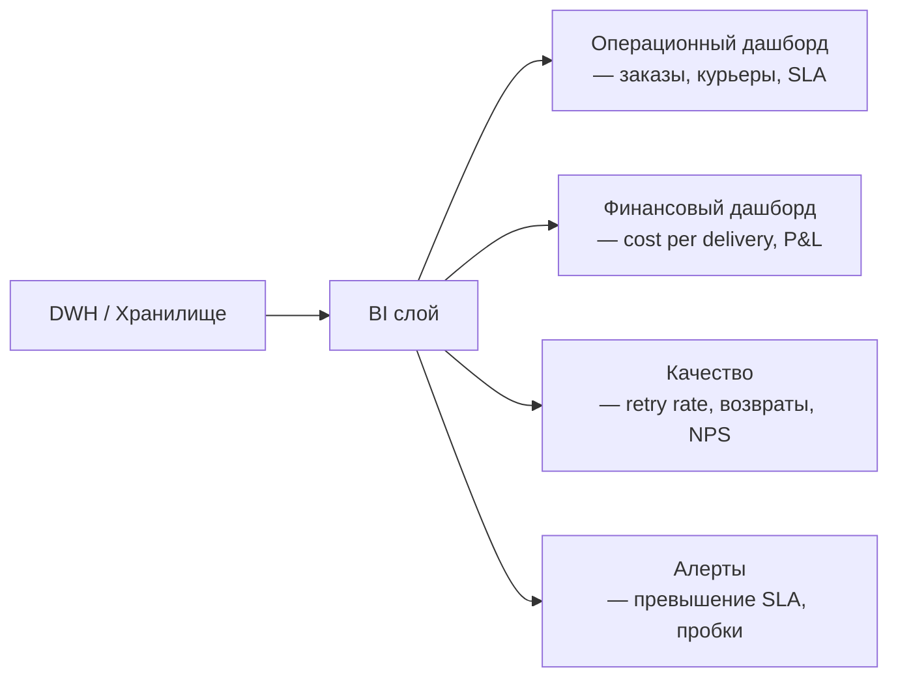

:::info[TL;DR]
Логистическая аналитика — метрики скорости (on-time rate, время доставки), качества (retry rate, возвраты) и стоимости (cost per delivery, last mile cost). Аналитик проектирует дашборды, отчёты и алерты для операционного контроля и стратегической оптимизации.
:::

## Группы метрик

| Группа | Метрики |
|--------|---------|
| **Скорость** | On-time rate, avg delivery time, time to pick |
| **Качество** | Retry rate, return rate, damage rate |
| **Стоимость** | Cost per delivery, last mile cost, fuel cost |
| **Загрузка** | Fill rate, utilisation, empty runs |
| **Склад** | Picking speed, inventory accuracy, cycle time |

## Дашборд логистики

## Ключевые вопросы аналитики

| Вопрос | Метрика |
|--------|---------|
| Сколько заказов доставлено вовремя? | On-time delivery rate |
| Какой регион опаздывает? | Avg delivery time by region |
| Какой перевозчик дешевле? | Cost per delivery by carrier |
| Сколько возвратов? | Return rate |
| Какая загрузка курьеров? | Fill rate |

## Что дальше

Вернитесь к началу: [Логистика — путь аналитика](/docs/specialization/logistics-path)

## Проверь себя

1. **Какие группы метрик в логистике?**
   *Ответ:* Скорость, качество, стоимость, загрузка, склад.

2. **Какие вопросы решает логистическая аналитика?**
   *Ответ:* On-time rate, cost per delivery, fill rate, return rate — для операционного контроля и оптимизации.
