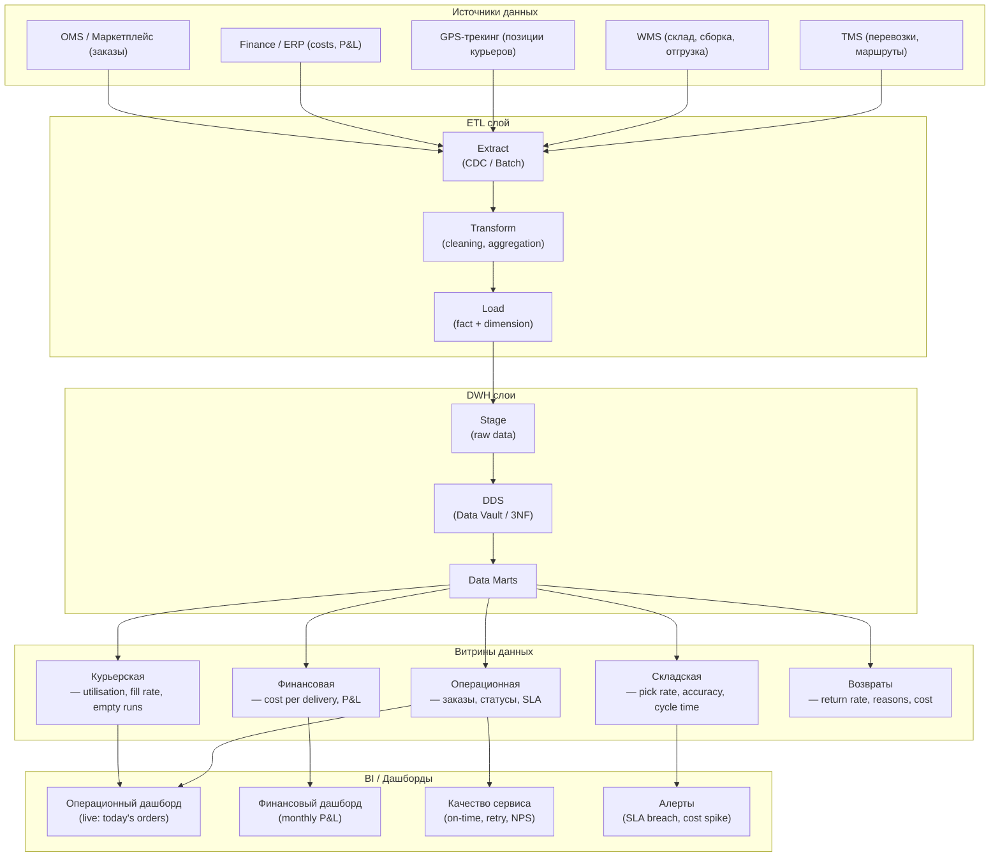
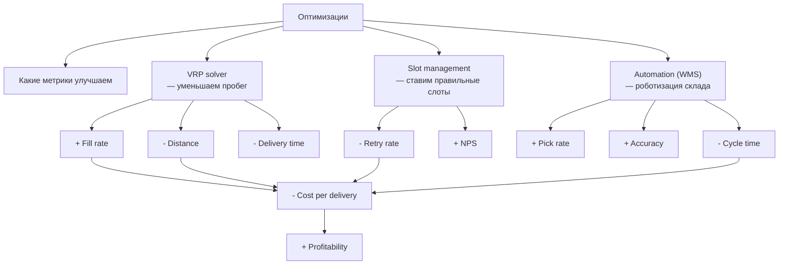

:::info[TL;DR]
Логистическая аналитика — система метрик для операционного контроля и стратегической оптимизации: скорость (on-time rate, avg delivery time), качество (retry rate, return rate, damage rate), стоимость (cost per delivery, last mile cost, cost per km), загрузка (fill rate, courier utilisation) и склад (pick rate, inventory accuracy). Аналитик проектирует DWH-модель (data marts по TMS, WMS, last mile), ETL-процессы и дашборды (операционный, финансовый, качество). BI-стеки: ClickHouse + Superset, Redash, Tableau.
:::

## Для кого эта статья

Senior SA, проектирующий аналитику. После прочтения вы:

- Поймёте метрики логистики: скорость, качество, стоимость, загрузка, склад
- Узнаете архитектуру DWH для логистики: data marts, ETL, схемы «звезда»
- Сможете проектировать дашборды для операционного и финансового контроля
- Поймёте: как метрики влияют на cost per delivery и что оптимизировать

## 1. Метрики логистики

### 1.1 Core метрики

| Группа | Метрика | Формула | Норма | Источник данных |
|--------|---------|---------|-------|-----------------|
| **Скорость** | On-time delivery rate | delivered_on_time / total | > 95% | TMS (слот vs факт) |
| **Скорость** | Avg delivery time | sum(times) / deliveries | < 4h (city) | TMS / GPS |
| **Скорость** | Pick-to-ship | shipped_time - pick_time | < 2h | WMS |
| **Качество** | Retry rate | failed_attempts / total | < 5% | TMS |
| **Качество** | Return rate | returned / delivered | < 10% | WMS + TMS |
| **Качество** | Damage rate | damaged / total | < 0.3% | WMS (return inspection) |
| **Стоимость** | Cost per delivery | total_opex / delivered | $1-5 (city) | TMS + Finance |
| **Стоимость** | Last mile cost | last_mile_opex / delivered | $0.50-3 | TMS + Finance |
| **Стоимость** | Cost per km | total_opex / total_km | $0.30-1.0 | TMS |
| **Загрузка** | Fill rate | actual_weight / capacity | > 80% | TMS |
| **Загрузка** | Courier utilisation | active_time / shift_time | > 70% | GPS (idle time) |
| **Загрузка** | Empty runs | empty_km / total_km | < 10% | GPS |
| **Склад** | Pick rate | picked_lines / hour | > 200 | WMS |
| **Склад** | Inventory accuracy | correct_count / total | > 99.9% | WMS (cycle count) |
| **Склад** | Order cycle time | receipt → shipped | < 4h | WMS |

### 1.2 Финансовые метрики

| Метрика | Описание | Пример расчёта |
|---------|----------|----------------|
| **COPD** (Cost Per Delivered) | Полная стоимость доставки | $3.50 за заказ |
| **Last mile as % of total** | Доля последней мили | 50% |
| **Labour cost per order** | Зарплата курьеров / заказы | $1.20 |
| **Fuel cost per km** | Топливо / пробег | $0.12/km |
| **Cost variance** | (факт - план) / план | < 10% |
| **Revenue per delivery** | Средняя выручка с доставки | $5.00 |
| **P&L by route** | Прибыль/убыток по маршруту | Маршрут Москва-Тула: +$200 |

## 2. Архитектура DWH для логистики



### 2.1 Модель «звезда» для витрины TMS

```
Fact table: delivery_fact
  — order_id (FK)
  — courier_id (FK) 
  — warehouse_id (FK)
  — planned_pickup_ts
  — actual_pickup_ts
  — planned_delivery_ts
  — actual_delivery_ts
  — planned_cost
  — actual_cost
  — distance_km
  — status
  — SLA_met (boolean)
  — created_at

Dimension tables:
  — dim_order (order_id, weight, volume, slot, address, region)
  — dim_courier (courier_id, name, vehicle_type, region)
  — dim_warehouse (warehouse_id, city, address)
  — dim_date (date_id, day, week, month, quarter, year)
```

**Пример SQL-аналитики:**

```sql
-- On-time rate by courier
SELECT 
  c.name,
  COUNT(*) as deliveries,
  SUM(CASE WHEN f.SLA_met THEN 1 ELSE 0 END) * 100 / COUNT(*) as on_time_rate,
  AVG(f.actual_cost) as avg_cost
FROM delivery_fact f
JOIN dim_courier c ON f.courier_id = c.courier_id
WHERE f.created_at >= '2025-01-01'
GROUP BY c.name
ORDER BY on_time_rate DESC;
```

## 3. Дашборды

### 3.1 Операционный дашборд (Live)

| Блок | Метрика | Источник | Refresh |
|------|---------|----------|---------|
| **Today's orders** | Создано / В работе / Доставлено / Просрочено | TMS | 1 min |
| **Courier status** | Online / On route / Idle / Offline | GPS | Real-time |
| **SLA breaches** | # заказов с опозданием > 15 мин | TMS | 1 min |
| **Fill rate** | Средняя загрузка курьеров | TMS | 1 hour |
| **Incoming orders** | Rate (orders/min) | OMS | Real-time |

### 3.2 Финансовый дашборд

| Блок | Метрика | Trend | Target |
|------|---------|-------|--------|
| **Cost per delivery** | $3.50 | ↓ | < $3.00 |
| **Last mile cost** | $1.75 | ↑ | < $1.50 |
| **Total monthly opex** | $150K | ↓ | < $140K |
| **Cost variance** | +8% | ↓ | < 5% |
| **Revenue vs Cost** | $200K / $150K | → | Margin 25% |

## 4. Метрики и их влияние на бизнес



**Пример:** Уменьшение retry rate с 10% до 5% при 100K заказов/день:

```
Without retry reduction:
- Cost per delivery: $3.50
- Retries: 10K/day ($35K extra cost)
- Monthly: $1.05M extra

With retry reduction (5%):
- Retries: 5K/day ($17.5K extra)  
- Monthly: $525K extra
- Savings: $525K/month = $6.3M/year
```

## 5. Практический кейс: DWH для логистической компании

**Проблема:** Логистическая компания (50K заказов/день). Данные в 5 системах (TMS, WMS, GPS, Finance, OMS). Отчёты в Excel, 3 дня на месячный отчёт.

**Решение:** ClickHouse + Apache Superset:

```
1. ETL (Airflow) собирает данные из 5 систем каждые 15 мин
2. Data Vault 2.0 — hub/ Satellite для TMS, WMS, GPS, Finance
3. Витрины: операционная (live SLA), финансовая (P&L по маршрутам), складская
4. Superset дашборды: CEO (финансы, стратегия), Operations (live), Finance (P&L)
5. Алерты: SLA breach → Telegram, cost spike → email CFO
```

**Роль аналитика:**
- Описал требования к витринам (поля, агрегации, refresh rate)
- Согласовал метрики и их определения (что считается on-time?)
- Спроектировал ETL-маппинг TMS → Витрина TMS
- Проверил данные: accuracy 99.9% (сверка с Excel-отчётами)

**Результат:**
- Отчёт: 3 дня → 5 минут (real-time)
- Алерты: 0 ручного мониторинга (auto SLA breach detection)
- Оптимизация: выявили маршрут с cost per delivery $8 (норма $3) → пересмотр тарифа
- ROI DWH: 8 месяцев

## Ссылки для самостоятельного изучения

| Ресурс | Описание | Ссылка |
|--------|----------|--------|
| Superset — BI | Apache Superset для дашбордов | https://superset.apache.org/ |
| ClickHouse Docs | Колоночная БД для аналитики | https://clickhouse.com/docs |
| Airflow — ETL | Apache Airflow для оркестрации | https://airflow.apache.org/ |
| dbt — Transform | Data Build Tool для трансформаций | https://docs.getdbt.com/ |
| Data Vault 2.0 | Моделирование DWH | https://www.data-vault.co.uk/ |
| Kimball — DWH Toolkit | Классика DWH-моделирования | https://www.kimballgroup.com/data-warehouse-business-intelligence-resources/ |
| Logistics KPIs Guide | Гайд по KPI логистики | https://www.logisticsbureau.com/kpi-library/ |
| TMS KPI Dashboard | Пример дашборда TMS | https://www.logiwa.com/blog/tms-kpis |

## Проверь себя

1. **Какие группы метрик в логистике?**
   *Ответ:* Скорость (on-time rate, avg delivery time), качество (retry rate, return rate, damage rate), стоимость (cost per delivery, last mile cost), загрузка (fill rate, utilisation, empty runs), склад (pick rate, inventory accuracy, cycle time).

2. **Как устроен DWH для логистики?**
   *Ответ:* Stage (сырые данные из 5+ систем) → DDS (Data Vault) → Data Marts (операционная, финансовая, складская, курьерская, возвраты) → BI (Superset/Tableau). ETL: Airflow + dbt. Хранилище: ClickHouse (аналитика) или PostgreSQL (операционные отчёты).

3. **Какие метрики влияют на cost per delivery?**
   *Ответ:* Fill rate (чем выше, тем меньше cost), Retry rate (каждый retry = 2× cost), Empty runs (пробег без груза), Courier utilisation (простой = cost без revenue). Оптимизация VRP solver, slot management, automation — напрямую снижают COPD.

4. **Как влияет retry rate на бизнес?**
   *Ответ:* При 100K заказов/день: retry 10% = 10K ретраев = $35K extra/day. Снижение до 5% = $525K savings/month. Помимо cost: NPS падает, клиенты уходят (churn). Главная причина: клиент не открыл дверь (40%).

5. **Что такое операционный дашборд и что на нём должно быть?**
   *Ответ:* Live-дашборд для ops-менеджера: Today's orders (создано/в работе/доставлено/просрочено), Courier status (online/on route/idle), SLA breaches (кол-во опозданий), Fill rate, Incoming orders rate. Refresh: real-time (1 min). Источники: TMS + GPS.
