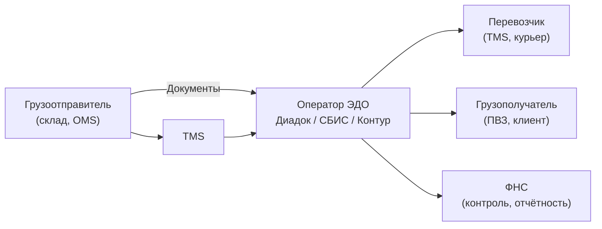
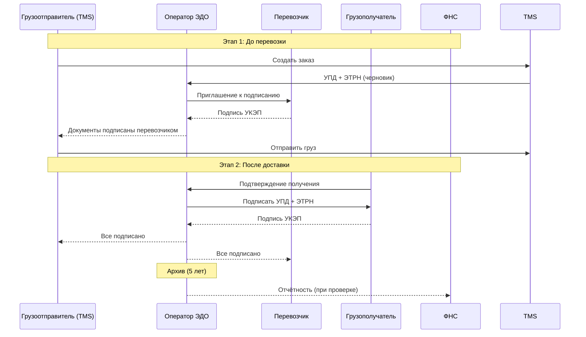

:::info[TL;DR]
ЭДО (электронный документооборот) в логистике — обмен УПД, актами, счетами-фактурами, транспортными накладными между участниками (грузоотправитель, перевозчик, грузополучатель). С 2021 года ЭТРН (электронная транспортная накладная) обязательна для грузоперевозок в РФ. Участники подписывают документы УКЭП (усиленная квалифицированная электронная подпись) через операторов ЭДО (Диадок, СБИС, Контур). Аналитик проектирует типы документов, статусную модель, интеграцию с операторами и TMS.
:::

## Для кого эта статья

Middle SA, работающий с документооборотом. После прочтения вы:

- Поймёте типы документов в логистическом ЭДО (УПД, ЭТРН, акты, счета)
- Узнаете процесс подписания: создание → отправка → подпись → закрытие
- Сможете проектировать интеграцию с операторами ЭДО
- Поймёте требования: УКЭП, ЭТРН с 2021, штрафы

## 1. Участники ЭДО в логистике



**Участники потока:**

| Участник | Роль | Документы (входящие/исходящие) |
|----------|------|-------------------------------|
| **Грузоотправитель** | Создаёт документы | Выставляет УПД, ЭТРН, счёт-фактуру |
| **Перевозчик** | Подписывает, передаёт дальше | Подписывает ЭТРН, акты, выставляет счёт |
| **Грузополучатель** | Подтверждает получение | Подписывает УПД, ЭТРН |
| **Оператор ЭДО** | Пересылает, хранит, контролирует | Маршрутизация, архив, ФНС |
| **ФНС** | Контролирует легальность | Отчётность, камеральные проверки |

## 2. Типы документов

| Документ | Описание | Обязательность | Участники подписи |
|----------|----------|----------------|-------------------|
| **УПД** | Универсальный передаточный документ (счёт + акт + накладная) | Стандарт | Отправитель → Получатель |
| **Счёт-фактура** | Для вычета НДС | Обязательно (НДС) | Только отправитель |
| **Акт** | Акт выполненных работ (услуги перевозки) | По договору | Перевозчик → Заказчик |
| **ТН / ТТН** | Товарная накладная (ТОРГ-12) | Стандарт | Отправитель → Получатель |
| **ЭТРН** | Электронная транспортная накладная | Обязательно с 2021 | Отправитель → Перевозчик → Получатель |
| **Поручение** | Поручение экспедитору | Внутренний | Отправитель → Экспедитор |
| **Договор** | Договор перевозки | По требованию | Одна подпись |

### 2.1 ЭТРН — электронная транспортная накладная

**Что это:** Электронный аналог бумажной ТТН (товарно-транспортной накладной). Обязательна с 2021 года для грузоперевозок в РФ.

```
Формат: XML (ФНС утвердила формат)
Участники: Грузоотправитель → Перевозчик → Грузополучатель
Подпись: УКЭП каждого участника
Срок: до начала перевозки (план) + после доставки (факт)
Хранение: 5 лет
Штраф: до 50К ₽ за отсутствие
```

**Поля ЭТРН:**

| Раздел | Данные | Заполняет |
|--------|--------|-----------|
| **Грузоотправитель** | Название, ИНН, адрес | Отправитель |
| **Грузополучатель** | Название, ИНН, адрес | Отправитель |
| **Перевозчик** | Название, ИНН, лицензия | Отправитель |
| **Груз** | Наименование, вес, объём, кол-во мест | Отправитель |
| **Маршрут** | Пункт погрузки → пункт разгрузки | Отправитель |
| **Транспорт** | Госномер, тип, прицеп | Перевозчик |
| **Подписи** | УКЭП всех сторон | Все |

## 3. Процесс ЭДО: полный цикл



### Статусная модель документа

| Статус | Описание | Действие |
|--------|----------|----------|
| **Черновик** | Создан, не отправлен | Редактирование |
| **Отправлен** | Доставлен получателю | Ожидание подписи |
| **На подписи** | У получателя | Ожидание УКЭП |
| **Подписан получателем** | Получатель подписал | Ожидание подписи отправителя |
| **Подписан всеми** | Полный комплект | Архив |
| **Отказ** | Получатель отказался | Разбор причин |
| **Аннулирован** | Отменён | Только до первой подписи |

## 4. Операторы ЭДО

| Оператор | Доля рынка РФ | Особенность | API |
|----------|--------------|-------------|-----|
| **Диадок (СКБ Контур)** | 40% | Лидер рынка, мощное API | REST + WebSocket |
| **СБИС (Тензор)** | 30% | Интеграция с 1С, широкий функционал | REST + SOAP |
| **Калуга Астрал** | 10% | Госсектор, бюджетники | REST |
| **ЭДО Лайт (Такском)** | 5% | Малый бизнес | REST |

**Выбор оператора:**

| Критерий | Диадок | СБИС | Калуга Астрал |
|----------|--------|------|---------------|
| **API качество** | ⭐⭐⭐⭐⭐ | ⭐⭐⭐⭐ | ⭐⭐⭐ |
| **Интеграция с 1С** | ⭐⭐⭐⭐ | ⭐⭐⭐⭐⭐ | ⭐⭐⭐ |
| **Цена (за документ)** | ~5-10 ₽ | ~5-15 ₽ | ~3-7 ₽ |
| **Маршрутизация сложная** | ✅ | ✅ | ❌ |
| **Транспортные документы (ЭТРН)** | ✅ | ✅ | ✅ |
| **REST API** | ✅ | ✅ | ✅ |

## 5. Интеграция TMS ↔ Оператор ЭДО

```json
// Пример: отправка УПД через API Диадока
POST /v1/documents/upload
{
  "type": "upd",
  "sender": {
    "inn": "7701234567",
    "kpp": "770101001",
    "name": "ООО Логистика"
  },
  "receiver": {
    "inn": "7712345678",
    "kpp": "771201001",
    "name": "ООО Получатель"
  },
  "items": [
    {
      "name": "Услуги перевозки Москва-Казань",
      "price": 15000.00,
      "quantity": 1,
      "vat": 20
    }
  ],
  "signature": "base64_encoded_signed_xml"
}
```

**Типовой поток интеграции:**

```
1. TMS → Оператор: POST /documents/create (черновик документа)
2. Оператор → TMS: Callback (документ создан, id = 123)
3. TMS → Оператор: POST /documents/{id}/sign (подписать)
4. Оператор → Контрагент: Доставка документа
5. Оператор → TMS: Callback / Webhook (документ подписан / отказ)
6. TMS → Оператор: GET /documents/{id}/status — проверка статуса
```

## 6. Практический кейс: Автоматизация ЭДО для перевозчика

**Проблема:** Перевозчик (5000 рейсов/месяц). Каждый рейс — 5 документов (УПД, акт, счёт, ЭТРН, ТТН). Бухгалтерия обрабатывает вручную: 20 человеко-дней/месяц.

**Решение:** Автоматизация ЭДО через интеграцию TMS + Диадок:

```
1. TMS создаёт документы автоматически при закрытии рейса
2. TMS → Диадок API: загрузить УПД + ЭТРН (XSD-схема ФНС)
3. Диадок → Контрагенты: подписание
4. TMS ← Диадок Webhook: статус (подписан/отказ)
5. Если отказ: TMS → бухгалтер (ручная обработка исключения)
6. Подписанные документы → архив TMS (10 лет)
```

**Роль аналитика:**
- Описал статусную модель документа (8 статусов, переходы)
- Специфицировал mapping TMS → XML ФНС (ЭТРН, УПД)
- Согласовал с бухгалтерией: какие поля обязательны, какие optional
- Спроектировал обработку исключений (отказ подписи, ошибка формата)

**Результат:**
- Время обработки: 20 дней → 2 часа (автоматизация 99%)
- Ошибки: 5% → 0.3%
- Штрафы ФНС за отсутствие ЭТРН: 0 (было 2 штрафа/мес)
- ROI: 6 месяцев

## Ссылки для самостоятельного изучения

| Ресурс | Описание | Ссылка |
|--------|----------|--------|
| Диадок API | REST API оператора ЭДО | https://www.diadoc.ru/api |
| СБИС API | REST API СБИС | https://sbis.ru/help/api |
| ФНС — Формат ЭТРН | XSD-схема для ЭТРН | https://www.nalog.gov.ru/ |
| 1С:ЭДО | Модуль ЭДО для 1С | https://v8.1c.ru/edo/ |
| Контур.ЭДО | Оператор ЭДО от СКБ Контур | https://kontur.ru/edo |
| ФЗ-63 «Об электронной подписи» | Закон об УКЭП | http://pravo.gov.ru/proxy/ips/?docbody=&nd=102130750 |
| 402-ФЗ «О бухгалтерском учёте» | Первичные документы | http://pravo.gov.ru/proxy/ips/ |

## Проверь себя

1. **Какие документы передаются через ЭДО в логистике?**
   *Ответ:* УПД (универсальный передаточный), счёт-фактура, акт выполненных работ, ТН/ТТН (товарная накладная), ЭТРН (электронная транспортная накладная — обязательна с 2021). Каждый документ подписывается УКЭП.

2. **Что такое ЭТРН?**
   *Ответ:* Электронная транспортная накладная — обязательный с 2021 года документ для грузоперевозок в РФ. Заменяет бумажную ТТН. Участники: грузоотправитель → перевозчик → грузополучатель. Подписывается УКЭП. Штраф до 50К ₽ за отсутствие.

3. **Как устроен процесс подписания документов?**
   *Ответ:* Создание (черновик) → отправка через оператора ЭДО → получатель подписывает УКЭП → отправитель подтверждает → архив (5 лет). В логистике — двухэтапно: до перевозки (ЭТРН план) и после (ЭТРН факт + УПД).

4. **Какие операторы ЭДО работают в РФ?**
   *Ответ:* Диадок (40%, лидер, мощное API), СБИС (30%, сильная 1С-интеграция), Калуга Астрал (10%, госсектор), Такском (5%, малый бизнес). Основные критерии выбора: API, цена за документ (3-15 ₽), поддержка ЭТРН.

5. **Что будет, если перевозчик не выставит ЭТРН?**
   *Ответ:* Штраф до 50К ₽ (ст. 15.1 КоАП). Невозможность списания расходов на перевозку (налоговая не примет). Риск претензий от клиента (нет подтверждения доставки). Поэтому TMS обязана создавать ЭТРН автоматически при каждом рейсе.
