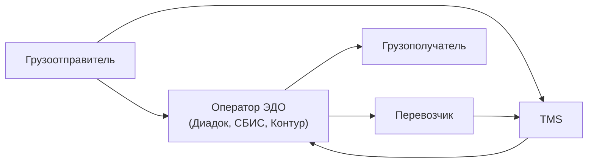
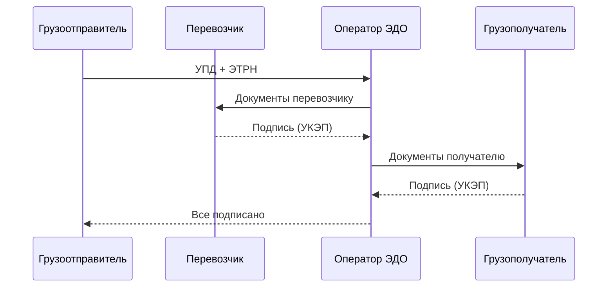

:::info[TL;DR]
ЭДО (электронный документооборот) в логистике — обмен УПД, актами, счетами-фактурами, транспортными накладными между участниками (грузоотправитель, перевозчик, грузополучатель). С 2021 года обязателен для ряда перевозок (ЭТРН — электронная транспортная накладная). Аналитик проектирует типы документов, статусную модель, интеграцию с операторами ЭДО.
:::

## Участники ЭДО в логистике

## Типы документов

| Документ | Описание | Обязательность |
|----------|----------|----------------|
| **УПД** | Универсальный передаточный документ | Стандарт |
| **Акт** | Акт выполненных работ | По договору |
| **Счёт-фактура** | Для НДС | Стандарт |
| **ТН / ТТН** | Товарная накладная (ТОРГ-12) | Стандарт |
| **ЭТРН** | Электронная транспортная накладная | Обязательно с 2021 |
| **Поручение** | Поручение экспедитору | Внутренний |

## Процесс ЭДО: полный цикл

## Что дальше

- [Интеграции с маркетплейсами и курьерами](/docs/specialization/logistics-integrations)

## Проверь себя

1. **Какие документы передаются через ЭДО в логистике?**
   *Ответ:* УПД, счета-фактуры, ТН/ТТН, ЭТРН, акты.

2. **Что такое ЭТРН?**
   *Ответ:* Электронная транспортная накладная — обязательный документ для перевозок с 2021 года.
