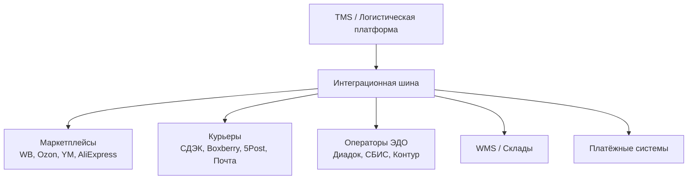

:::info[TL;DR]
Логистическая система интегрируется с десятками внешних сервисов: маркетплейсами (Wildberries, Ozon, Яндекс.Маркет), курьерскими службами (СДЭК, Boxberry, 5Post, Почта России) и операторами ЭДО. Каждый интегратор — свой API, свой формат данных, свои SLA. Аналитик проектирует универсальную шину интеграций и адаптеры под каждого партнёра.
:::

## Типовые интеграции

## Что передаётся

| Интеграция | Данные | Протокол |
|------------|--------|----------|
| **Маркетплейс → TMS** | Заказы, статусы, трекинг | REST API (JSON) |
| **TMS → Курьер** | Заказ на доставку, трек-номер | REST / SOAP |
| **Курьер → TMS** | Статусы, ПВЗ, стоимость | REST / Webhook |
| **TMS → WMS** | Заказ на сборку | REST / MQ |
| **TMS → ЭДО** | УПД, счета, акты | REST / API оператора |

## Особенности курьерских интеграций

| Курьерская служба | API | Формат | Примечание |
|-------------------|-----|--------|-----------|
| **СДЭК** | REST API v2 | JSON | Трекинг, ПВЗ, расчёт |
| **Boxberry** | REST API | JSON/XML | Кассеты, ПВЗ |
| **5Post** | REST | JSON | Магазины Пятёрочка |
| **Почта России** | REST / SOAP | JSON/XML | 1 класс, EMS, посылки |
| **Яндекс.Доставка** | REST | JSON | Маршрутизация, трекинг |

## Что дальше

- [Аналитика в логистике](/docs/specialization/logistics-analytics)

## Проверь себя

1. **С кем интегрируется логистическая платформа?**
   *Ответ:* Маркетплейсы, курьерские службы, WMS, ЭДО, платёжные системы.

2. **Какие API используют курьерские службы?**
   *Ответ:* REST API, JSON, иногда SOAP (Почта России), webhook для статусов.
