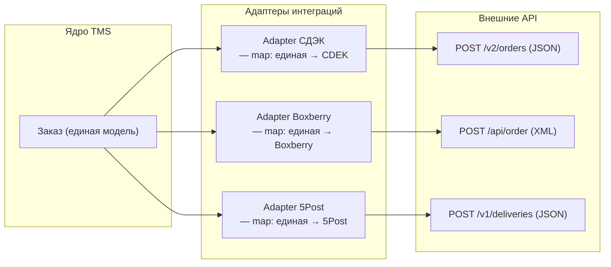
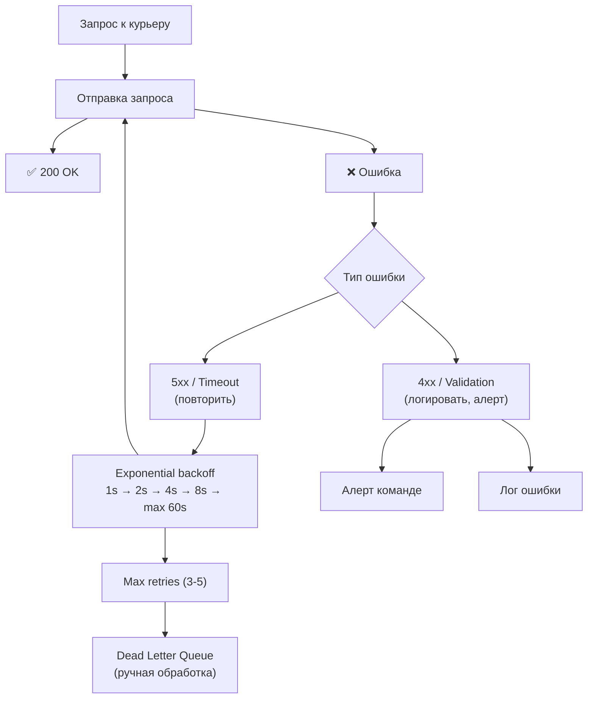

:::info[TL;DR]
Логистическая платформа интегрируется с десятками внешних сервисов: маркетплейсами (Wildberries, Ozon, Яндекс.Маркет), курьерскими службами (СДЭК, Boxberry, 5Post, Почта России), операторами ЭДО (Диадок, СБИС). Каждый интегратор — свой API, свой формат данных (REST/JSON, SOAP/XML), свои SLA. Аналитик проектирует интеграционную шину (ESB) и адаптеры под каждого партнёра. Сложность: асинхронность (Webhook + Polling), обработка ошибок, ретраи, идемпотентность.
:::

## Для кого эта статья

Middle SA, проектирующий интеграции. После прочтения вы:

- Поймёте типы интеграций: маркетплейсы, курьерские, ЭДО, WMS, платёжные
- Узнаете паттерны: REST API, Webhook, Polling, Async (MQ), EDI
- Сможете проектировать интеграционные адаптеры и обработку ошибок
- Поймёте метрики интеграций: latency, error rate, retry rate, SLA

## 1. Архитектура интеграций

```mermaid
flowchart TD
    LOG["Логистическая платформа (TMS + WMS)"]
    
    subgraph Marketplace["Маркетплейсы"]
        WB["Wildberries API"]
        OZON["Ozon API"]
        YM["Яндекс.Маркет API"]
    end
    
    subgraph Couriers["Курьерские службы"]
        CDEK["СДЭК API"]
        BOX["Boxberry API"]
        FIVEP["5Post API"]
        RUSPOST["Почта России API"]
        YDEL["Яндекс.Доставка API"]
        DPD["DPD API"]
    end
    
    subgraph EDO["ЭДО"]
        DIADOK["Диадок"]
        SBIS["СБИС"]
    end
    
    subgraph Internal["Внутренние"]
        WMS_EXT["WMS"]
        ERP["ERP / 1С"]
        PAY["Платёжные системы"]
    end
    
    LOG --> WB
    LOG --> OZON
    LOG --> YM
    LOG --> CDEK
    LOG --> BOX
    LOG --> FIVEP
    LOG --> RUSPOST
    LOG --> YDEL
    LOG --> DIADOK
    LOG --> SBIS
    LOG --> WMS_EXT
    LOG --> ERP
    LOG --> PAY
```



### 1.1 Типовой API маркетплейса

| Эндпоинт | Метод | Описание | Частота вызова |
|----------|-------|----------|---------------|
| `POST /orders/create` | Создать заказ | Маркетплейс передаёт заказ в TMS | 100K/день |
| `POST /orders/status` | Обновить статус | TMS → Маркетплейс: статус доставки | 1M/день |
| `GET /orders/{id}/track` | Получить трекинг | Маркетплейс запрашивает GPS-трекинг | 500K/день |
| `POST /returns/create` | Создать возврат | Клиент вернул → TMS создаёт реверс | 10K/день |
| `GET /fbo/stocks` | Остатки FBO | WMS → Маркетплейс: остатки на складе | 100/час |

## 2. Интеграция с маркетплейсами

### 2.1 Wildberries API

| Параметр | Значение |
|----------|----------|
| **API протокол** | REST (JSON) |
| **Авторизация** | API Key (Authorization header) |
| **Rate limit** | 100 req/min (ключ), 1000 req/min (токен) |
| **Асинхронность** | Polling (GET /api/v2/orders — новые заказы) |
| **Webhook** | Есть (статусы, возвраты) |
| **Система** | Stateless (нужно polling для новых заказов) |

**Специфика WB:** WB не отправляет заказы в TMS активно. TMS должен polling'ить новые заказы каждые 1-5 минут.

```
GET /api/v2/orders?date_from=2025-01-01T10:00:00&skip=0&take=100
Response: [{id, article, sku, price, address, ...}] 
```

### 2.2 Ozon API

| Параметр | Значение |
|----------|----------|
| **API протокол** | GraphQL + REST |
| **Авторизация** | Client-Id + API-Key |
| **Rate limit** | 10 req/sec |
| **Асинхронность** | Webhook (статусы) + REST (основной) |
| **Система** | Event-driven |

**Специфика Ozon:** GraphQL API (POST /api/v2/query). Можно запрашивать только нужные поля.

```graphql
query {
  orders(filter: {status: "pending", date_from: "2025-01-01"}) {
    id
    order_number
    items { sku name price quantity }
    delivery { address slot_from slot_to }
  }
}
```

## 3. Интеграция с курьерскими службами

| Курьерская служба | API | Формат | Аутентификация | Rate Limit | Примечание |
|-------------------|-----|--------|----------------|-----------|------------|
| **СДЭК** | REST v2 | JSON | Token (Bearer) | 50 req/sec | Трекинг, ПВЗ, расчёт, заказ, этикетки |
| **Boxberry** | REST | JSON/XML | Token | 30 req/sec | Кассеты, ПВЗ, расчёт, создание заказа |
| **5Post** | REST | JSON | Token | 100 req/min | Доставка в Пятёрочку |
| **Почта России** | REST + SOAP | JSON/XML | Token (OAuth 2.0) | 20 req/sec | 1 класс, EMS, посылки, отслеживание |
| **Яндекс.Доставка** | REST | JSON | OAuth 2.0 | 100 req/sec | Маршрутизация, трекинг, ETA |
| **DPD** | SOAP | XML | Login/Password | 10 req/sec | Расчёт, заказ, накладная |

### 3.1 Адаптер интеграции — паттерн



**Принцип адаптера:** TMS оперирует единой моделью заказа → каждый адаптер преобразует в формат курьера. Новый курьер = новый адаптер, без изменения ядра.

```typescript
interface CourierAdapter {
  createOrder(order: UnifiedOrder): Promise<CourierResponse>;
  getStatus(trackNumber: string): Promise<DeliveryStatus>;
  cancelOrder(orderId: string): Promise<void>;
  getPrice(order: UnifiedOrder): Promise<Price>;
}
```

## 4. Обработка ошибок и ретраи



**Ретраи:**

```
HTTP 5xx / Timeout → exponential backoff (3 retries, max 60s)
HTTP 429 (Rate limit) → retry after Retry-After header
HTTP 400 (Bad Request) → не retry, логировать
HTTP 401/403 (Auth) → не retry, алерт
HTTP 404 → не retry, исключение
Network timeout → retry (3 раза)
```

**Идемпотентность:** Каждый запрос к курьеру должен быть идемпотентным. Используем `idempotency_key` (UUID заказа):

```
POST /v2/orders
Idempotency-Key: order-12345
```

Если запрос упал (timeout) — повторяем с тем же ключом. Курьер видит дубликат и возвращает существующий результат.

## 5. Метрики интеграций

| Метрика | Описание | Хорошо | Плохо |
|---------|----------|--------|-------|
| **API latency (P50)** | Время ответа API | < 200ms | > 1s |
| **API latency (P99)** | Время ответа для 99% запросов | < 1s | > 5s |
| **Error rate** | % ошибок | < 0.5% | > 2% |
| **Retry rate** | % запросов с ретраем | < 5% | > 15% |
| **Dead letter queue** | % необработанных | < 0.1% | > 1% |
| **Webhook delivery** | % успешных webhook | > 99% | < 95% |
| **SLA compliance** | % запросов в SLA | > 99.9% | < 99% |

## 6. Практический кейс: Интеграционная шина для Ozon + 5 курьеров

**Проблема:** Маркетплейс Ozon подключает 5 курьерских служб. Каждая — свой API, свой формат. Ручная обработка заказов (оператор выбирает курьера). Время: 5 мин/заказ, ошибки: 8%.

**Решение:** Интеграционная шина (ESB) + адаптеры:

```
1. Единая модель: TMS → UnifiedOrder {id, address, weight, volume, slot}
2. Маршрутизация: Rule engine → курьер
   — Если вес < 5 кг и адрес в Москве → СДЭК
   — Если вес 5-20 кг → Boxberry
   — Если регион → Почта России
   — Если экспресс (слот 1-2 часа) → Яндекс.Доставка
3. Адаптеры: каждый курьер — свой класс с map единая → их формат
4. Ретраи: exponential backoff + DLQ
5. Webhook: статусы от курьеров → TMS → Ozon
```

**Роль аналитика:**
- Специфицировал единую модель заказа (20 полей)
- Описал rule engine для выбора курьера (10 правил)
- Спроектировал адаптеры для 5 курьеров
- Согласовал SLA: API < 500ms, retry 3 раза, DLQ если > 3 retry

**Результат:**
- Manual work: 0 (выбор курьера автоматический)
- Error rate: 8% → 0.5%
- Time per order: 5 мин → 2 сек
- New courier onboarding: 3 месяца → 2 недели (новый адаптер)

## Ссылки для самостоятельного изучения

| Ресурс | Описание | Ссылка |
|--------|----------|--------|
| Wildberries API | API для работы с WB | https://openapi.wildberries.ru/ |
| Ozon Seller API | GraphQL API Ozon | https://api.ozon.ru/ |
| Яндекс.Маркет API | API Яндекс.Маркета | https://yandex.ru/dev/market/ |
| СДЭК API v2 | REST API | https://api.cdek.ru/v2/swagger/ |
| Boxberry API | REST API Boxberry | https://boxberry.ru/business/dlya-integratorov |
| 5Post API | API доставки | https://5post.ru/integration/ |
| Яндекс.Доставка API | API доставки | https://yandex.ru/dev/delivery/ |
| Почта России API | API отслеживания | https://tracking.pochta.ru/ |
| DPD API | SOAP/REST API | https://www.dpd.ru/ |

## Проверь себя

1. **С кем интегрируется логистическая платформа?**
   *Ответ:* Маркетплейсы (WB, Ozon, YM), курьерские службы (СДЭК, Boxberry, 5Post, Почта, Яндекс.Доставка), ЭДО (Диадок, СБИС), WMS, ERP, платёжные системы. Каждый — свой API, формат, SLA.

2. **Чем отличается API Wildberries от Ozon?**
   *Ответ:* WB — REST (JSON), polling-based (TMS сам проверяет новые заказы), stateless. Ozon — GraphQL + REST, event-driven (Webhook для статусов). WB rate limit ниже (100 req/min vs Ozon 10 req/sec).

3. **Как работает паттерн адаптера для курьеров?**
   *Ответ:* TMS оперирует единой моделью (UnifiedOrder). Каждый курьер — свой адаптер, который маппит единую модель → формат курьера. Новый курьер = новый адаптер, ядро TMS не меняется. Интерфейс: createOrder, getStatus, cancelOrder, getPrice.

4. **Как обрабатывать ошибки интеграций?**
   *Ответ:* HTTP 5xx / timeout → exponential backoff (1s → 2s → 4s → max 60s, 3 попытки). HTTP 4xx → не retry, алерт. Идемпотентность через Idempotency-Key. Dead Letter Queue для необработанных. Мониторинг: error rate, retry rate, latency.

5. **Какие метрики важны для интеграционной шины?**
   *Ответ:* API latency (P50 < 200ms, P99 < 1s), Error rate (< 0.5%), Retry rate (< 5%), Dead letter queue (< 0.1%), Webhook delivery (> 99%), SLA compliance (> 99.9%).
