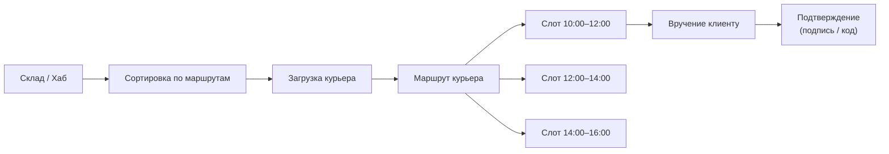
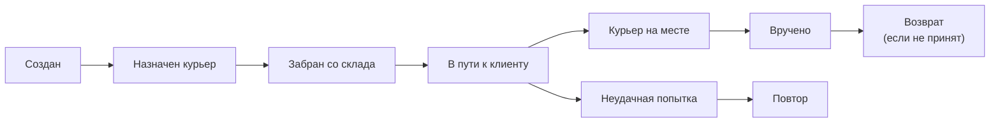

:::info[TL;DR]
Последняя миля — финальный этап доставки от склада/хаба до клиента. Ключевые аспекты: временные окна (слоты), трекинг в реальном времени, связь с курьером, подтверждение получения, возвраты. Аналитик проектирует статусную модель, интеграцию с курьерскими API и real-time уведомления.
:::

## Процесс последней мили

## Статусная модель доставки

## Трекинг для клиента

| Событие | Канал | Тайминг |
|---------|-------|---------|
| Заказ передан в доставку | Push / SMS | Сразу |
| Курьер назначен | Push / SMS | За 1 час |
| Курьер выехал | Push / Map | За 30 мин |
| Курьер на месте | Push | Сейчас |
| Доставлено | Push / Email | Сразу |
| Чат с курьером | In-app | По запросу |

## Что дальше

- [Аналитика в логистике](/docs/specialization/logistics-analytics)

## Проверь себя

1. **Что такое последняя миля?**
   *Ответ:* Финальный этап доставки от склада до клиента (слот → маршрут → вручение).

2. **Какие события трекинга получает клиент?**
   *Ответ:* Создан → назначен курьер → выехал → на месте → вручено (через Push/SMS).
