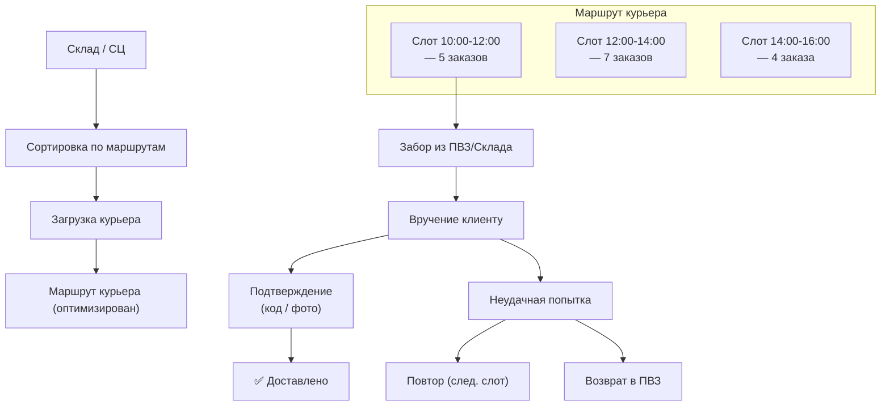
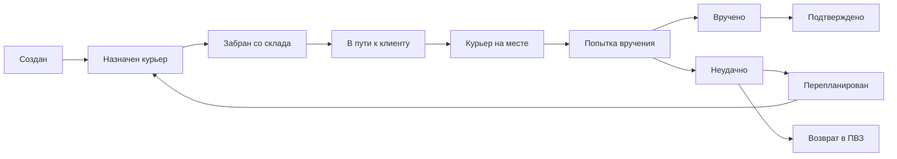
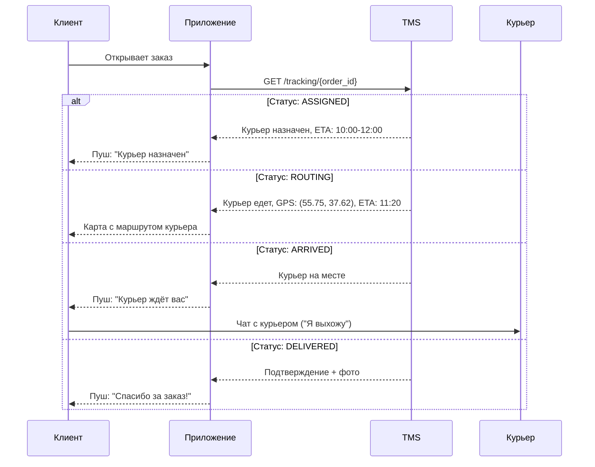

:::info[TL;DR]
Последняя миля — финальный этап доставки от склада/хаба/ПВЗ до клиента. Самый дорогой (40-60% стоимости логистики) и клиентоориентированный этап. Ключевые аспекты: временные окна (слоты 2-4 часа), трекинг в реальном времени (GPS), связь с курьером (чат/звонок), подтверждение получения (код/подпись/фото), возвраты (реверс). Аналитик проектирует статусную модель доставки, модель слотов (capacity planning), интеграцию с курьерскими API и real-time уведомления (Push/SMS/Email). Примеры: Яндекс.Доставка (100K+ заказов/день), СДЭК, Boxberry, 5Post.
:::

## Для кого эта статья

Middle SA, проектирующий доставку. После прочтения вы:

- Поймёте процесс последней мили: слот → маршрут → вручение → возврат
- Узнаете модель слотов (capacity, overbooking, surge pricing) и их оптимизацию
- Сможете проектировать трекинг и уведомления для клиента
- Поймёте метрики последней мили: on-time rate, retry rate, cost per delivery

## 1. Архитектура последней мили



### 1.1 Модель слотов

Слоты — временные окна доставки, которые клиент выбирает при оформлении заказа.

| Параметр | Standard | Express | Exact time |
|----------|----------|---------|------------|
| **Ширина слота** | 4 часа (10-14, 14-18, 18-22) | 2 часа | 1 час |
| **Cost for client** | Free | $1-3 | $5-10 |
| **Planning horizon** | За 1 день | За 3 часа | За 1 час |
| **On-time SLA** | ±30 мин | ±15 мин | ±5 мин |

**Capacity planning слотов:**

```
Problem: сколько курьеров нужно в каждом слоте?

Formula:
Slots_needed = expected_orders × avg_service_time / slot_duration
Service_time = drive_to_client + wait + handover + return_to_route

Пример:
- Слот 10:00-14:00 = 4h = 240 min
- Ожидаемые заказы: 120
- Avg service time: 15 min (5 min drive + 5 min wait + 2 min handover + 3 min buffer)
- Курьер за слот: 240 / 15 = 16 заказов
- Курьеров нужно: 120 / 16 = 7.5 ≈ 8 курьеров

Overbooking: продаём +10% слотов (знаем ~5% отмена + ~5% неудачная попытка)
Surge pricing: если capacity < demand → повышаем цену доставки
```

## 2. Статусная модель доставки



### Типы неудачных попыток

| Причина | % случаев | Действие |
|---------|-----------|----------|
| **Клиент не открыл** | 40% | Повтор через 1 час, звонок |
| **Неверный адрес** | 15% | Уточнение у клиента |
| **Клиент отменил** | 15% | Возврат на склад |
| **Курьер не нашёл** | 10% | GPS-координаты, фото подъезда |
| **Отказ от получения** | 10% | Возврат на склад |
| **Просрочка слота** | 10% | Перенос на следующий слот |

## 3. Трекинг для клиента



### Каналы уведомлений

| Событие | Push | SMS | Email | In-app | Время |
|---------|------|-----|-------|--------|-------|
| Заказ передан в доставку | ✅ | ✅ | — | ✅ | За 2 часа до слота |
| Курьер назначен | ✅ | ✅ | — | ✅ | За 1 час |
| Курьер выехал | ✅ | — | — | ✅ (map) | За 30 мин |
| Курьер на месте | ✅ | — | — | ✅ | Сейчас |
| Доставлено | ✅ | ✅ | ✅ | ✅ | Сразу |
| Неудачная попытка | ✅ | ✅ | — | ✅ | Сразу |
| Возврат | ✅ | — | — | ✅ | При возврате |

## 4. ПВЗ (Пункты выдачи заказов)

| Параметр | WB | Ozon | СДЭК | 5Post |
|----------|----|------|------|-------|
| **Количество ПВЗ** | 10K+ | 10K+ | 2.5K | 20K+ (в Пятёрочке) |
| **Срок хранения** | 7 дней | 7 дней | 5 дней | 7 дней |
| **Примерка** | ✅ Одежда | ❌ | ❌ | ❌ |
| **Оплата картой** | ✅ | ✅ | ✅ | ✅ |
| **Возврат через ПВЗ** | ✅ | ✅ | ✅ | ✅ |
| **Комиссия ПВЗ** | 3-5% | 3-6% | — | — |

## 5. Метрики последней мили

| Метрика | Формула | Хорошо | Плохо |
|---------|---------|--------|-------|
| **On-time delivery rate** | delivered_in_slot / total | > 95% | < 85% |
| **Retry rate** | failed_attempts / total | < 5% | > 15% |
| **First-attempt success** | delivered_first_try / total | > 90% | < 80% |
| **Cost per delivery** | total_cost / delivered | $1-3 (city) | > $10 |
| **Delivery time** | от склада до клиента | < 4 hours | > 24 hours |
| **Courier utilisation** | active_delivery_time / total_shift | > 70% | < 50% |
| **Customer satisfaction** | NPS / rating | > 80 | < 60 |
| **Return rate** | returned / delivered | < 10% | > 25% |

## 6. Практический кейс: Яндекс.Доставка — real-time маршрутизация

**Проблема:** Яндекс.Маркет (100K+ заказов/день) — клиенты хотят узкие слоты (2 часа), курьеры простаивают, retry rate 12%.

**Решение:** Внедрение динамической маршрутизации:

```
1. Slot capacity planning: ML прогноз заказов на завтра → число курьеров
2. Оптимизация маршрута: VRP + real-time пробки (Яндекс.Пробки)
3. Real-time ребалансировка: новый заказ → перестроить маршрут ближайшего курьера
4. ETA: точное время прибытия (ML модель на исторических данных)
5. Чат с курьером: клиент видит, где курьер, может написать
6. Surge pricing: если слот 10:00-12:00 переполнен → повышаем цену
```

**Роль аналитика:**
- Специфицировал модель слотов (capacity, overbooking, pricing)
- Описал статусную модель доставки (10+ статусов и переходов)
- Согласовал SLA: ±15 мин для Express, ±30 мин для Standard
- Спроектировал уведомления (Push/SMS по каждому статусу)

**Результат:**
- On-time rate: 85% → 97%
- Retry rate: 12% → 4%
- Courier utilisation: 50% → 72%
- NPS доставки: 65 → 85
- Surge pricing: +15% revenue при peak load

## Ссылки для самостоятельного изучения

| Ресурс | Описание | Ссылка |
|--------|----------|--------|
| Яндекс.Доставка API | API для заказа доставки | https://yandex.ru/dev/delivery/ |
| СДЭК API v2 | REST API СДЭК | https://api.cdek.ru/v2/swagger/ |
| Boxberry API | Документация Boxberry | https://boxberry.ru/business/dlya-integratorov |
| 5Post API | API доставки 5Post | https://5post.ru/integration/ |
| Почта России API | API отслеживания | https://tracking.pochta.ru/ |
| Google OR-Tools VRP | Vehicle Routing Problem solver | https://developers.google.com/optimization/routing |
| Last Mile Delivery Guide | Гайд по последней миле | https://www.logisticsbureau.com/last-mile-delivery/ |
| TFM (Time Slot Management) | Управление временными слотами | https://www.tfm.com/ |

## Проверь себя

1. **Что такое последняя миля?**
   *Ответ:* Финальный этап доставки от склада/хаба/ПВЗ до клиента. 40-60% стоимости логистики. Включает: слот (временное окно), маршрут курьера, вручение, подтверждение (код/фото), возвраты.

2. **Какие каналы уведомлений используются?**
   *Ответ:* Push (мгновенно), SMS (гарантированно), Email (подтверждение), In-app (карта с курьером). Ключевые точки: курср назначен → выехал → на месте → вручено → возврат.

3. **Как рассчитывается capacity слотов?**
   *Ответ:* Slots = expected_orders × avg_service_time / slot_duration. Курьерский service_time = drive + wait + handover + buffer. Overbooking +10% (отмена + retry). Surge pricing при превышении capacity.

4. **Почему retry rate — важнейшая метрика?**
   *Ответ:* Каждая неудачная попытка = повторный выезд (x2 cost). Retry rate 10% = +10% к cost per delivery. Клиент получает негативный опыт (NPS падает). Норма: < 5%. Основная причина: клиент не открыл дверь (40%).

5. **Как real-time ребалансировка улучшает доставку?**
   *Ответ:* Новый заказ → не создавать новый маршрут, а добавить к ближайшему курьеру. ML предсказывает ETA на основе пробок, расстояния, истории. Результат: on-time rate +12%, retry rate -8%, utilisation +22% (кейс Яндекс.Доставки).
