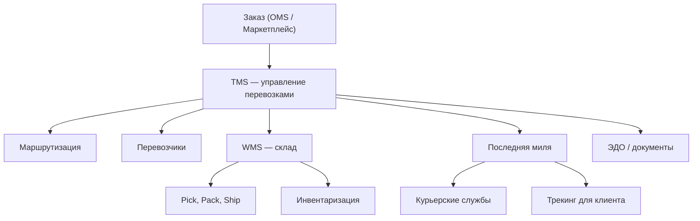

:::info[TL;DR]
Логистический аналитик работает с системами управления перевозками (TMS), складами (WMS), доставкой последней мили, маршрутизацией и ЭДО. Специфика: разнообразие участников (перевозчики, склады, маркетплейсы, курьеры), жёсткие SLA, real-time трекинг, сложные тарифы и огромные объёмы данных (миллионы заказов/день).
:::

## Основные системы логистики

## Карьерный путь

| Этап | Роль | Ключевые навыки |
|------|------|----------------|
| 1 | Junior SA | WMS, документация |
| 2 | Middle SA | TMS, интеграции, маршрутизация |
| 3 | Senior SA | Архитектура логистики, оптимизация |
| 4 | Lead | Supply Chain, стратегия |

## Что дальше

- [TMS — система управления перевозками](/docs/specialization/logistics-tms)
- [Складская логистика и WMS](/docs/specialization/logistics-wms)

## Проверь себя

1. **Какие основные системы в логистике?**
   *Ответ:* TMS (перевозки), WMS (склад), маршрутизация, последняя миля, ЭДО.

2. **Чем логистика отличается от других отраслей?**
   *Ответ:* Множество участников, real-time трекинг, жёсткие SLA, огромные объёмы данных.
