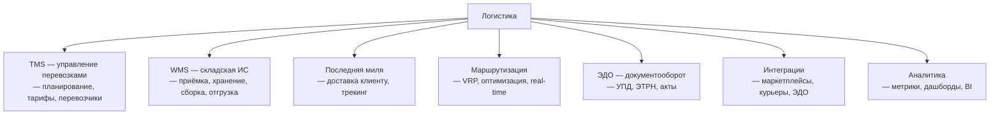

:::info[TL;DR]
Логистический аналитик работает с системами управления перевозками (TMS), складами (WMS), доставкой последней мили, маршрутизацией (VRP) и ЭДО. Специфика: множество участников (перевозчики, склады, маркетплейсы, курьерские службы), жёсткие SLA, real-time трекинг, сложные тарифы и огромные объёмы данных (миллионы заказов/день у крупных игроков). Рынок: $500B+ глобально, 5M+ перевозок/день в РФ.
:::

## Для кого эта статья

Middle-аналитик, переходящий в логистику. После прочтения вы:

- Поймёте домены логистики: TMS, WMS, последняя миля, маршрутизация, ЭДО
- Узнаете ключевые интеграции и участников: маркетплейсы, курьерские службы, перевозчики
- Получите словарь терминов и метрик логистики
- Сможете определить, какой домен вам ближе

## 1. Рынок логистики: цифры и тренды

| Параметр | Значение |
|----------|----------|
| **Глобальный рынок логистики (2025)** | $500B+ |
| **Рынок РФ (2024)** | ~$70B |
| **Объём e-commerce логистики РФ** | ~1.5B заказов/год |
| **Крупнейшие маркетплейсы (доставка)** | Wildberries (1M+ заказов/день), Ozon (0.5M+) |
| **Средняя стоимость доставки (РФ)** | $1-5 (Москва), $5-15 (регионы) |
| **Доля последней мили в стоимости** | 40-60% |
| **Курьерские службы РФ** | СДЭК, Boxberry, 5Post, Почта России, Яндекс.Доставка |

**Тренды 2024-2026:**

- **Same-day / Super-fast delivery** — Ozon и WB доставляют за 1-4 часа в Москве
- **Autonomous delivery** — роботы-курьеры (Яндекс.Ровер), дроны
- **Real-time visibility** — трекинг каждого заказа в реальном времени (NFC, IoT)
- **Green logistics** — электромобили, углеродный след, оптимизация пробега
- **AI маршрутизация** — ML-оптимизаторы вместо классических VRP-solver (Yandex ML Route)
- **ЭТРН обязательна** — электронная транспортная накладная с 2021 года

## 2. Домены логистики

### 2.1 TMS — управление перевозками
Центральная система логистики. Планирует маршруты, выбирает перевозчика, рассчитывает тарифы, отслеживает доставку. **Пример:** SAP TM, Oracle OTM, Яндекс.Маршрутизация, индивидуальные разработки. Ключевые метрики: on-time rate, cost per delivery, fill rate.

### 2.2 WMS — складская система
Управляет складом: приёмка, размещение, сборка (pick/pack), отгрузка, инвентаризация. Типы складов: FBO (маркетплейс), FBS (продавец), DBS (DIY), кросс-док. **Пример:** WMS 1C, Manhattan Associates, SAP EWM, Solvo.

### 2.3 Последняя миля
Самый затратный и сложный этап (40-60% стоимости). Временные окна (слоты), трекинг, связь с курьером, подтверждение. **Пример:** Яндекс.Доставка, СДЭК, Boxberry, 5Post.

### 2.4 Маршрутизация (VRP)
Классическая задача оптимизации маршрутов. Кластеризация → VRP → ребалансировка. Учитывает пробки, временные окна, вместимость. **Конкуренты:** OR-Tools (Google), Routific, OptimoRoute, Яндекс.Маршрутизация.

### 2.5 ЭДО
Электронный документооборот между участниками. С 2021 обязательна ЭТРН (электронная транспортная накладная). **Операторы:** Диадок, СБИС, Контур. Документы: УПД, акты, счета-фактуры, ЭТРН.

### 2.6 Интеграции
Логистика — центр интеграций. Маркетплейсы (WB, Ozon, YM), курьерские службы (СДЭК, Boxberry, 5Post, Почта), ЭДО, WMS, платёжные системы, склады. Каждый партнёр — свой API (REST/JSON или SOAP/XML).

### 2.7 Аналитика
Метрики: on-time rate (цель > 95%), cost per delivery, fill rate (цель > 80%), return rate (< 5%), retry rate (< 3%). BI-дашборды для операционного (заказы в работе) и финансового контроля (P&L по маршрутам).

## 3. Специфика логистики vs Enterprise

| Параметр | Enterprise | Логистика |
|----------|-----------|-----------|
| **Основные системы** | ERP, CRM | TMS, WMS, маршрутизация, ЭДО |
| **Участники** | Внутренние | Внешние: перевозчики, склады, маркетплейсы |
| **SLA** | Секунды-минуты | Реальное время: доставка в слот ±15 мин |
| **Объёмы** | Транзакции | Миллионы заказов/день |
| **Режим** | 9-18 | 24/7 (склады, доставка) |
| **География** | Офис | Вся страна, тысячи городов |
| **Данные** | Документы | GPS-треки, статусы, тарифы, фотографии |
| **Регуляторика** | GDPR, ПД | ЭТРН, транспортные налоги, маркировка |

## 4. Карьерный путь аналитика в логистике

| Этап | Роль | Ключевые навыки | Что делаешь |
|------|------|----------------|-------------|
| 1 | Junior SA | WMS, документация, SQL | Описываешь складские процессы, пишешь API-спеки для WMS-интеграций |
| 2 | Middle SA | TMS, интеграции, тарифы | Проектируешь статусные модели, интеграции с курьерами, тарифные сетки |
| 3 | Senior SA | Маршрутизация, оптимизация, аналитика | Проектируешь VRP-решения, дашборды, ребалансировку |
| 4 | Lead | Supply chain, стратегия, P&L | Выстраиваешь логистику целиком: склад → транспортировка → последняя миля |

## 5. Словарь терминов

| Термин | Значение | Пример |
|--------|----------|--------|
| **TMS** | Система управления перевозками | SAP TM, Яндекс.Маршрутизация |
| **WMS** | Система управления складом | Manhattan, Solvo |
| **Последняя миля** | Доставка от хаба до клиента | Курьер привёз заказ |
| **Pick/Pack** | Сборка и упаковка заказа на складе | pick-by-light, voice picking |
| **FBO/FBS/DBS** | Модели fulfilment для маркетплейсов | WB FBO — товар на складе WB |
| **VRP** | Vehicle Routing Problem | Построить маршрут для 50 курьеров |
| **SLOT** | Временное окно доставки | 10:00-12:00 |
| **ЭТРН** | Электронная транспортная накладная | Обязательна с 2021 |
| **ПВЗ** | Пункт выдачи заказов | 10K+ у WB |
| **On-time rate** | % доставок в срок | > 95% |
| **Cross-dock** | Склад без хранения (транзит) | Сортировка ночью, доставка утром |
| **Fill rate** | Загрузка транспорта (вес/объём) | 85% для фуры |

## 6. Типичные ошибки новичков

1. **Недооценивать количество участников.** В одной доставке участвуют: маркетплейс, TMS, перевозчик, склад, курьер, получатель, оператор ЭДО, банк.
2. **Считать, что SLA = 100%.** Всегда есть форс-мажор: пробки, погода, поломки. Нужна модель исключений.
3. **Игнорировать тарифы.** Тарифы — сложнейший домен (вес, объём, расстояние, надбавки, сезонность). Без понимания тарифов не спроектировать TMS.
4. **Не учитывать возвраты.** Возвраты (реверс-логистика) — 10-30% заказов в e-commerce. Это отдельный процесс.
5. **Путать логистику с ERP.** TMS ≠ ERP. TMS фокусируется на перевозках, WMS на складе. ERP — финансы.

## Ссылки для самостоятельного изучения

| Ресурс | Описание | Ссылка |
|--------|----------|--------|
| SAP TM Documentation | SAP Transportation Management | https://help.sap.com/docs/SAP_TRANSPORTATION_MANAGEMENT |
| Oracle OTM | Oracle Transportation Management | https://www.oracle.com/scm/logistics/transportation-management/ |
| Яндекс.Маршрутизация | API оптимизации маршрутов | https://yandex.ru/dev/routing/ |
| СДЭК API | API интеграции с курьерской службой | https://api.cdek.ru/ |
| Boxberry API | REST API Boxberry | https://boxberry.ru/business/dlya-integratorov |
| 5Post API | API доставки 5Post (X5 Group) | https://5post.ru/integration/ |
| Диадок API | Оператор ЭДО Диадок | https://www.diadoc.ru/api |
| Госуслуги — ЭТРН | Электронная транспортная накладная | https://www.gosuslugi.ru/etrn |
| OR-Tools (Google) | Open-source VRP solver | https://developers.google.com/optimization/routing |

## Проверь себя

1. **Какие основные системы в логистике?**
   *Ответ:* TMS (перевозки), WMS (склад), последняя миля (доставка), маршрутизация (VRP), ЭДО (документы), интеграционная шина, аналитика.

2. **Чем логистика отличается от Enterprise?**
   *Ответ:* Множество внешних участников (перевозчики, маркетплейсы, курьеры), real-time трекинг, жёсткие SLA (±15 мин), 24/7 работа, GPS-данные, объёмы миллионов заказов/день, обязательный ЭДО (ЭТРН с 2021).

3. **Какие модели fulfilment существуют?**
   *Ответ:* FBO (товар на складе маркетплейса, полный WMS), FBS (товар у продавца, доставка маркетплейсом), DBS (продавец всё делает сам), кросс-док (транзит, без хранения).

4. **Почему последняя миля — самая дорогая?**
   *Ответ:* 40-60% стоимости логистики. Причины: много точек доставки, неэффективная маршрутизация, неудачные попытки (retry rate 5-15%), возвраты, временные окна. Курьер может проехать 100 км, чтобы доставить 1 заказ на последней миле.

5. **Что такое ЭТРН и зачем она нужна?**
   *Ответ:* Электронная транспортная накладная — обязательный с 2021 года документ для грузоперевозок в РФ. Заменяет бумажную ТТН. Участники: грузоотправитель → перевозчик → грузополучатель. Подписывается УКЭП через оператора ЭДО. Штрафы за отсутствие — до 50К ₽.
