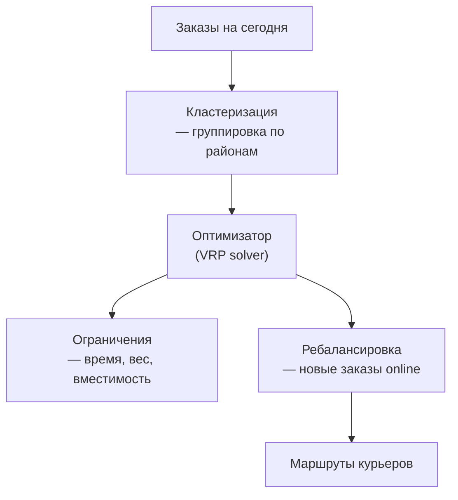

:::info[TL;DR]
Маршрутизация — построение оптимальных маршрутов для курьеров с учётом временных окон, загрузки, пробок и ограничений. Классическая задача VRP (Vehicle Routing Problem) на практике: кластеризация заказов → построение маршрута → ребалансировка в реальном времени. Аналитик описывает бизнес-правила, ограничения и метрики маршрутов.
:::

## Компоненты маршрутизации

## Классические задачи

| Задача | Описание |
|--------|----------|
| **VRP** | Vehicle Routing Problem — базовый маршрут |
| **VRPTW** | VRP с временными окнами |
| **CVRP** | VRP с ограничением вместимости (capacity) |
| **MDVRP** | Multi-depot — несколько точек выезда |
| **VRPPD** | VRP с pick-up и delivery |
| **Dynamic VRP** | Маршруты в реальном времени |

## Метрики маршрутизации

| Метрика | Что измеряет |
|---------|-------------|
| **On-time delivery rate** | % заказов в срок |
| **Среднее время в пути** | От хаба до клиента |
| **Пробег (км)** | Общий пробег курьеров |
| **Fill rate** | Загрузка курьера (вес/объём) |
| **Cost per delivery** | Себестоимость доставки |
| **Retry rate** | Неудачные попытки |

## Что дальше

- [Аналитика в логистике](/docs/specialization/logistics-analytics)

## Проверь себя

1. **Какие задачи решает маршрутизация?**
   *Ответ:* Кластеризация → построение маршрута (VRP) → ребалансировка с учётом окон, веса, вместимости.

2. **Какие ограничения учитывает маршрутизация?**
   *Ответ:* Временные окна, вес/объём, тип авто, пробки, точки выезда.
